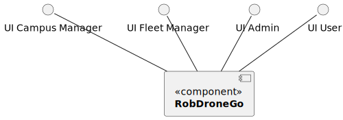
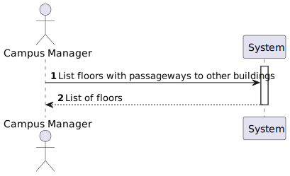
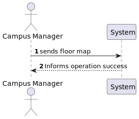
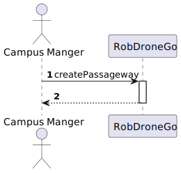
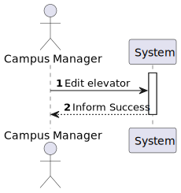

# Layer 1

## Logical View

### US150

### US160

### US170

### US180

### US190

### US200

### US210

### US220

### US230

### US240

### US250

### US260

### US270

### US280

### US290

### US300

### US310

### US350

### US360

### US370

### US380

### US390

