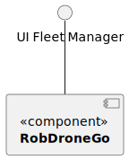
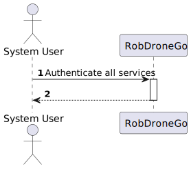
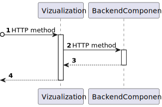
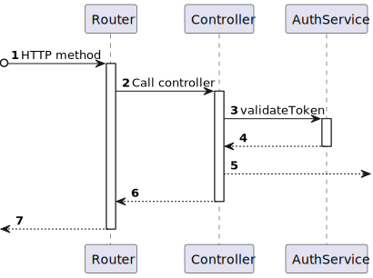

# US 1310 - As the solution architect, I pretend that every service in the backend are authenticated

## 1. Context

* First time that this task is developed.

## 2. Requirements

Being able to send a request to a backend service and it has to be authenticated

**Dependencies:**

**US 10** As an administrator, I pretende to registar a system user specifying their permissions

**US 20** As a potencial system user, I pretend to register myself into the system

## 3. Analysis

Every time there is a request to a backend service, this request needs to be validated
in order to check if the request was made by a registered system user

## 4. Design

To implement this use case, we will implement a service which will take the received token by the routing
component and will verify if it is a valid token. These tokens will be generated by the authentication component
every time the user logins into the system

### 4.1. Realization

### Level1

#### LogicalView

#### SceneryView

#### ProcessView

### Level2

#### LogicalView

#### ImplementationView

#### PhysicalView

#### ProcessView

### Level3

#### LogicalView

#### ImplementationView

#### ProcessView

### 4.2. Applied Patterns

* Controller
* Service

### 4.3. Tests

## 5. Implementation

## 6. Integration/Demonstration

## 7. Observations

No observations.
