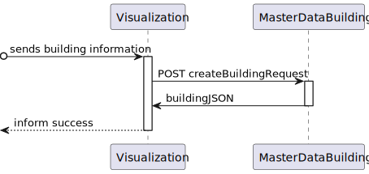

# US 150 - As a Campus Manager, I want to create a building

## 1. Context

* First time that this task is developed.
* This task is relative to system user Campus Manager.

## 2. Requirements

**US 150 -** As a Campus Manager, I want to:

* Create a building


**Client Clarifications**
>**Question**: " Relativamente à criação de edifícios é suposto criar-mos um edifício sem nenhum piso inicialmente e depois adicionarmos os pisos?
Por exemplo: Criar o edifício A apenas, sem nenhum piso, e só depois na US 190 criar-mos os respetivos pisos do edifício A.
Ou é necessário sempre que criarmos um edifício especificar os pisos que o mesmo tem?
Por exemplo: Criar o edifício A, com os pisos A1, A2, A3 com as dimensões da grelha para cada um dos pisos."<br><br>
>**Answer**: "...são dois requisitos independentes. 150 apenas define o edificio. posteriormente o utilizador invocará o caso de uso correspondete ao requisito 190 para criar cada piso desse edificio"<br>

>**Question**: "O nome do edifício tem limitações como, por exemplo, tem de ter uma letra e números? E para além do nome do edifício, que mais informação deve ser guardada sobre o edifício."<br><br>
>**Answer**: "o código do edificio é obrigatório, no máximo 5 caracteres, letras e digitos, podendo conter espaços no meio
o nome do edificio é opcional, no máximo 50 caracteres alfanuméricos"<br>

>**Question**: "Em relação à breve descrição, existe alguma regra em particular?"<br><br>
>**Answer**: "é opcional, com o máximo de 255 caracteres"<br>

>**Question**: "Será possível esclarecer como funcionarão estas user stories? Com a 230 (Carregar mapa do piso) o nosso entendimento foi que as células seriam carregadas já com a criação de salas e pisos, e assim sendo não faria sentido as outras duas user stories, onde é pedido para criar um piso de um edifício e uma sala. Não entendemos o que é pretendido  com as us's 190 e 310."<br><br>
>**Answer**: "o requisito 150 Criar edificio permite criar um edificio, exemplo, edificio "B", com um nome opcional e com uma breve descrição (ex., "departamento de engenharia informática") indicando a dimensão máxima de cada piso em termos de células (ex., 10 x 10)"<br>


**Dependencies:**
There are no Dependencies associated with this US.

## 3. Analysis

Regarding this requirement we understand that as a Campus Manager, an actor of the system, I will be able to access the system and create a building in the Campus area. A building is a structure within the campus that houses various rooms, floors, elevators and may have passageways to other buildings, it can be navigated by the robisep robots using corridors and elevators.

### 3.1. Domain Model Excerpt


## 4. Design

### 4.1. Realization

### Level1
###### LogicalView:


###### SceneryView:


###### ProcessView:


#### Level2

###### LogicalView:


###### ImplementationView:


###### PhysicalView:


###### ProcessView:


#### Level3
###### LogicalView:


###### ImplementationView:


###### ProcessView:


### 4.2. Applied Patterns
* Controller
* Service
* Repository
* Mapper
* DTO
* GRASP


### 4.3. Tests

**Test 1:** *Verifies that is the creation of a building is successful*

```javascript
it('Create building test, valid building', async function () {
        const buildingDTO = {
            buildingName: "EdificioA",
            buildingDescription: "uma descricao",
            buildingCode: "cod1",
            buildingLength: 2,
            buildingWidth: 2
        } as IBuildingDTO

        const building = Building.create({
            buildingName: new BuildingName({ value: buildingDTO.buildingName }),
            buildingDescription: new BuildingDescription({ value: buildingDTO.buildingDescription }),
            buildingSize: new BuildingSize({ length: buildingDTO.buildingLength, width: buildingDTO.buildingWidth }),
            floors: [],
        }, buildingDTO.buildingCode)


        assert.equal(building.isSuccess, true)
    })
```

**Test 2:** *Verifies that is not possible to create a building with an invalid name*

```javascript
it('Create building test, invalid building name (not alphanumeric)', async function () {
        const buildingDTO = {
            buildingName: "a!12",
            buildingDescription: "uma descricao",
            buildingCode: "a122",
            buildingLength: 2,
            buildingWidth: 2
        } as IBuildingDTO

        const building = Building.create({
            buildingName: new BuildingName({ value: buildingDTO.buildingName }),
            buildingDescription: new BuildingDescription({ value: buildingDTO.buildingDescription }),
            buildingSize: new BuildingSize({ length: buildingDTO.buildingLength, width: buildingDTO.buildingWidth }),
            floors: [],
        }, buildingDTO.buildingCode)

        assert.equal(building.isSuccess, false)
    })
```
**Test 3:** *Verifies that is not possible to create an building using the service class*

```javascript
it('Service unit test with stub repo, invalid building', async function () {
        const buildingDTO = {
            buildingName: "EdificioA",
            buildingDescription: "uma descricao",
            buildingCode: "123456",
            buildingLength: 2,
            buildingWidth: 2,
            buildingFloors: []
        } as IBuildingDTO

        let buildingRepo = Container.get('buildingRepo')
        sinon.stub(buildingRepo, 'findByBuidingCode').returns(new Promise((resolve, reject) => { resolve(null) }))

        const createBuildingService = new CreateBuildingService(buildingRepo as IBuildingRepo)

        const actual = await createBuildingService.createBuilding(buildingDTO)

        sinon.assert.match(actual.isFailure, true)
    })
```
**Test 4:** *Verifies that is not possible to create an building using the controller class*

```javascript
it('Controller unit test with stub service, invalid building', async function () {
        let req: Partial<Request> = {}
        let res: Partial<Response> = {
            status: sinon.spy()
        }

        let next: Partial<NextFunction> = () => { }

        let createBuildingService = Container.get('createBuildingService')
        sinon.stub(createBuildingService, 'createBuilding').returns(Result.fail<Building>('Error'))

        const createBuildingController = new CreateBuildingController(createBuildingService as ICreateBuildingService)

        await createBuildingController.createBuilding(<Request>req, <Response>res, <NextFunction>next)

        sinon.assert.calledOnce(res.status)
        sinon.match(400)
    })
```
**Test 5:** *Verifies that is possible to create a building using the controller and service classes together*

```javascript
it('Controller + service integration test using BuildingRepo stub valid building', async function () {
        const body = {
            "buildingCode": "bdgA1",
            "buildingName": "buildingTest",
            "buildingDescription": "this is a building",
            "buildingLength": 10,
            "buildingWidth": 10,
        }

        const expected = {
            "buildingCode": "bdgA1",
            "buildingName": "buildingTest",
            "buildingDescription": "this is a building",
            "buildingLength": 10,
            "buildingWidth": 10,
            "buildingFloor": []
        }

        const buildingDTO = {
            buildingCode: "bgdA1",
            buildingName: "buildingTest",
            buildingDescription: "this is a building",
            buildingLength: 10,
            buildingWidth: 10,
            buildingFloors: []
        } as IBuildingDTO

        const buildingResult = Building.create({
            buildingName: new BuildingName({ value: buildingDTO.buildingName }),
            buildingDescription: new BuildingDescription({ value: buildingDTO.buildingDescription }),
            buildingSize: new BuildingSize({ length: buildingDTO.buildingLength, width: buildingDTO.buildingWidth }),
            floors: [],
        }, buildingDTO.buildingCode)

        let req: Partial<Request> = {
            body: body
        }
        let res: Partial<Response> = {
            json: sinon.spy()
        }

        let next: Partial<NextFunction> = () => { }

        let buildingRepo = Container.get('buildingRepo')
        sinon.stub(buildingRepo, 'findByBuidingCode').returns(new Promise((resolve, reject) => { resolve(null) }))
        sinon.stub(buildingRepo, 'save').returns(buildingResult)

        const createBuildingService = new CreateBuildingService(buildingRepo as IBuildingRepo)
        const createBuildingController  = new CreateBuildingController(createBuildingService as ICreateBuildingService)

        createBuildingController.createBuilding(<Request>req, <Response>res, <NextFunction>next)

        sinon.match(expected)
    })
```

## 5. Implementation

### Class createBuildingService
```typescript
@Service()
export default class CreateBuildingService implements ICreateBuildingService {

    constructor(
        @Inject(config.repos.building.name) private buildingRepo: IBuildingRepo
    ) { }

    public async createBuilding(buildingDto: IBuildingDTO): Promise<Result<IBuildingDTO>> {
        try {
            if (await this.buildingRepo.findByBuidingCode(new BuildingCode(buildingDto.buildingCode)) !== null) return Result.fail<IBuildingDTO>('A building with that code already exists')
            const buildingOrError = Building.create(
                {
                    buildingName: new BuildingName({ value: buildingDto.buildingName }),
                    buildingDescription: new BuildingDescription({ value: buildingDto.buildingDescription}),
                    buildingSize: new BuildingSize({length: buildingDto.buildingLength, width: buildingDto.buildingWidth}),
                    floors: [],
                }, buildingDto.buildingCode)

            if (buildingOrError.isFailure) {
                return Result.fail<IBuildingDTO>(buildingOrError.errorValue())
            }

            const buildingResult = buildingOrError.getValue()

            await this.buildingRepo.save(buildingResult);

            const buildingDtoResult = BuildingMap.toDto(buildingResult) as IBuildingDTO
            return Result.ok<IBuildingDTO>(buildingDtoResult)

        } catch (e) {
            throw e
        }
    }
}
```

### Class Building
```typescript
interface BuildingProps {
  buildingName?: BuildingName
  buildingDescription?: BuildingDescription;
  buildingSize?: BuildingSize
  floors?: Floor[];
}

export class Building extends AggregateRoot<BuildingProps> {
  private constructor(buildingCode: BuildingCode, props?: BuildingProps) {
    super(props, buildingCode);
  }

  get code(): UniqueEntityID {
    return this.id;
  }

  get name(): BuildingName {
    return this.props.buildingName
  }

  get desctription(): BuildingDescription {
    return this.props.buildingDescription
  }

  get size(): BuildingSize {
    return this.props.buildingSize
  }

  get floors(): Floor[] {
    return this.props.floors
  }

  changeName(name: string) {
    this.props.buildingName = new BuildingName({value: name})
  }

  changeDescription(description: string) {
    this.props.buildingDescription = new BuildingDescription({value: description})
  }

  changeSize(length: number, width: number) {
    this.props.buildingSize = new BuildingSize({length: length, width: width})
  }

  get floorsNumber(): number[] {
    let floors: number[] = []
    this.props.floors.forEach(f => {
      floors.push(Number(f.id.toValue()))
    });
    return floors
  }

  addFloor(floor: Floor) {
    this.props.floors.push(floor)
  }

  public static create(buildingProps: BuildingProps, buildingCode: string): Result<Building> {
    const name = buildingProps.buildingName
    const description = buildingProps.buildingDescription
    const length = buildingProps.buildingSize.length
    const width = buildingProps.buildingSize.width
    const floors = buildingProps.floors

    if (!checkName(name.name) || !checkDescription(description.description) || !checkCode(buildingCode) || !checkSize(length, width)) {
      return Result.fail<Building>('Missing paramethers')
    }
    const building = new Building(new BuildingCode(buildingCode),
      {
        buildingName: name,
        buildingDescription: description,
        buildingSize: new BuildingSize({ length: length, width: width }),
        floors: floors
      })

    return Result.ok<Building>(building)
  }
}

function checkName(name: string): boolean {
  let strRegex = new RegExp(/^[a-z0-9]+$/i);
  if (name.length > 50 || !strRegex.test(name)) {
    return false
  }

  return true
}

function checkCode(code: string): boolean {
  let strRegex = new RegExp(/^[a-z0-9 ]+$/i);
  if (!!code === false || code.length === 0 || code.length > 5 || !strRegex.test(code)) {
    return false
  }

  return true
}

function checkDescription(description: string): boolean {
  if (description.length > 255) {
    return false
  }

  return true
}

function checkSize(length: number, width: number): boolean {
  if (width < 1 || length < 1) return false

  return true
}
```
## 6. Integration/Demonstration
To use this US, you need to send an HTTP request.

Using this URI: localhost:4000/api/buildings/createBuilding

With the following JSON
```
{
    "buildingName": "A",
    "buildingDescription": "Uma descricao",
    "buildingCode": "A",
    "buildingLength": 10,
    "buildingWidth": 10
}
```

## 7. Observations

No observations.
