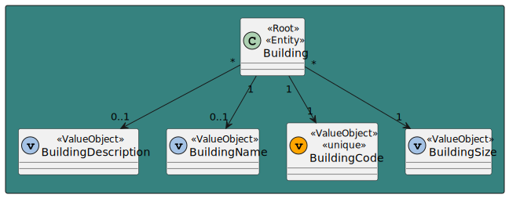
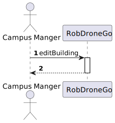
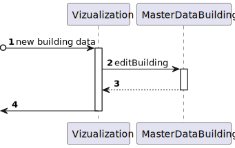
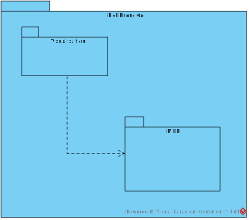
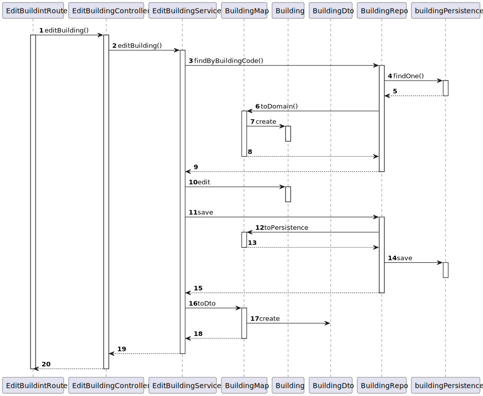

# US 160 As a Campus Manager I want to edit an building

## 1. Context

* First time that this task is developed.
* This task is relative to system user Campus Manager.

## 2. Requirements

**US 160 -** As a Campus Manager, I want to:

* Edit a building

**Dependencies:**
There are no Dependencies associated with this US.

## 3. Analysis

Regarding this requirement we understand that as a Campus Manager, an actor of the system, I will be able to access
the system and edit the information of a certain building. The Campus Manager can choose a building of the list of
buildings and change any information execpt the building code.

### 3.1. Domain Model Excerpt



## 4. Design

### 4.1. Realization

### Level 1

* Logical:


* Process



* Scenary


### level 2

* Logical:


* Process



* Physical


* Implementation



### Level 3

* Logical:


* Implementation


* Process



### 4.2. Applied Patterns

* Controller
* Service
* Repository
* Mapper
* Dto

### 4.3. Tests

There are some tests that were implemented

```typescript
    it('1. Controller valid edit (building exist on database)', async function () {
        const serviceReturns = {
            buildingName: "EdificioA",
            buildingDescription: "uma descricao",
            buildingCode: "cod1",
            buildingLength: 2,
            buildingWidth: 2,
            buildingFloors: []
        } as IBuildingDTO

        const buildingDTOJSONExpected = {
            "buildingName": "EdificioA",
            "buildingDescription": "uma descricao",
            "buildingCode": "cod1",
            "buildingLength": 2,
            "buildingWidth": 2,
            "buildingFloors": []
        }

        const buildingDTOJSON = {
            "buildingName": "EdificioB",
            "buildingDescription": "uma descricao",
            "buildingCode": "cod1",
            "buildingLength": 2,
            "buildingWidth": 2,
            "buildingFloors": []
        }

        const buildingDTO2 = {
            buildingName: "EdificioB",
            buildingDescription: "uma descricao",
            buildingCode: "cod1",
            buildingLength: 2,
            buildingWidth: 2,
            buildingFloors: []
        } as IBuildingDTO

        let req: Partial<Request> = {}
        req.body = buildingDTOJSON

        let res: Partial<Response> = {
            status: sinon.stub().returnsThis(),
            json: sinon.spy()
        }

        let next: Partial<NextFunction> = () => { }

        const editBuildingService = Container.get('editBuildingService')

        sinon.stub(editBuildingService, 'editBuilding')
            .withArgs(buildingDTO2)
            .returns(new Promise((resolve, reject) => { resolve(Result.ok<IBuildingDTO>(serviceReturns)) }))


        const editBuildingController = new EditBuildingController(editBuildingService as IEditBuildingService)

        await editBuildingController.editBuilding(<Request>req, <Response>res, <NextFunction>next)

        sinon.assert.calledOnce(res.status)
        sinon.assert.calledWith(res.status, 201)
        sinon.assert.calledOnce(res.json)
        sinon.assert.calledWith(res.json, sinon.match(buildingDTOJSONExpected))
    })
```

```typescript
    it('2. Controller valid edit (building doesn\'t exist on database)', async function () {
        const buildingDTO2 = {
            buildingName: "EdificioB",
            buildingDescription: "uma descricao",
            buildingCode: "cod1",
            buildingLength: 2,
            buildingWidth: 2,
            buildingFloors: []
        } as IBuildingDTO

        const buildingDTOJSON = {
            "buildingName": "EdificioB",
            "buildingDescription": "uma descricao",
            "buildingCode": "cod1",
            "buildingLength": 2,
            "buildingWidth": 2,
            "buildingFloors": []
        }

        let req: Partial<Request> = {}
        req.body = buildingDTOJSON

        let res: Partial<Response> = {
            status: sinon.stub().returnsThis(),
            send: sinon.spy()
        }

        let next: Partial<NextFunction> = () => { }

        const editBuildingService = Container.get('editBuildingService')

        sinon.stub(editBuildingService, 'editBuilding')
            .withArgs(buildingDTO2)
            .returns(new Promise((resolve, reject) => { resolve(Result.fail<IBuildingDTO>('null')) }))

        const editBuildingController = new EditBuildingController(editBuildingService as IEditBuildingService)

        await editBuildingController.editBuilding(<Request>req, <Response>res, <NextFunction>next)

        sinon.assert.calledOnce(res.status)
        sinon.assert.calledWith(res.status, 400)
        sinon.assert.calledOnce(res.send)
    })
```

```typescript
    it('5. Controller + Service valid edit (building exist on database)', async function () {
        const original = {
            buildingName: "EdificioA",
            buildingDescription: "uma descricao",
            buildingCode: "cod1",
            buildingLength: 2,
            buildingWidth: 2,
            buildingFloors: []
        } as IBuildingDTO

        const building1 = Building.create({
            buildingName: new BuildingName({ value: original.buildingName }),
            buildingDescription: new BuildingDescription({ value: original.buildingDescription }),
            buildingSize: new BuildingSize({ length: original.buildingLength, width: original.buildingWidth }),
            floors: [],
        }, original.buildingCode)

        const after = {
            "buildingName": "EdificioB",
            "buildingDescription": "uma descricao",
            "buildingCode": "cod1",
            "buildingLength": 2,
            "buildingWidth": 2,
            "buildingFloors": []
        }

        let req: Partial<Request> = {}
        req.body = after

        let res: Partial<Response> = {
            status: sinon.stub().returnsThis(),
            json: sinon.spy()
        }

        let next: Partial<NextFunction> = () => { }

        const buildingRepo = Container.get('buildingRepo')
        sinon.stub(buildingRepo, 'findByBuidingCode').returns(new Promise((resolve, reject) => {resolve(building1.getValue())}))
        sinon.stub(buildingRepo, 'save')

        const editBuildingService = new EditBuildingService(buildingRepo as IBuildingRepo)

        const editBuildingController = new EditBuildingController(editBuildingService as IEditBuildingService)

        await editBuildingController.editBuilding(<Request>req, <Response>res, <NextFunction>next)

        sinon.assert.calledOnce(res.status)
        sinon.assert.calledWith(res.status, 201)
        sinon.assert.calledOnce(res.json)
        sinon.assert.calledWith(res.json, sinon.match(after))
    })
```

```typescript
    it('6. Controller + Service invalid edit (building doesn\'t exist on database)', async function () {
        const after = {
            "buildingName": "EdificioB",
            "buildingDescription": "uma descricao",
            "buildingCode": "cod1",
            "buildingLength": 2,
            "buildingWidth": 2,
            "buildingFloors": []
        }

        let req: Partial<Request> = {}
        req.body = after

        let res: Partial<Response> = {
            status: sinon.stub().returnsThis(),
            send: sinon.spy()
        }

        let next: Partial<NextFunction> = () => {}

        const buildingRepo = Container.get('buildingRepo')
        sinon.stub(buildingRepo, 'findByBuidingCode').returns(new Promise((resolve, reject) => {resolve(null)}))
        sinon.stub(buildingRepo, 'save')

        const editBuildingService = Container.get('editBuildingService')

        const editBuildiongController = new EditBuildingController(editBuildingService as IEditBuildingService)

        await editBuildiongController.editBuilding(<Request>req, <Response>res, <NextFunction>next)

        sinon.assert.calledOnce(res.status)
        sinon.assert.calledWith(res.status, 400)
        sinon.assert.calledOnce(res.send)
    })
```

## 5. Implementation

### EditBuildingService

```typescript
@Service()
export default class EditBuildingService implements IEditBuildingService {


    constructor(
        @Inject(config.repos.building.name) private buildingRepo: IBuildingRepo
    ) {}

    public async editBuilding(buildingDto: IBuildingDTO): Promise<Result<IBuildingDTO>> {
        try {
            const buildingOrError = await this.buildingRepo.findByBuidingCode(new BuildingCode(buildingDto.buildingCode))

            if (buildingOrError === null) {
                return Result.fail<IBuildingDTO>('There is no building with that code')
            }

            if (buildingDto.buildingName !== undefined || buildingDto.buildingName !== null) {
                buildingOrError.changeName(buildingDto.buildingName)
            }

            if (buildingDto.buildingDescription !== undefined || buildingDto.buildingDescription !== null) {
                buildingOrError.changeDescription(buildingDto.buildingDescription)
            }

            if (buildingDto.buildingLength !== undefined || buildingDto.buildingLength !== null &&
                buildingDto.buildingWidth !== undefined || buildingDto.buildingWidth !== null) {
                buildingOrError.changeSize(buildingDto.buildingLength, buildingDto.buildingWidth)
            }

            await this.buildingRepo.save(buildingOrError);

            const buildingDtoResult = BuildingMap.toDto(buildingOrError)
            return Result.ok<IBuildingDTO>(buildingDtoResult)

        } catch (err) {
            throw err
        }
    }
}
```

## 6. Integration/Demonstration

To use this US, you need to send an put HTTP request with the building as a JSON in the body.

Using this URI: localhost:4000/api/buildings/editBuilding

If the edit was succesfull you will get to see the new information about the building

```

{
    "buildingName": "A",
    "buildingDescription": "Uma descricao",
    "buildingCode": "A",
    "buildingLength": 10,
    "buildingWidth": 10
}

```
