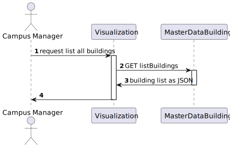

# US 170 AS a campus manager, I want to list all buildings

## 1. Context

* First time that this task is developed.
* This task is relative to system user Campus Manager.

## 2. Requirements

**US 170** As a campus manager i want to:

* List all buildings

**Dependencies:** There are no Dependencies associated with this US.

## 3. Analysis

Regarding this requirement we understod that as a Campus manager an actor
of the system, I want to have the posibility of list every building
registered in the system regarless of number of floors, elevators, passageways, etc. And the information that I should be able to see is
the building name, description and code.

### 3.1 Domain model excerpt


## 4. Design

### 4.1. Realization

### Level 2



### Level 3

In order to resolve this US we will make use of the folliwing classes:

1. ListBuildingController
2. ListBuildingService
3. BuildingRepo
4. BuildingMap
5. BuildingDto

We will make also use of ListBuildingRoute file, inside this file we will put our route for any get request to list buildings


### 4.2. Applied Patterns

* Controller
* Repository
* Service
* Dto
* Mapper

### 4.3. Tests

**Test 1:** *Verifies that it is not possible to create an instance of the Example class with null values.*

```javaScript
it('test something', () => {

})
```

## 5. Implementation

*In this section the team should present, if necessary, some evidencies that the implementation is according to the design. It should also describe and explain other important artifacts necessary to fully understand the implementation like, for instance, configuration files.*

*It is also a best practice to include a listing (with a brief summary) of the major commits regarding this requirement.*

## 6. Integration/Demonstration

*In this section the team should describe the efforts realized in order to integrate this functionality with the other parts/components of the system*
*It is also important to explain any scripts or instructions required to execute an demonstrate this functionality*

## 7. Observations

*This section should be used to include any content that does not fit any of the previous sections.*

*The team should present here, for instance, a critical prespective on the developed work including the analysis of alternative solutioons or related works*
*The team should include in this section statements/references regarding third party works that were used in the development this work*
