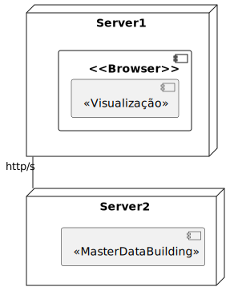

# US 170 AS a campus manager, I want to list all buildings

## 1. Context

* First time that this task is being developed.
* This task is relative to system user Campus Manager.

## 2. Requirements

**US 170** As a campus manager i want to:

* List all buildings

**Dependencies:** There are no Dependencies associated with this US.

## 3. Analysis

Regarding this requirement we understod that as a Campus manager an actor
of the system, I want to have the posibility of list every building
registered in the system regarless of number of floors, elevators, passageways and rooms.

### 3.1 Domain model excerpt


## 4. Design

### 4.1. Realization

### Level 1

* Logical:


* Process


* Scenary


### level 2

* Logical:


* Process


* Physical



* Implementation


### Level 3

* Logical:


* Implementation


* Process


### 4.2. Applied Patterns

* Controller
* Repository
* Service
* Dto
* Mapper

### 4.3. Tests

```typescript
    it('1. Controller with stub service 2 buildings', async function () {
        const buildingDTO1 = {
            buildingName: "EdificioA",
            buildingDescription: "uma descricao",
            buildingCode: "cod1",
            buildingLength: 2,
            buildingWidth: 2,
            buildingFloors: []
        } as IBuildingDTO

        const buildingDTO2 = {
            buildingName: "EdificioB",
            buildingDescription: "uma descricao",
            buildingCode: "cod2",
            buildingLength: 3,
            buildingWidth: 3,
            buildingFloors: []
        } as IBuildingDTO

        const result = [buildingDTO1, buildingDTO2]

        let req: Partial<Request> = {}
        let res: Partial<Response> = {
            status: sinon.stub().returnsThis(),
            json: sinon.spy()
        }

        let next: Partial<NextFunction> = () => { }

        const listAllBuildingsService = Container.get('listAllBuildingsService')
        sinon.stub(listAllBuildingsService, 'listAllBuildings').returns(new Promise((resolve, reject) => { resolve(Result.ok<IBuildingDTO[]>(result)) }))

        const listAllBuildingsController = new ListAllBuildingsController(listAllBuildingsService as IListAllBuildingsService)

        await listAllBuildingsController.listAllBuildings(<Request>req, <Response>res, <NextFunction>next)

        sinon.assert.calledOnce(res.status)
        sinon.assert.calledWith(res.status, 200)
        sinon.assert.calledOnce(res.json)
        sinon.assert.calledWith(res.json, sinon.match(result))
    })
```

```typescript
    it('2. Controller with stub service no buildings', async function () {
        let req: Partial<Request> = {}
        let res: Partial<Response> = {
            status: sinon.stub().returnsThis(),
            send: sinon.spy()
        }

        let next: Partial<NextFunction> = () => { }

        const listAllBuildingsService = Container.get('listAllBuildingsService')
        sinon.stub(listAllBuildingsService, 'listAllBuildings').returns(new Promise((resolve, reject) => { resolve(Result.fail<IBuildingDTO[]>('null')) }))

        const listAllBuildingsController = new ListAllBuildingsController(listAllBuildingsService as IListAllBuildingsService)

        await listAllBuildingsController.listAllBuildings(<Request>req, <Response>res, <NextFunction>next)

        sinon.assert.calledOnce(res.status)
        sinon.assert.calledWith(res.status, 404)
        sinon.assert.calledOnce(res.send)
    })
```

```typescript
    it('5. Controller + Service with stub repo 2 buildings', async function () {
        const buildingDTO1 = {
            buildingName: "EdificioA",
            buildingDescription: "uma descricao",
            buildingCode: "cod1",
            buildingLength: 2,
            buildingWidth: 2,
            buildingFloors: []
        } as IBuildingDTO

        const buildingDTO2 = {
            buildingName: "EdificioB",
            buildingDescription: "uma descricao",
            buildingCode: "cod2",
            buildingLength: 3,
            buildingWidth: 3,
            buildingFloors: []
        } as IBuildingDTO

        const resultExpected = [buildingDTO1, buildingDTO2]

        const building1 = Building.create({
            buildingName: new BuildingName({ value: buildingDTO1.buildingName }),
            buildingDescription: new BuildingDescription({ value: buildingDTO1.buildingDescription }),
            buildingSize: new BuildingSize({ length: buildingDTO1.buildingLength, width: buildingDTO1.buildingWidth }),
            floors: [],
        }, buildingDTO1.buildingCode)

        const building2 = Building.create({
            buildingName: new BuildingName({ value: buildingDTO2.buildingName }),
            buildingDescription: new BuildingDescription({ value: buildingDTO2.buildingDescription }),
            buildingSize: new BuildingSize({ length: buildingDTO2.buildingLength, width: buildingDTO2.buildingWidth }),
            floors: [],
        }, buildingDTO2.buildingCode)

        const repoReturns = [building1.getValue(), building2.getValue()]

        let req: Partial<Request> = {}
        let res: Partial<Response> = {
            status: sinon.stub().returnsThis(),
            json: sinon.spy()
        }
        let next: Partial<NextFunction> = () => { }

        const listAllBuildingsRepo = Container.get('buildingRepo')
        sinon.stub(listAllBuildingsRepo, 'findAll').returns(new Promise((resolve, reject) => { resolve(repoReturns) }))

        const listAllBuildingsService = new ListAllBuildingsService(listAllBuildingsRepo as IBuildingRepo)

        const listAllBuildingsController = new ListAllBuildingsController(listAllBuildingsService as IListAllBuildingsService)

        await listAllBuildingsController.listAllBuildings(<Request>req, <Response>res, <NextFunction>next)

        sinon.assert.calledOnce(res.status)
        sinon.assert.calledWith(res.status, 200)
        sinon.assert.calledOnce(res.json)
        sinon.assert.calledWith(res.json, sinon.match(resultExpected))
    })
```

## 5. Implementation

### ListAllBuildingService

```typescript
@Service()
export default class listAllBuildingsService implements IListAllBuildingsService {

    constructor(
        @Inject(config.repos.building.name) private buildingRepo: IBuildingRepo
    )
    {}

    public async listAllBuildings(): Promise<Result<IBuildingDTO[]>> {
        const buildings = await this.buildingRepo.findAll()

        if(buildings.length === 0) {
            return Result.fail<IBuildingDTO[]>("null")
        }
        
        let resolve: IBuildingDTO[] = []

        buildings.forEach(b => {
            resolve.push(BuildingMap.toDto(b))
        })
        
        return Result.ok<IBuildingDTO[]>(resolve)
    }

}
```

### BuildingRepo

```typescript
    public async findAll(): Promise<Building[]> {
        let buildings: Building[] = []

        const cursor = this.buildingSchema.find<Building>({});

        for await (let doc of cursor) {
            buildings.push(await BuildingMap.toDomain(doc))
        }

        return buildings
    }
```

## 6. Integration/Demonstration

To run this US you will need to send an http request (GET) to the application host, here is an example:
http://localhost:4000/api/buildings/listAllBuildigns (In the case that the host is your local machine)
if there were buildings in the database you shuold receive a JSON containing a list of buildins and its information
