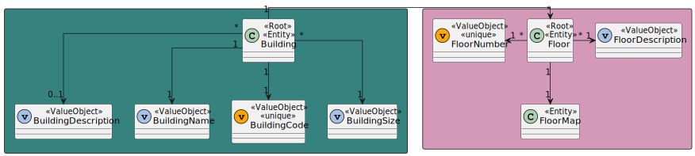
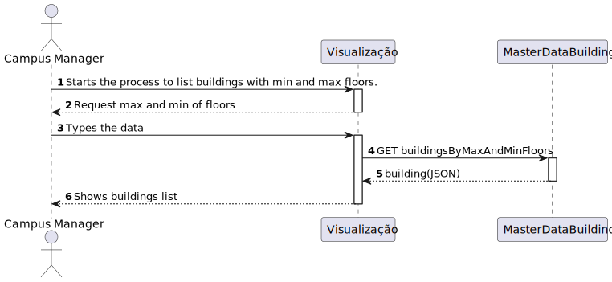
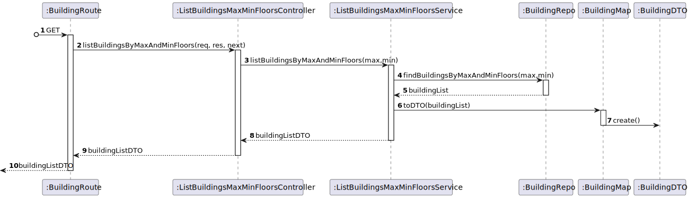

# US 180 - As a Campus Manager, I want to list buildings with min and max floors.

## 1. Context

* First time that this task is developed.
* This task is relative to system user Campus Manager .

## 2. Requirements

**US 180 -** As a Campus Manager, I want to list buildings with min and max floors.

**Dependencies:**
- **US150 -** As a Campus Manager, I want to create a building.

**Regarding this requirement we understand that:** <br>
As a Campus Manager, an actor of the system, I will be able to access the system list buildings specifying a min and max of floors.

## 3. Analysis

**Analyzing this User Story we understand that:**
* Campus Manager is a user role that manages the data of the routes and maps.
* Building is a structure within the campus that houses various rooms and facilities. It can be navigated by the robisep robots using corridors and elevators.
* Floor is a level within a building. Each floor can contain multiple rooms and is accessible by elevators and stairs (though robisep robots cannot use stairs).

### 3.1. Domain Model Excerpt



## 4. Design

### 4.1. Realization

### Level1
###### LogicalView:


###### SceneryView:


###### ProcessView:


#### Level2

###### LogicalView:


###### ImplementationView:


###### PhysicalView:


###### ProcessView:


#### Level3
###### LogicalView:


###### ImplementationView:


###### ProcessView:



### 4.3. Applied Patterns
* Controller
* Service
* Repository
* Mapper
* DTO
* GRASP


### 4.4. Tests

**Test 1:** *Tests the controller's behavior in isolation by stubbing the service, ensuring it correctly handles the data received from the service, and responds appropriately.*
```
it("BuildingController unit test using BuildingService stub", async function() {
		// Arrange
		let body = {};
		let req: Partial<Request> = {};
		req.body = body;
		req.params = {
			max: "3",
			min: "1"
		  }
		let res: Partial<Response> = {
		  json: sinon.spy(),
		  status: sinon.stub().returnsThis(),
		  send: sinon.spy()
		};
		let next: Partial<NextFunction> = () => {};

		let listBuildingsMaxMinFloorsServiceInstance = Container.get("listBuildingsMaxMinFloorsService");

		// Stub the createBuilding method in the BuildingService
		const buildingDTO = {
			buildingName: "EdificioA",
			buildingDescription: "uma descricao",
			buildingCode: "A",
			buildingLength: 2,
			buildingWidth: 2
		  } as IBuildingDTO

		  const building = Building.create({
			buildingName: new BuildingName({ value: buildingDTO.buildingName }),
			buildingDescription: new BuildingDescription({ value: buildingDTO.buildingDescription }),
			buildingSize: new BuildingSize({ length: buildingDTO.buildingLength, width: buildingDTO.buildingWidth }),
			floors: [],
		  }, buildingDTO.buildingCode).getValue()

		  const floor = Floor.create(
			{
			  "floorNumber": new FloorNumber({number: 1}),
			  "floorDescription": new FloorDescription({ value: 'Test floor' }),
			  "floormap": new FloorMap(
				{
				  map: [[]],
				  passageways: [],
				  rooms: [],
				  elevators: [],
				  passagewaysCoords: [],
				  elevatorsCoords: [],
				  roomsCoords: [],
				}
			  )
		  }, 1 ).getValue()

		  building.addFloor(floor);


		sinon.stub(listBuildingsMaxMinFloorsServiceInstance, "listBuildingsMaxMinFloors").returns(Result.ok<IBuildingDTO[]>([buildingDTO]));


		const ctrl = new ListBuildingsMaxMinFloorsController(listBuildingsMaxMinFloorsServiceInstance as IListBuildingsMaxMinFloorsService);

		// Act
		await ctrl.listBuildingsMaxMinFloors(<Request>req, <Response>res, <NextFunction>next);

		// Assert
		sinon.assert.calledOnce(res.json);
		sinon.assert.calledWith(res.json, sinon.match([buildingDTO]));
	});
````

**Test 2:** *Tests the interaction between the controller and the actual service, making sure that the controller correctly processes and responds to data received from the service.*
```
it("BuildingController + BuildingService integration test", async function() {
		// Arrange
		let body = {};
		let req: Partial<Request> = {};
		req.body = body;
		req.params = {
			max: "3",
			min: "1"
		  }
		let res: Partial<Response> = {
		  json: sinon.spy(),
		  status: sinon.stub().returnsThis(),
		  send: sinon.spy()
		};
		let next: Partial<NextFunction> = () => {};

		// Stub repo methods
		let listBuildingsMaxMinFloorsServiceInstance = Container.get("listBuildingsMaxMinFloorsService");

		// Stub the createBuilding method in the BuildingService
		const buildingDTO = {
			buildingName: "EdificioA",
			buildingDescription: "uma descricao",
			buildingCode: "A",
			buildingLength: 2,
			buildingWidth: 2
		  } as IBuildingDTO

		const building = Building.create({
			buildingName: new BuildingName({ value: buildingDTO.buildingName }),
			buildingDescription: new BuildingDescription({ value: buildingDTO.buildingDescription }),
			buildingSize: new BuildingSize({ length: buildingDTO.buildingLength, width: buildingDTO.buildingWidth }),
			floors: [],
		}, buildingDTO.buildingCode).getValue()

		const floor = Floor.create(
			{
			  "floorNumber": new FloorNumber({number: 1}),
			  "floorDescription": new FloorDescription({ value: 'Test floor' }),
			  "floormap": new FloorMap(
				{
				  map: [[]],
				  passageways: [],
				  rooms: [],
				  elevators: [],
				  passagewaysCoords: [],
				  elevatorsCoords: [],
				  roomsCoords: [],
				}
			  )
		  	}, 1 ).getValue()

		building.addFloor(floor);

		buildingRepoMock.findBuildingsMaxMinFloors.resolves([building]);

		const listBuildingsMaxMinFloorsServiceSpy = sinon.spy(listBuildingsMaxMinFloorsServiceInstance, "listBuildingsMaxMinFloors");

		const ctrl = new ListBuildingsMaxMinFloorsController(listBuildingsMaxMinFloorsServiceInstance as IListBuildingsMaxMinFloorsService);

		// Act
		await ctrl.listBuildingsMaxMinFloors(<Request>req, <Response>res, <NextFunction>next);

		// Assert
		sinon.assert.calledOnce(res.json);
		sinon.assert.calledWith(res.json,sinon.match([{
			buildingCode: "A",
			buildingDescription: "uma descricao",
			buildingFloors: [1],
			buildingLength: 2,
			buildingName: "EdificioA",
			buildingWidth: 2
		  }]));
		sinon.assert.calledOnce(listBuildingsMaxMinFloorsServiceSpy);
	  });
````
**Test 3:** *Checks if the controller handles and responds to service errors properly, ensuring it sends an appropriate response to the client.*
```
it("BuildingController + BuildingService integration test (Test 500 Internal server Error)", async function() {
		// Arrange
		let body = {};
		let req: Partial<Request> = {};
		req.body = body;
		req.params = {
			max: "3",
			min: "1"
		  }
		let res: Partial<Response> = {
		  json: sinon.spy(),
		  status: sinon.stub().returnsThis(),
		  send: sinon.spy()
		};
		let next: Partial<NextFunction> = () => {};

		// Stub repo methods
		const buildingDTO = {
			buildingName: "EdificioA",
			buildingDescription: "uma descricao",
			buildingCode: "A",
			buildingLength: 2,
			buildingWidth: 2
		  } as IBuildingDTO

		  const building = Building.create({
			buildingName: new BuildingName({ value: buildingDTO.buildingName }),
			buildingDescription: new BuildingDescription({ value: buildingDTO.buildingDescription }),
			buildingSize: new BuildingSize({ length: buildingDTO.buildingLength, width: buildingDTO.buildingWidth }),
			floors: [],
		  }, buildingDTO.buildingCode).getValue()

		  const floor = Floor.create(
			{
			  "floorNumber": new FloorNumber({number: 1}),
			  "floorDescription": new FloorDescription({ value: 'Test floor' }),
			  "floormap": new FloorMap(
				{
				  map: [[]],
				  passageways: [],
				  rooms: [],
				  elevators: [],
				  passagewaysCoords: [],
				  elevatorsCoords: [],
				  roomsCoords: [],
				}
			  )
		  }, 1 ).getValue()

		  building.addFloor(floor);

		buildingRepoMock.findBuildingsMaxMinFloors.resolves(building);

		let listBuildingsMaxMinFloorsServiceInstance = Container.get("listBuildingsMaxMinFloorsService");
		const listBuildingsMaxMinFloorsServiceSpy = sinon.spy(listBuildingsMaxMinFloorsServiceInstance, "listBuildingsMaxMinFloors");

		const ctrl = new ListBuildingsMaxMinFloorsController(listBuildingsMaxMinFloorsServiceInstance as IListBuildingsMaxMinFloorsService);

		// Act
		await ctrl.listBuildingsMaxMinFloors(<Request>req, <Response>res, <NextFunction>next);

		// Assert
		sinon.assert.calledOnce(res.json);
		sinon.assert.calledWith(res.json,sinon.match({ error: "Internal Server Error" }));
		sinon.assert.calledOnce(res.status);
		sinon.assert.calledWith(res.status,500);
	  });
````

**Test 4:** *Checks if the controller can correctly handle the scenario where no data is returned from the service, responding with an appropriate message.*
```
it("BuildingController + BuildingService integration test (No buildings found)", async function() {
		// Arrange
		let body = {};
		let req: Partial<Request> = {};
		req.body = body;
		req.params = {
			max: "3",
			min: "1"
		  }
		let res: Partial<Response> = {
		  json: sinon.spy(),
		  status: sinon.stub().returnsThis(),
		  send: sinon.spy()
		};
		let next: Partial<NextFunction> = () => {};

		// Stub repo methods
		buildingRepoMock.findBuildingsMaxMinFloors.resolves([]);

		let listBuildingsMaxMinFloorsServiceInstance = Container.get("listBuildingsMaxMinFloorsService");
		const listBuildingsMaxMinFloorsServiceSpy = sinon.spy(listBuildingsMaxMinFloorsServiceInstance, "listBuildingsMaxMinFloors");

		const ctrl = new ListBuildingsMaxMinFloorsController(listBuildingsMaxMinFloorsServiceInstance as IListBuildingsMaxMinFloorsService);

		// Act
		await ctrl.listBuildingsMaxMinFloors(<Request>req, <Response>res, <NextFunction>next);

		// Assert
		sinon.assert.calledOnce(res.status);
        sinon.assert.calledWith(res.status,400);
        sinon.assert.calledOnce(res.send);
        sinon.assert.calledWith(res.send, sinon.match("No buildings found"));
	  });
````

**Test 5:** *Ensures the controller validates input data and correctly responds when the input parameters do not meet the required criteria.*
```
it("BuildingController + BuildingService integration test (max < min)", async function() {
		// Arrange
		let body = {};
		let req: Partial<Request> = {};
		req.body = body;
		req.params = {
			max: "3",
			min: "5"
		  }
		let res: Partial<Response> = {
		  json: sinon.spy(),
		  status: sinon.stub().returnsThis(),
		  send: sinon.spy()
		};
		let next: Partial<NextFunction> = () => {};

		// Stub repo methods
		buildingRepoMock.findBuildingsMaxMinFloors.resolves([]);

		let listBuildingsMaxMinFloorsServiceInstance = Container.get("listBuildingsMaxMinFloorsService");
		const listBuildingsMaxMinFloorsServiceSpy = sinon.spy(listBuildingsMaxMinFloorsServiceInstance, "listBuildingsMaxMinFloors");

		const ctrl = new ListBuildingsMaxMinFloorsController(listBuildingsMaxMinFloorsServiceInstance as IListBuildingsMaxMinFloorsService);

		// Act
		await ctrl.listBuildingsMaxMinFloors(<Request>req, <Response>res, <NextFunction>next);

		// Assert
		sinon.assert.calledOnce(res.status);
        sinon.assert.calledWith(res.status,400);
        sinon.assert.calledOnce(res.send);
        sinon.assert.calledWith(res.send, sinon.match("max < min"));
	  });
````

## 5. Implementation

### ListBuildingsMaxMinFloorsController
```
export default class ListBuildingsMaxMinFloorsController implements IListBuildingsMaxMinFloorsController {

    constructor(
        @Inject(config.services.listBuildingsMaxMinFloors.name) private listBuildingsMaxMinFloorsService: IListBuildingsMaxMinFloorsService
    )
    {}

    public async listBuildingsMaxMinFloors(req: Request, res: Response, next: NextFunction) {
        try{
            const max = Number(req.params.max);
            const min = Number(req.params.min);

            const buildingsOrError = await this.listBuildingsMaxMinFloorsService.listBuildingsMaxMinFloors(max,min)

            if(buildingsOrError.isFailure){
                return res.status(400).send(buildingsOrError.errorValue())
            }

            res.status(200).json(buildingsOrError.getValue());
        }catch(error){
            res.status(500).json({ error: "Internal Server Error" });
        }
    }
}
````

#### ListBuildingsMaxMinFloorsService
```
@Service()
export default class listBuildingsMaxMinFloorsService implements IListBuildingsMaxMinFloorsService {

    constructor(
        @Inject(config.repos.building.name) private buildingRepo: IBuildingRepo
    )
    {}

    public async listBuildingsMaxMinFloors(max: number, min: number): Promise<Result<IBuildingDTO[]>> {
        if(max < min) return Result.fail<IBuildingDTO[]>("max < min")

        let values: IBuildingDTO[]  = [];

        const buildings = await this.buildingRepo.findBuildingsMaxMinFloors(max,min)


        if(buildings.length === 0) {
            return Result.fail<IBuildingDTO[]>("No buildings found")
        }

        buildings.forEach((element) => {
            values.push(BuildingMap.toDto(element))
        })

        return Result.ok<IBuildingDTO[]>(values)
    }

}
````

#### BuildingRepo - findBuildingsMaxMinFloors
```
public async findBuildingsMaxMinFloors(max: number, min: number): Promise<Building[]> {
        try {
            const buildings = await this.findAll();
            const filteredBuildings: Building[] = [];


            for (const element of buildings) {
                if (element.floors.length >= min && element.floors.length <= max) {
                    filteredBuildings.push(element);
                }
            }
            return filteredBuildings;
        } catch (error) {
            console.error("Error in findBuildingsMaxMinFloors:", error);
            throw error;
        }
    }
````
## 6. Integration/Demonstration
To use this US, you need to send an HTTP request.

Using this URI: localhost:4000/api/buildings/listBuildingsMaxMinFloors/${max}/${min}

${max} is the maximum number of floors. Ex: 10
${min} is the minimum number if floors. Ex: 5

${max} should be biggest than ${min}


## 7. Observations
