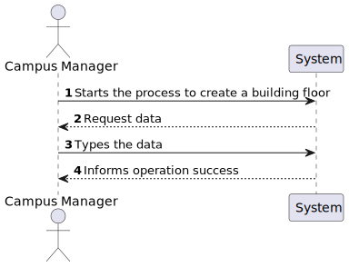

# US 190 - As a Campus Manager, I want to create building floor

## 1. Context

* First time that this task is developed.
* This task is relative to system user Fleet Manager .

## 2. Requirements

**US 190 -** As a Campus Manager, I want to create building floor

> **Q**: Será possível esclarecer como funcionarão estas user stories??
>
> **A**: O requisito 190 Criar piso permite definir um piso para um dos edificios criados anteriormente, por exemplo, o piso 1 do edificio B com uma breve descrição (ex., "salas TP".

**Dependencies:**

* **US150 -** As a Campus Manager, I want to create a building.

**Regarding this requirement we understand that:**

As a Campus Manager, an actor of the system, I will be able to access the system and create building floor.

## 3. Analysis

**Analyzing this User Story we understand that:**

* Campus Manager is a user role that manages the data of the routes and maps.
* Building is a structure within the campus that houses various rooms and facilities. It can be navigated by the robisep robots using corridors and elevators.
* Floor is a level within a building. Each floor can contain multiple rooms and is accessible by elevators and stairs (though robisep robots cannot use stairs).
* The floor information is based on: Floor Number, Floor Description and each floor coordinate info(wall,door,elevator,etc)
* Floor example:

|  3  |  2  |  2  |  2  |  2  |  3  |  2  |  2  |  1  |
|:---:|:---:|:---:|:---:|:---:|:---:|:---:|:---:|:---:|
|  1  |     |     |     |     |  1  |     |     |  1  |
| 18  |  2  |  2  |  6  |  2  |  2  |  6  |  2  |  8  |
| 16  |     |     |     |     |     |     |     |  8  |
|  3  |  2  |  2  |  2  |  2  |  2  |  5  |     |  1  |
|  1  |     |     |     |     |     |  1  |     | 16  |
|  1  |     |     |     |     |     |  1  |     | 16  |
|  2  |  2  |  2  |  2  |  2  |  2  |  2  |  2  |     |


| description.map[][] | North wall | West wall | Door | Elevator | Passageway |
|:-------------------:|:----------:|:---------:|:----:|:--------:|:----------:|
|          0          |     No     |    No     |  No  |    No    |     No     |
|          1          |     No     |    Yes    |  No  |    No    |     No     |
|          2          |    Yes     |    No     |  No  |    No    |     No     |
|          3          |    Yes     |    Yes    |  No  |    No    |     No     |
|          4          |     No     |    No     | Yes  |    No    |     No     |
|          5          |     No     |    Yes    | Yes  |    No    |     No     |
|          6          |    Yes     |    No     | Yes  |    No    |     No     |
|          7          |    Yes     |    Yes    | Yes  |    No    |     No     |
|          8          |     No     |    No     |  No  |   Yes    |     No     |
|          9          |     No     |    Yes    |  No  |   Yes    |     No     |
|         10          |    Yes     |    No     |  No  |   Yes    |     No     |
|         11          |    Yes     |    Yes    |  No  |   Yes    |     No     |
|         12          |     No     |    No     | Yes  |   Yes    |     No     |
|         13          |     No     |    Yes    | Yes  |   Yes    |     No     |
|         14          |    Yes     |    No     | Yes  |   Yes    |     No     |
|         15          |    Yes     |    Yes    | Yes  |   Yes    |     No     |
|         16          |     No     |    No     |  No  |    No    |    Yes     |
|         17          |     No     |    Yes    |  No  |    No    |    Yes     |
|         18          |    Yes     |    No     |  No  |    No    |    Yes     |
|         19          |    Yes     |    Yes    |  No  |    No    |    Yes     |
|         20          |     No     |    No     | Yes  |    No    |    Yes     |
|         21          |     No     |    Yes    | Yes  |    No    |    Yes     |
|         22          |    Yes     |    No     | Yes  |    No    |    Yes     |
|         23          |    Yes     |    Yes    | Yes  |    No    |    Yes     |
|         24          |     No     |    No     |  No  |   Yes    |    Yes     |
|         25          |     No     |    Yes    |  No  |   Yes    |    Yes     |
|         26          |    Yes     |    No     |  No  |   Yes    |    Yes     |
|         27          |    Yes     |    Yes    |  No  |   Yes    |    Yes     |
|         28          |     No     |    No     | Yes  |   Yes    |    Yes     |
|         29          |     No     |    Yes    | Yes  |   Yes    |    Yes     |
|         30          |    Yes     |    No     | Yes  |   Yes    |    Yes     |
|         31          |    Yes     |    Yes    | Yes  |   Yes    |    Yes     |


### 3.1. Domain Model Excerpt


### 3.2. System Sequence Diagram



## 4. Design

### 4.1. Realization

Level 2:


Level 3:

In order to resolve this US we will make use of the folliwing classes:

1. CreateFloorController
2. CreateFloorService
3. FloorRepo
4. FloorMap
5. FloorDto
6. Floor
7. Building
8. BuildingMap
9. BuildingRepo

We will make also use of CreateFloorRoute file, inside this file we will put our route for any post request regarding the floor creation


### 4.2. Class Diagram


### 4.3. Applied Patterns

* Controller
* Repository
* Service
* Dto
* Mapper

### 4.4. Tests

```javascript
it('floor create valid test', async function {

})
```

```javascript
it('floor create invalid test', async function {

})
```

```javascript
it('controller unit test with stud service', async function {

})
```

```javascript
it('service unit test with stud repo', async function {

})
```

```javascript
it('controller + service + repo test with stud database', async function {

})
```

## 5. Implementation

## 6. Integration/Demonstration

## 7. Observations
