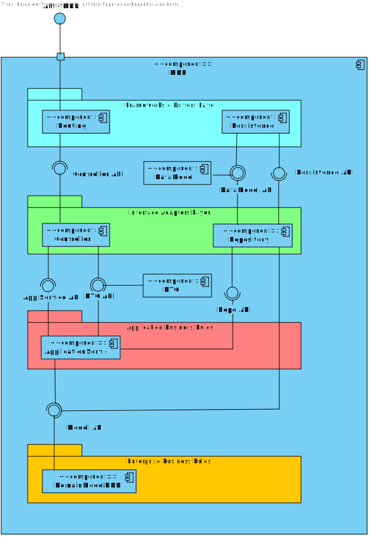

# US 190 - As a Campus Manager, I want to create building floor

## 1. Context

* First time that this task is developed.
* This task is relative to system user Fleet Manager .

## 2. Requirements

**US 190 -** As a Campus Manager, I want to create building floor

> **Q**: Será possível esclarecer como funcionarão estas user stories?? <br>
> **A**: O requisito 190 Criar piso permite definir um piso para um dos edificios criados anteriormente, por exemplo, o piso 1 do edificio B com uma breve descrição (ex., "salas TP". <br>


**Dependencies:**
- **US150 -** As a Campus Manager, I want to create a building.

**Regarding this requirement we understand that:** <br>
As a Campus Manager, an actor of the system, I will be able to access the system and create building floor.

## 3. Analysis

**Analyzing this User Story we understand that:**
* Campus Manager is a user role that manages the data of the routes and maps.
* Building is a structure within the campus that houses various rooms and facilities. It can be navigated by the robisep robots using corridors and elevators.
* Floor is a level within a building. Each floor can contain multiple rooms and is accessible by elevators and stairs (though robisep robots cannot use stairs).
* The floor information is based on: Floor Number, Floor Description and each floor coordinate info(wall,door,elevator,etc)
* Floor example:

|  7  |  6  |  6  |  6  |  6  |  7  |  6  |  6  |  2  |
|:---:|:---:|:---:|:---:|:---:|:---:|:---:|:---:|:---:|
|  5  |  4  |  4  |  4  |  4  |  5  |  4  |  4  |  2  |
| 13  |  2  |  2  |  9  |  2  |  2  |  9  |  2  | 14  |
|  0  |  0  |  0  |  0  |  0  |  0  |  0  |  0  | 14  |
|  7  |  6  |  6  |  6  |  6  |  6  |  8  |  0  |  2  |
|  5  |  4  |  4  |  4  |  4  |  4  |  1  |  0  | 12  |
|  5  |  4  |  4  |  4  |  4  |  4  |  1  |  0  | 12  |
|  2  |  2  |  2  |  2  |  2  |  2  |  2  |  2  |  0  |


| description.map[][] | North wall | West wall | Door | Elevator | Passageway | Room |
|:-------------------:|:----------:|:---------:|:----:|:--------:|:----------:|:----:|
|          0          |     No     |    No     |  No  |    No    |     No     |  No  |
|          1          |     No     |    Yes    |  No  |    No    |     No     |  No  |
|          2          |    Yes     |    No     |  No  |    No    |     No     |  No  |
|          3          |    Yes     |    Yes    |  No  |    No    |     No     |  No  |
|          4          |     No     |    No     |  No  |    No    |     No     | Yes  |
|          5          |     No     |    Yes    |  No  |    No    |     No     | Yes  |
|          6          |    Yes     |    No     |  No  |    No    |     No     | Yes  |
|          7          |    Yes     |    Yes    |  No  |    No    |     No     | Yes  |
|          8          |     No     |    Yes    | Yes  |    No    |     No     |  No  |
|          9          |    Yes     |    No     | Yes  |    No    |     No     |  No  |
|         10          |     No     |    Yes    | Yes  |    No    |     No     | Yes  |
|         11          |    Yes     |    No     | Yes  |    No    |     No     | Yes  |
|         12          |     No     |    No     |  No  |    No    |    Yes     |  No  |
|         13          |    Yes     |    No     |  No  |    No    |    Yes     |  No  |
|         14          |     No     |    No     |  No  |   Yes    |     No     |  No  |


### 3.1. Domain Model Excerpt


## 4. Design

### 4.1. Realization

### Level1
###### LogicalView:


###### SceneryView:


###### ProcessView:


#### Level2

###### LogicalView:


###### ImplementationView:


###### PhysicalView:


###### ProcessView:


#### Level3
###### LogicalView:


###### ImplementationView:


###### ProcessView:


In order to resolve this US we will make use of the folliwing classes:

1. CreateFloorController
2. CreateFloorService
3. FloorRepo
4. FloorMap
5. FloorDto
6. Floor
7. Building
8. BuildingMap
9. BuildingRepo

We will make also use of CreateFloorRoute file, inside this file we will put our route for any post request regarding the floor creation

### 4.3. Applied Patterns

* Controller
* Repository
* Service
* Dto
* Mapper

### 4.4. Tests

**Test 1:** *Checks if the Floor.create method correctly creates a floor with valid properties, including the floor description, floor number, and floor map.*
```
it('should create a valid floor', function () {
        const floorProps = {
          floorDescription: new FloorDescription({ value: 'Test floor' }),
          floorNumber: new FloorNumber({number: 1}),
          floormap: new FloorMap({
            map: [[]],
            passageways: [],
            rooms: [],
            elevators: [],
            elevatorsCoords: [],
            roomsCoords: [],
            passagewaysCoords: [],
          }),
        };
        const floorId = 5;
        const result = Floor.create(floorProps, floorId);

        assert(result.isSuccess);
        assert(result.getValue().description.description === 'Test floor');
        assert(result.getValue().id.toValue() === 5);
        assert(result.getValue().map.props.map.length === 1);
        assert(result.getValue().map.props.passageways.length === 0);
        assert(result.getValue().map.props.rooms.length === 0);
        assert(result.getValue().map.props.elevators.length === 0);

      });
````

**Test 2:** *Ensures that the method returns a failure result when an invalid floor ID is provided.*
```
it('should fail to create a floor with negative id', function () {
        const floorProps = {
          floorDescription: new FloorDescription({ value: 'Test floor' }),
          floorNumber: new FloorNumber({number: 1}),
          floormap: new FloorMap({
            map: [[]],
            passageways: [],
            rooms: [],
            elevators: [],
            elevatorsCoords: [],
            roomsCoords: [],
            passagewaysCoords: [],
          }),
        };
        const floorId = -1;
        const result = Floor.create(floorProps, floorId);

        assert(result.isFailure);
        assert(result.error === 'Invalid floor');
      });
````

**Test 3:** *Verifies that the method returns a failure result when the description exceeds the maximum allowed length.*
```
it('should fail to create a floor with description longer than 250 characters', function () {
        const floorProps = {
          floorDescription: new FloorDescription({ value: 'a'.repeat(251) }),
          floorNumber: new FloorNumber({number: 1}),
          floormap: new FloorMap({
            map: [[]],
            passageways: [],
            rooms: [],
            elevators: [],
            elevatorsCoords: [],
            roomsCoords: [],
            passagewaysCoords: [],
          }),
        };
        const floorId = 5;
        const result = Floor.create(floorProps, floorId);

        assert(result.isFailure);
        assert(result.error === 'Invalid floor');
      });
````

**Test 4:** *Tests the controller's behavior in isolation by stubbing the service, ensuring it correctly handles the data received from the service and responds appropriately.*
```
it('createFloorController unit test using createFloorService stub', async function () {
        // Arrange
        let body = {
          "floorId": 1,
          "floorNumber":  1,
          "floorDescription": "Joi.string().max(255)",
          "buildingCode": "A"
        };
        let req: Partial<Request> = {};
          req.body = body;
        let res: Partial<Response> = {
          json: sinon.spy(),
          status: sinon.stub().returnsThis(),
          send: sinon.spy()
        };
        let next: Partial<NextFunction> = () => {};

        const buildingDTO = {
          buildingName: "EdificioA",
          buildingDescription: "uma descricao",
          buildingCode: "A",
          buildingLength: 2,
          buildingWidth: 2
        } as IBuildingDTO

        const building = Building.create({
          buildingName: new BuildingName({ value: buildingDTO.buildingName }),
          buildingDescription: new BuildingDescription({ value: buildingDTO.buildingDescription }),
          buildingSize: new BuildingSize({ length: buildingDTO.buildingLength, width: buildingDTO.buildingWidth }),
          floors: [],
        }, buildingDTO.buildingCode)

        buildingRepoMock.findByBuidingCode.resolves(building)

        let createFloorServiceInstance = Container.get("createFloorService");
        sinon.stub(createFloorServiceInstance, "createFloor").returns(Result.ok<IFloorDTO>(
          {
            "floorId": 1,
            "floorNumber": 1,
            "floorDescription": "Joi.string().max(255)",
            "floorMap": {
                "map": [],
                "passageways": [],
                "rooms": [],
                "elevators": [],
                "passagewaysCoords": [],
                "elevatorsCoords": [],
                "roomCoords": []
            }
        } ));

        const ctrl = new createFloorController(createFloorServiceInstance as ICreateFloorService);

        // Act
        await ctrl.createFloor(<Request>req, <Response>res, <NextFunction>next);

        // Assert
        sinon.assert.calledOnce(res.json);
        sinon.assert.calledWith(res.json, sinon.match({
          "floorId": 1,
          "floorNumber": 1,
          "floorDescription": "Joi.string().max(255)",
          "floorMap": {
              "map": [],
              "passageways": [],
              "rooms": [],
              "elevators": [],
              "passagewaysCoords": [],
              "elevatorsCoords": [],
              "roomCoords": []
          }
      }));
      });
````

**Test 5:** *Tests the interaction between the controller and the actual service, making sure that the controller correctly processes and responds to data received from the service.*
```
it("BuildingController + BuildingService integration test", async function() {
        // Arrange
        let body = {
          "floorId": 1,
          "floorNumber":  1,
          "floorDescription": "Joi.string().max(255)",
          "buildingCode": "A"
        };
        let req: Partial<Request> = {
          body: body
        };
        let res: Partial<Response> = {
          json: sinon.spy(),
          status: sinon.stub().returnsThis(),
          send: sinon.spy()
        };
        let next: Partial<NextFunction> = () => {};

        // Stub repo methods
        const buildingDTO = {
          buildingName: "EdificioA",
          buildingDescription: "uma descricao",
          buildingCode: "A",
          buildingLength: 2,
          buildingWidth: 2
        } as IBuildingDTO

        const building = Building.create({
          buildingName: new BuildingName({ value: buildingDTO.buildingName }),
          buildingDescription: new BuildingDescription({ value: buildingDTO.buildingDescription }),
          buildingSize: new BuildingSize({ length: buildingDTO.buildingLength, width: buildingDTO.buildingWidth }),
          floors: [],
        }, buildingDTO.buildingCode)

        buildingRepoMock.findByBuidingCode.resolves(building.getValue())

        floorRepoMock.findById.resolves(null);
        floorRepoMock.save.resolves(Floor.create(
          {
            "floorNumber": new FloorNumber({number: 1}),
            "floorDescription": new FloorDescription({ value: 'Test floor' }),
            "floormap": new FloorMap(
              {
                map: [[]],
                passageways: [],
                rooms: [],
                elevators: [],
                passagewaysCoords: [],
                elevatorsCoords: [],
                roomsCoords: [],
              }
            )
        }, 1 ).getValue());


        let floorServiceInstance = Container.get("createFloorService");
        const floorServiceSpy = sinon.spy(floorServiceInstance, "createFloor");

        const ctrl = new CreateFloorController(floorServiceInstance as ICreateFloorService);

        // Act
        await ctrl.createFloor(<Request>req, <Response>res, <NextFunction>next);

        // Assert
        sinon.assert.calledOnce(res.json);
        sinon.assert.calledWith(res.json, sinon.match({
          "floorId": 1,
          "floorNumber": 1,
          "floorDescription": "Joi.string().max(255)",
          "floorMap": {
              "map": [],
              "passageways": [],
              "rooms": [],
              "elevators": [],
              "passagewaysCoords": [],
              "elevatorsCoords": [],
              "roomCoords": []
          }
      }));
        sinon.assert.calledOnce(floorServiceSpy);

      });
````

**Test 6:** *Checks if the controller handles the scenario where the building is not found and responds with an appropriate error message.*
```
it("BuildingController + BuildingService integration test (Building Not Found)", async function() {
        // Arrange
        let body = {
          "floorId": 1,
          "floorNumber":  1,
          "floorDescription": "Joi.string().max(255)",
          "buildingCode": "A"
        };
        let req: Partial<Request> = {
          body: body
        };
        let res: Partial<Response> = {
          json: sinon.spy(),
          status: sinon.stub().returnsThis(),
          send: sinon.spy()
        };
        let next: Partial<NextFunction> = () => {};

        // Stub repo methods
        buildingRepoMock.findByBuidingCode.resolves(null)
        floorRepoMock.findById.resolves(null);
        floorRepoMock.save.resolves(Floor.create(
          {
            "floorNumber": new FloorNumber({number: 1}),
            "floorDescription": new FloorDescription({ value: 'Test floor' }),
            "floormap": new FloorMap(
              {
                map: [[]],
                passageways: [],
                rooms: [],
                elevators: [],
                passagewaysCoords: [],
                elevatorsCoords: [],
                roomsCoords: [],
              }
            )
        }, 1 ).getValue());


        let floorServiceInstance = Container.get("createFloorService");
        const floorServiceSpy = sinon.spy(floorServiceInstance, "createFloor");

        const ctrl = new CreateFloorController(floorServiceInstance as ICreateFloorService);

        // Act
        await ctrl.createFloor(<Request>req, <Response>res, <NextFunction>next);

        // Assert

        sinon.assert.calledOnce(floorServiceSpy);
        sinon.assert.calledOnce(res.status);
        sinon.assert.calledWith(res.status,400);
        sinon.assert.calledOnce(res.send);
        sinon.assert.calledWith(res.send, sinon.match("Building not found"));

      });
````

**Test 7:** *Ensures that the controller handles the scenario where the floor ID is already in use and responds with an appropriate error message.*
```
it("BuildingController + BuildingService integration test (Floor Already exist)", async function() {
        // Arrange
        let body = {
          "floorId": 1,
          "floorNumber":  1,
          "floorDescription": "Joi.string().max(255)",
          "buildingCode": "A"
        };
        let req: Partial<Request> = {
          body: body
        };
        let res: Partial<Response> = {
          json: sinon.spy(),
          status: sinon.stub().returnsThis(),
          send: sinon.spy()
        };
        let next: Partial<NextFunction> = () => {};

        // Stub repo methods
        const buildingDTO = {
          buildingName: "EdificioA",
          buildingDescription: "uma descricao",
          buildingCode: "A",
          buildingLength: 2,
          buildingWidth: 2
        } as IBuildingDTO

        const building = Building.create({
          buildingName: new BuildingName({ value: buildingDTO.buildingName }),
          buildingDescription: new BuildingDescription({ value: buildingDTO.buildingDescription }),
          buildingSize: new BuildingSize({ length: buildingDTO.buildingLength, width: buildingDTO.buildingWidth }),
          floors: [],
        }, buildingDTO.buildingCode)

        buildingRepoMock.findByBuidingCode.resolves(Result.ok<Building>(building.getValue()))

        floorRepoMock.findById.resolves(Floor.create(
          {
            "floorNumber": new FloorNumber({number: 1}),
            "floorDescription": new FloorDescription({ value: 'Test floor' }),
            "floormap": new FloorMap(
              {
                map: [[]],
                passageways: [],
                rooms: [],
                elevators: [],
                passagewaysCoords: [],
                elevatorsCoords: [],
                roomsCoords: [],
              }
            )
        }, 1 ).getValue())


        let floorServiceInstance = Container.get("createFloorService");
        const floorServiceSpy = sinon.spy(floorServiceInstance, "createFloor");

        const ctrl = new CreateFloorController(floorServiceInstance as ICreateFloorService);

        // Act
        await ctrl.createFloor(<Request>req, <Response>res, <NextFunction>next);

        // Assert

        sinon.assert.calledOnce(res.status);
        sinon.assert.calledWith(res.status,400);
        sinon.assert.calledOnce(res.send);
        sinon.assert.calledWith(res.send, sinon.match("Floor already exists"));

      });
````

## 5. Implementation

### CreateFloorController
```
export default class CreateFloorController implements ICreateFloorController {

    constructor(
        @Inject(config.services.createFloor.name) private service: ICreateFloorService
    )
    {}

    public async createFloor(req: Request, res: Response, next: NextFunction) {
        try {
            const FloorOrError = await this.service.createFloor(req.body as ICreateFloorDTO) as Result<IFloorDTO>

            if (FloorOrError.isFailure) {
                return res.status(400).send(FloorOrError.errorValue())
            }

            const FloorDTO = FloorOrError.getValue();
            return res.status(201).json(FloorDTO);

        }catch (e){
            return next(e);
        }
    }
}
````

### CreateFloorService
```
export default class CreateFloorService implements ICreateFloorService {

    constructor(
        @Inject(config.repos.floor.name) private floorRepo: IFloorRepo,
        @Inject(config.repos.building.name) private buildingRepo: IBuildingRepo
    ) { }

    public async createFloor(createFloorDTO: ICreateFloorDTO): Promise<Result<IFloorDTO>> {

        try {
            const buildingResult = await this.buildingRepo.findByBuidingCode(new BuildingCode(createFloorDTO.buildingCode))
            if (buildingResult == null) {
                return Result.fail<IFloorDTO>("Building not found")
            }

            const floor = await this.floorRepo.findById(createFloorDTO.floorId)
            if(floor != null){
                return Result.fail<IFloorDTO>("Floor already exists")
            }

            const floors = buildingResult.floors
            for (let i = 0; i < floors.length; i++) {
                if (floors[i].floorNumber.number == createFloorDTO.floorNumber) {
                    return Result.fail<IFloorDTO>("Floor number already exists")
                }
            }

            const FloorOrError = await Floor.create(
                {
                    floorDescription: new FloorDescription({ value: createFloorDTO.floorDescription }),
                    floorNumber: new FloorNumber({number: createFloorDTO.floorNumber}),
                    floormap: new FloorMap({
                        map: [],
                        passageways: [],
                        elevators: [],
                        rooms: [],
                        passagewaysCoords: [],
                        elevatorsCoords: [],
                        roomsCoords: [],
                    })
                }, createFloorDTO.floorId)


            if (FloorOrError.isFailure) {
                return Result.fail<IFloorDTO>(FloorOrError.errorValue())
            }


            const floorResult = FloorOrError.getValue()


            buildingResult.addFloor(floorResult);

            await this.floorRepo.save(floorResult);
            await this.buildingRepo.save(buildingResult);

            const floorDtoResult = FloorMaper.toDto(floorResult) as IFloorDTO
            return Result.ok<IFloorDTO>(floorDtoResult)

        } catch (e) {
            throw e
        }
    }
}
````

### Floor
```
interface FloorProps {
  floorDescription: FloorDescription
  floorNumber: FloorNumber
  floormap: FloorMap
}

export class Floor extends AggregateRoot<FloorProps> {

  private constructor(props: FloorProps, floorNumber: FloorId) {
    super(props, floorNumber);
  }

  get floorId(): FloorId {
    return this.id
  }

  get floorNumber(): FloorNumber {
    return this.props.floorNumber
  }

  get description(): FloorDescription {
    return this.props.floorDescription
  }

  get map(): FloorMap {
    return this.props.floormap
  }

  loadFloorMapAndUpdate(layout: number[][], passageways: DoubleCoords[], elevators: SingleCoords[], rooms: DoubleCoords[]) {
    this.map.loadFloorMap(layout)
    this.map.updateFloorObjectsCoordinates(passageways, elevators, rooms)
  }

  public static create(floorProp: FloorProps, floorId: number): Result<Floor> {

    if (floorId < 0 || floorProp.floorDescription.description.length > 250) {
      return Result.fail<Floor>('Invalid floor')
    }

    const floor = new Floor({
      floorDescription: floorProp.floorDescription,
      floorNumber: floorProp.floorNumber,
      floormap: new FloorMap({
        map: floorProp.floormap.props.map,
        passageways: floorProp.floormap.props.passageways,
        rooms: floorProp.floormap.props.rooms,
        elevators: floorProp.floormap.props.elevators,
        passagewaysCoords: floorProp.floormap.props.passagewaysCoords,
        elevatorsCoords: floorProp.floormap.props.elevatorsCoords,
        roomsCoords: floorProp.floormap.props.roomsCoords
      })
    }, new FloorId(floorId))

    return Result.ok<Floor>(floor)
  }


  addPassageway(passageway: Passageway) {
    this.map.addPassageway(passageway)
  }

  removePassageway(passageway: Passageway) {
    this.map.removePassageway(passageway)
  }

  addElevators(elevator: Elevator) {
    if (this.props.floormap.props.elevators.includes(elevator)) throw new Error("Floor with Number" + this.props.floorNumber + "already has this elevator!")
    this.map.addElevators(elevator)
  }

  removeElevator(elevator: Elevator) {
    this.map.removeElevator(elevator)
  }

  addRoom(room: Room) {
    this.map.addRoom(room)
  }

}
````

## 6. Integration/Demonstration
To use this US, you need to send an HTTP request.

Using this URI: localhost:4000/api/floors/createFloor

With the following JSON
```
{
    "floorId": 1,
    "floorNumber":  1,
    "floorDescription": "Joi.string().max(255)",
    "buildingCode": "A"
}
````


## 7. Observations
