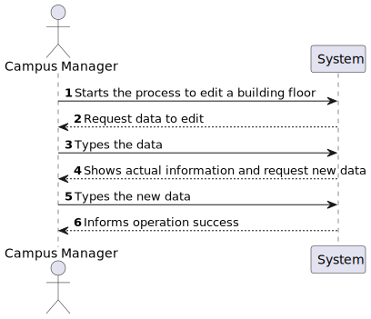
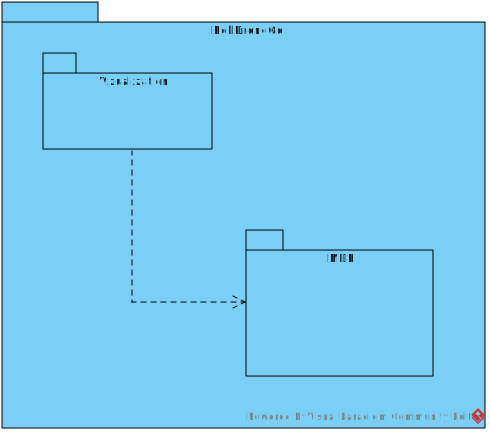

# US 200 - As a Campus Manager, I want to edit building floor information.

## 1. Context

* First time that this task is developed.
* This task is relative to system user Campus Manager .

## 2. Requirements

**US 200 -** As a Campus Manager, I want to edit building floor information.

**Dependencies:**
- **US150 -** As a Campus Manager, I want to create a building.
- **US190 -** As a Campus Manager, I want to create building floor.

**Regarding this requirement we understand that:** <br>
As a Campus Manager, an actor of the system, I will be able to access the system and edit building floor information(floor number, floor description).

## 3. Analysis

**Analyzing this User Story we understand that:**
* Campus Manager is a user role that manages the data of the routes and maps.
* Building is a structure within the campus that houses various rooms and facilities. It can be navigated by the robisep robots using corridors and elevators.
* Floor is a level within a building. Each floor can contain multiple rooms and is accessible by elevators and stairs (though robisep robots cannot use stairs).
* Floor example:

|  7  |  6  |  6  |  6  |  6  |  7  |  6  |  6  |  2  |
|:---:|:---:|:---:|:---:|:---:|:---:|:---:|:---:|:---:|
|  5  |  4  |  4  |  4  |  4  |  5  |  4  |  4  |  2  |
| 13  |  2  |  2  |  9  |  2  |  2  |  9  |  2  | 14  |
|  0  |  0  |  0  |  0  |  0  |  0  |  0  |  0  | 14  |
|  7  |  6  |  6  |  6  |  6  |  6  |  8  |  0  |  2  |
|  5  |  4  |  4  |  4  |  4  |  4  |  1  |  0  | 12  |
|  5  |  4  |  4  |  4  |  4  |  4  |  1  |  0  | 12  |
|  2  |  2  |  2  |  2  |  2  |  2  |  2  |  2  |  0  |


| description.map[][] | North wall | West wall | Door | Elevator | Passageway | Room |
|:-------------------:|:----------:|:---------:|:----:|:--------:|:----------:|:----:|
|          0          |     No     |    No     |  No  |    No    |     No     |  No  |
|          1          |     No     |    Yes    |  No  |    No    |     No     |  No  |
|          2          |    Yes     |    No     |  No  |    No    |     No     |  No  |
|          3          |    Yes     |    Yes    |  No  |    No    |     No     |  No  |
|          4          |     No     |    No     |  No  |    No    |     No     | Yes  |
|          5          |     No     |    Yes    |  No  |    No    |     No     | Yes  |
|          6          |    Yes     |    No     |  No  |    No    |     No     | Yes  |
|          7          |    Yes     |    Yes    |  No  |    No    |     No     | Yes  |
|          8          |     No     |    Yes    | Yes  |    No    |     No     |  No  |
|          9          |    Yes     |    No     | Yes  |    No    |     No     |  No  |
|         10          |     No     |    Yes    | Yes  |    No    |     No     | Yes  |
|         11          |    Yes     |    No     | Yes  |    No    |     No     | Yes  |
|         12          |     No     |    No     |  No  |    No    |    Yes     |  No  |
|         13          |    Yes     |    No     |  No  |    No    |    Yes     |  No  |
|         14          |     No     |    No     |  No  |   Yes    |     No     |  No  |


### 3.1. Domain Model Excerpt


## 4. Design

### 4.1. Realization

### Level1
###### LogicalView:


###### SceneryView:


###### ProcessView:


#### Level2

###### LogicalView:


###### ImplementationView:


###### PhysicalView:


###### ProcessView:


#### Level3
###### LogicalView:


###### ImplementationView:


###### ProcessView:


### 4.3. Applied Patterns
* Controller
* Service
* Repository
* Mapper
* DTO
* GRASP

### 4.4. Tests

**Test 1:** *Checks the behavior of the controller in isolation by stubbing the service, ensuring it correctly processes a valid request and responds with the expected result.*
```
it('editFloorController unit test using editFloorService stub', async function () {
        // Arrange
        let body = {
            "floorId": 1,
            "floorNumber":  2,
            "floorDescription": "Joi.string().max(254)"
        };
        let req: Partial<Request> = {};
          req.body = body;
        let res: Partial<Response> = {
          json: sinon.spy(),
          status: sinon.stub().returnsThis(),
          send: sinon.spy()
        };
        let next: Partial<NextFunction> = () => {};

        const FloorDTO = {
            floorId: 1,
            floorNumber: 2,
            floorDescription: "Joi.string().max(254)",
            floorMap: {
                map: [],
                passageways: [],
                rooms: [],
                elevators: [],
                passagewaysCoords: [],
                elevatorsCoords: [],
                roomCoords: []
            }
        } as IEditFloorDTO


        let editFloorServiceInstance = Container.get("editFloorService");
        sinon.stub(editFloorServiceInstance, "editFloor").returns(Result.ok<IEditFloorDTO>(FloorDTO));

        const ctrl = new editFloorController(editFloorServiceInstance as IEditFloorService);

        // Act
        await ctrl.editFloor(<Request>req, <Response>res, <NextFunction>next);

        // Assert
        sinon.assert.calledOnce(res.json);
        sinon.assert.calledWith(res.json, sinon.match({
            floorId: 1,
            floorNumber: 2,
            floorDescription: "Joi.string().max(254)",
            floorMap: {
                map: [],
                passageways: [],
                rooms: [],
                elevators: [],
                passagewaysCoords: [],
                elevatorsCoords: [],
                roomCoords: []
            }
            }));

    });
````

**Test 2:** *Verifies that the controller correctly interacts with the service and updates the floor with the provided information, returning the expected result.*
```
it("editFloorController + editFloorService integration test (All values)", async function() {
        // Arrange
        let body = {
            "floorId": 1,
            "floorNumber":  2,
            "floorDescription": "Joi.string().max(254)"
        };
        let req: Partial<Request> = {
          body: body
        };
        let res: Partial<Response> = {
          json: sinon.spy(),
          status: sinon.stub().returnsThis(),
          send: sinon.spy()
        };
        let next: Partial<NextFunction> = () => {};

        // Stub repo methods
        const FloorDTO = {
            floorId: 1,
            floorNumber: 1,
            floorDescription: "Joi.string().max(255)",
            floorMap: {
                map: [],
                passageways: [],
                rooms: [],
                elevators: [],
                passagewaysCoords: [],
                elevatorsCoords: [],
                roomCoords: []
            }
        } as IFloorDTO

        const floor = Floor.create(
			{
			  "floorNumber": new FloorNumber({number: FloorDTO.floorNumber}),
			  "floorDescription": new FloorDescription({ value: FloorDTO.floorDescription }),
			  "floormap": new FloorMap(
				{
				  map: [[]],
				  passageways: [],
				  rooms: [],
				  elevators: [],
				  passagewaysCoords: [],
				  elevatorsCoords: [],
				  roomsCoords: [],
				}
			  )
		}, FloorDTO.floorId).getValue()

        const buildingDTO = {
            buildingName: "EdificioA",
            buildingDescription: "uma descricao",
            buildingCode: "A",
            buildingLength: 2,
            buildingWidth: 2
          } as IBuildingDTO

          const building = Building.create({
            buildingName: new BuildingName({ value: buildingDTO.buildingName }),
            buildingDescription: new BuildingDescription({ value: buildingDTO.buildingDescription }),
            buildingSize: new BuildingSize({ length: buildingDTO.buildingLength, width: buildingDTO.buildingWidth }),
            floors: [],
          }, buildingDTO.buildingCode).getValue()

          building.addFloor(floor)


        floorRepoMock.findById.resolves(floor);
        buildingRepoMock.findByFloorId.resolves(building);

        let editFloorServiceInstance = Container.get("editFloorService");
        const editFloorServiceSpy = sinon.spy(editFloorServiceInstance, "editFloor");

        const ctrl = new editFloorController(editFloorServiceInstance as IEditFloorService);

        // Act
        await ctrl.editFloor(<Request>req, <Response>res, <NextFunction>next);

        // Assert
        sinon.assert.calledOnce(editFloorServiceSpy);
        sinon.assert.calledOnce(res.json);
        sinon.assert.calledWith(res.json, sinon.match({
            floorDescription: "Joi.string().max(254)",
            floorId: 1,
            floorMap: {
              elevators: [],
              elevatorsCoords: [],
              map: [[]],
              passageways: [],
              passagewaysCoords: [],
              roomCoords: [],
              rooms: []
            },
            floorNumber: 2
          }));
    });
````

**Test 3:** *Ensures that the controller can handle partial updates and successfully modifies the floor's number while keeping other values intact.*
```
it("editFloorController + editFloorService integration test (Only Number)", async function() {
         // Arrange
         let body = {
            "floorId": 1,
            "floorNumber":  2
        };
        let req: Partial<Request> = {
          body: body
        };
        let res: Partial<Response> = {
          json: sinon.spy(),
          status: sinon.stub().returnsThis(),
          send: sinon.spy()
        };
        let next: Partial<NextFunction> = () => {};

        // Stub repo methods
        const FloorDTO = {
            floorId: 1,
            floorNumber: 1,
            floorDescription: "Joi.string().max(255)",
            floorMap: {
                map: [],
                passageways: [],
                rooms: [],
                elevators: [],
                passagewaysCoords: [],
                elevatorsCoords: [],
                roomCoords: []
            }
        } as IFloorDTO

        const floor = Floor.create(
			{
			  "floorNumber": new FloorNumber({number: FloorDTO.floorNumber}),
			  "floorDescription": new FloorDescription({ value: FloorDTO.floorDescription }),
			  "floormap": new FloorMap(
				{
				  map: [[]],
				  passageways: [],
				  rooms: [],
				  elevators: [],
				  passagewaysCoords: [],
				  elevatorsCoords: [],
				  roomsCoords: [],
				}
			  )
		}, FloorDTO.floorId).getValue()

        const buildingDTO = {
            buildingName: "EdificioA",
            buildingDescription: "uma descricao",
            buildingCode: "A",
            buildingLength: 2,
            buildingWidth: 2
          } as IBuildingDTO

          const building = Building.create({
            buildingName: new BuildingName({ value: buildingDTO.buildingName }),
            buildingDescription: new BuildingDescription({ value: buildingDTO.buildingDescription }),
            buildingSize: new BuildingSize({ length: buildingDTO.buildingLength, width: buildingDTO.buildingWidth }),
            floors: [],
          }, buildingDTO.buildingCode).getValue()

          building.addFloor(floor)


        floorRepoMock.findById.resolves(floor);
        buildingRepoMock.findByFloorId.resolves(building);

        let editFloorServiceInstance = Container.get("editFloorService");
        const editFloorServiceSpy = sinon.spy(editFloorServiceInstance, "editFloor");

        const ctrl = new editFloorController(editFloorServiceInstance as IEditFloorService);

        // Act
        await ctrl.editFloor(<Request>req, <Response>res, <NextFunction>next);

        // Assert
        sinon.assert.calledOnce(editFloorServiceSpy);
        sinon.assert.calledOnce(res.json);
        sinon.assert.calledWith(res.json, sinon.match({
            floorDescription: "Joi.string().max(255)",
            floorId: 1,
            floorMap: {
              elevators: [],
              elevatorsCoords: [],
              map: [[]],
              passageways: [],
              passagewaysCoords: [],
              roomCoords: [],
              rooms: []
            },
            floorNumber: 2
          }));
    });
````

**Test 4:** *Checks if the controller can handle partial updates by changing the floor description and keeping other values unchanged.*
```
it("editFloorController + editFloorService integration test (Only Description)", async function() {
        // Arrange
        let body = {
            "floorId": 1,
            "floorDescription": "Joi.string().max(254)"
        };
        let req: Partial<Request> = {
          body: body
        };
        let res: Partial<Response> = {
          json: sinon.spy(),
          status: sinon.stub().returnsThis(),
          send: sinon.spy()
        };
        let next: Partial<NextFunction> = () => {};

        // Stub repo methods
        const FloorDTO = {
            floorId: 1,
            floorNumber: 1,
            floorDescription: "Joi.string().max(255)",
            floorMap: {
                map: [],
                passageways: [],
                rooms: [],
                elevators: [],
                passagewaysCoords: [],
                elevatorsCoords: [],
                roomCoords: []
            }
        } as IFloorDTO

        const floor = Floor.create(
			{
			  "floorNumber": new FloorNumber({number: FloorDTO.floorNumber}),
			  "floorDescription": new FloorDescription({ value: FloorDTO.floorDescription }),
			  "floormap": new FloorMap(
				{
				  map: [[]],
				  passageways: [],
				  rooms: [],
				  elevators: [],
				  passagewaysCoords: [],
				  elevatorsCoords: [],
				  roomsCoords: [],
				}
			  )
		}, FloorDTO.floorId).getValue()

        const buildingDTO = {
            buildingName: "EdificioA",
            buildingDescription: "uma descricao",
            buildingCode: "A",
            buildingLength: 2,
            buildingWidth: 2
          } as IBuildingDTO

          const building = Building.create({
            buildingName: new BuildingName({ value: buildingDTO.buildingName }),
            buildingDescription: new BuildingDescription({ value: buildingDTO.buildingDescription }),
            buildingSize: new BuildingSize({ length: buildingDTO.buildingLength, width: buildingDTO.buildingWidth }),
            floors: [],
          }, buildingDTO.buildingCode).getValue()

          building.addFloor(floor)


        floorRepoMock.findById.resolves(floor);
        buildingRepoMock.findByFloorId.resolves(building);

        let editFloorServiceInstance = Container.get("editFloorService");
        const editFloorServiceSpy = sinon.spy(editFloorServiceInstance, "editFloor");

        const ctrl = new editFloorController(editFloorServiceInstance as IEditFloorService);

        // Act
        await ctrl.editFloor(<Request>req, <Response>res, <NextFunction>next);

        // Assert
        sinon.assert.calledOnce(editFloorServiceSpy);
        sinon.assert.calledOnce(res.json);
        sinon.assert.calledWith(res.json, sinon.match({
            floorDescription: "Joi.string().max(254)",
            floorId: 1,
            floorMap: {
              elevators: [],
              elevatorsCoords: [],
              map: [[]],
              passageways: [],
              passagewaysCoords: [],
              roomCoords: [],
              rooms: []
            },
            floorNumber: 1
          }));
    });
````

**Test 5:** *Ensures that the controller responds appropriately when no changes are requested and returns the existing floor details.*
```
it("editFloorController + editFloorService integration test (Nothing)", async function() {
        // Arrange
        let body = {
            "floorId": 1
        };
        let req: Partial<Request> = {
          body: body
        };
        let res: Partial<Response> = {
          json: sinon.spy(),
          status: sinon.stub().returnsThis(),
          send: sinon.spy()
        };
        let next: Partial<NextFunction> = () => {};

        // Stub repo methods
        const FloorDTO = {
            floorId: 1,
            floorNumber: 1,
            floorDescription: "Joi.string().max(255)",
            floorMap: {
                map: [],
                passageways: [],
                rooms: [],
                elevators: [],
                passagewaysCoords: [],
                elevatorsCoords: [],
                roomCoords: []
            }
        } as IFloorDTO

        const floor = Floor.create(
			{
			  "floorNumber": new FloorNumber({number: FloorDTO.floorNumber}),
			  "floorDescription": new FloorDescription({ value: FloorDTO.floorDescription }),
			  "floormap": new FloorMap(
				{
				  map: [[]],
				  passageways: [],
				  rooms: [],
				  elevators: [],
				  passagewaysCoords: [],
				  elevatorsCoords: [],
				  roomsCoords: [],
				}
			  )
		}, FloorDTO.floorId).getValue()

        const buildingDTO = {
            buildingName: "EdificioA",
            buildingDescription: "uma descricao",
            buildingCode: "A",
            buildingLength: 2,
            buildingWidth: 2
          } as IBuildingDTO

          const building = Building.create({
            buildingName: new BuildingName({ value: buildingDTO.buildingName }),
            buildingDescription: new BuildingDescription({ value: buildingDTO.buildingDescription }),
            buildingSize: new BuildingSize({ length: buildingDTO.buildingLength, width: buildingDTO.buildingWidth }),
            floors: [],
          }, buildingDTO.buildingCode).getValue()

          building.addFloor(floor)


        floorRepoMock.findById.resolves(floor);
        buildingRepoMock.findByFloorId.resolves(building);

        let editFloorServiceInstance = Container.get("editFloorService");
        const editFloorServiceSpy = sinon.spy(editFloorServiceInstance, "editFloor");

        const ctrl = new editFloorController(editFloorServiceInstance as IEditFloorService);

        // Act
        await ctrl.editFloor(<Request>req, <Response>res, <NextFunction>next);

        // Assert
        sinon.assert.calledOnce(editFloorServiceSpy);
        sinon.assert.calledOnce(res.json);
        sinon.assert.calledWith(res.json, sinon.match({
            floorDescription: "Joi.string().max(255)",
            floorId: 1,
            floorMap: {
              elevators: [],
              elevatorsCoords: [],
              map: [[]],
              passageways: [],
              passagewaysCoords: [],
              roomCoords: [],
              rooms: []
            },
            floorNumber: 1
          }));
    });
````

**Test 6:** *Checks if the controller handles the case where the requested floor does not exist and responds with an error message.*
```
it("editFloorController + editFloorService integration test (Invalid Floor)", async function() {
        // Arrange
        let body = {
            "floorId": 2,
            "floorNumber":  2,
            "floorDescription": "Joi.string().max(254)"
        };
        let req: Partial<Request> = {
          body: body
        };
        let res: Partial<Response> = {
          json: sinon.spy(),
          status: sinon.stub().returnsThis(),
          send: sinon.spy()
        };
        let next: Partial<NextFunction> = () => {};

        // Stub repo methods
        const FloorDTO = {
            floorId: 1,
            floorNumber: 1,
            floorDescription: "Joi.string().max(255)",
            floorMap: {
                map: [],
                passageways: [],
                rooms: [],
                elevators: [],
                passagewaysCoords: [],
                elevatorsCoords: [],
                roomCoords: []
            }
        } as IFloorDTO

        const floor = Floor.create(
			{
			  "floorNumber": new FloorNumber({number: FloorDTO.floorNumber}),
			  "floorDescription": new FloorDescription({ value: FloorDTO.floorDescription }),
			  "floormap": new FloorMap(
				{
				  map: [[]],
				  passageways: [],
				  rooms: [],
				  elevators: [],
				  passagewaysCoords: [],
				  elevatorsCoords: [],
				  roomsCoords: [],
				}
			  )
		}, FloorDTO.floorId).getValue()

        const buildingDTO = {
            buildingName: "EdificioA",
            buildingDescription: "uma descricao",
            buildingCode: "A",
            buildingLength: 2,
            buildingWidth: 2
          } as IBuildingDTO

          const building = Building.create({
            buildingName: new BuildingName({ value: buildingDTO.buildingName }),
            buildingDescription: new BuildingDescription({ value: buildingDTO.buildingDescription }),
            buildingSize: new BuildingSize({ length: buildingDTO.buildingLength, width: buildingDTO.buildingWidth }),
            floors: [],
          }, buildingDTO.buildingCode).getValue()

          building.addFloor(floor)


        floorRepoMock.findById.resolves(null);
        buildingRepoMock.findByFloorId.resolves(building);

        let editFloorServiceInstance = Container.get("editFloorService");
        const editFloorServiceSpy = sinon.spy(editFloorServiceInstance, "editFloor");

        const ctrl = new editFloorController(editFloorServiceInstance as IEditFloorService);

        // Act
        await ctrl.editFloor(<Request>req, <Response>res, <NextFunction>next);

        // Assert
        sinon.assert.calledOnce(editFloorServiceSpy);
        sinon.assert.calledOnce(res.status);
        sinon.assert.calledWith(res.status,400);
        sinon.assert.calledOnce(res.send);
        sinon.assert.calledWith(res.send, sinon.match("Floor dont exists on system!!"));
    });
````

**Test 7:** *Verifies that the controller correctly detects and responds to a duplicate floor number by returning an error message.*
```
it("editFloorController + editFloorService integration test (Invalid Floor)", async function() {
        // Arrange
        let body = {
            "floorId": 1,
            "floorNumber":  2,
            "floorDescription": "Joi.string().max(254)"
        };
        let req: Partial<Request> = {
          body: body
        };
        let res: Partial<Response> = {
          json: sinon.spy(),
          status: sinon.stub().returnsThis(),
          send: sinon.spy()
        };
        let next: Partial<NextFunction> = () => {};

        // Stub repo methods
        const FloorDTO = {
            floorId: 1,
            floorNumber: 2,
            floorDescription: "Joi.string().max(255)",
            floorMap: {
                map: [],
                passageways: [],
                rooms: [],
                elevators: [],
                passagewaysCoords: [],
                elevatorsCoords: [],
                roomCoords: []
            }
        } as IFloorDTO

        const floor = Floor.create(
			{
			  "floorNumber": new FloorNumber({number: FloorDTO.floorNumber}),
			  "floorDescription": new FloorDescription({ value: FloorDTO.floorDescription }),
			  "floormap": new FloorMap(
				{
				  map: [[]],
				  passageways: [],
				  rooms: [],
				  elevators: [],
				  passagewaysCoords: [],
				  elevatorsCoords: [],
				  roomsCoords: [],
				}
			  )
		}, FloorDTO.floorId).getValue()

        const buildingDTO = {
            buildingName: "EdificioA",
            buildingDescription: "uma descricao",
            buildingCode: "A",
            buildingLength: 2,
            buildingWidth: 2
        } as IBuildingDTO

        const building = Building.create({
            buildingName: new BuildingName({ value: buildingDTO.buildingName }),
            buildingDescription: new BuildingDescription({ value: buildingDTO.buildingDescription }),
            buildingSize: new BuildingSize({ length: buildingDTO.buildingLength, width: buildingDTO.buildingWidth }),
            floors: [],
        }, buildingDTO.buildingCode).getValue()

        building.addFloor(floor)
        building.floorsNumber.push(1)

        floorRepoMock.findById.resolves(floor);
        buildingRepoMock.findByFloorId.resolves(building);

        let editFloorServiceInstance = Container.get("editFloorService");
        const editFloorServiceSpy = sinon.spy(editFloorServiceInstance, "editFloor");

        const ctrl = new editFloorController(editFloorServiceInstance as IEditFloorService);

        // Act
        await ctrl.editFloor(<Request>req, <Response>res, <NextFunction>next);

        // Assert
        sinon.assert.calledOnce(editFloorServiceSpy);
        sinon.assert.calledOnce(res.status);
        sinon.assert.calledWith(res.status,400);
        sinon.assert.calledOnce(res.send);
        sinon.assert.calledWith(res.send, sinon.match("Floor number already exists"));
    });
````

## 5. Implementation
#### EditFloorController
```
export default class EditFloorController implements IEditFloorController {
	constructor(
		@Inject(config.services.editFloor.name) private service: IEditFloorService
	)
    {}

	public async editFloor(req: Request, res: Response, next: NextFunction) {
		try {
			const floorOrError = await this.service.editFloor(req.body as IEditFloorDTO) as Result<IFloorDTO>

			if (floorOrError.isFailure) {
				return res.status(400).send(floorOrError.error);
			}
			const FloorDTO = floorOrError.getValue();
			return res.status(200).json(FloorDTO);
		} catch (e) {
			return next(e);
		}
	}
}

````

#### EditFloorService
```
export default class EditFloorService implements IEditFloorService {

    constructor(
        @Inject(config.repos.floor.name) private floorRepo: IFloorRepo,
		@Inject(config.repos.building.name) private buildingRepo: IBuildingRepo
    ) { }


    public async editFloor(floorDTO: IEditFloorDTO): Promise<Result<IFloorDTO>> {
        try {

			const floor = await this.floorRepo.findById(floorDTO.floorId);

			if (floor === null) {
				return Result.fail<IFloorDTO>('Floor dont exists on system!!');
			} else {


				const building = await this.buildingRepo.findByFloorId(floorDTO.floorId)
            	for (let i = 0; i < building.floors.length; i++) {
					const floor = await this.floorRepo.findById(building.floorsNumber[i])
                	if (floor.floorNumber.props.number == floorDTO.floorNumber) {
                    	return Result.fail<IFloorDTO>("Floor number already exists")
                	}
           		}

                if (floorDTO.floorDescription !== undefined) {
					const floorDescription = new FloorDescription({ value: floorDTO.floorDescription });
					floor.props.floorDescription = floorDescription;
				}

				if (floorDTO.floorNumber !== undefined) {
					const floorNumber = new FloorNumber({ number: floorDTO.floorNumber });
					floor.props.floorNumber = floorNumber;
				}


				await this.floorRepo.save(floor);


				const floorDTOResult = FloorMaper.toDto(floor) as IFloorDTO;

				return Result.ok<IFloorDTO>(floorDTOResult);
			}
		} catch (e) {
			throw e;
		}
    }


}
````


## 6. Integration/Demonstration
To use this US, you need to send an HTTP request.

Using this URI: localhost:4000/api/floors/editFloor

With the following JSON
```
{
    "floorId": 3,
    "floorNumber":  10,
    "floorDescription": "Joi.string().max(254)"
}
````
## 7. Observations

*This section should be used to include any content that does not fit any of the previous sections.*

*The team should present here, for instance, a critical prespective on the developed work including the analysis of alternative solutioons or related works*

*The team should include in this section statements/references regarding third party works that were used in the development this work.*
