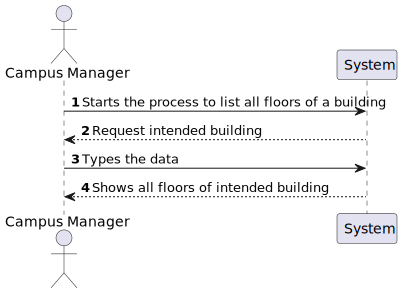
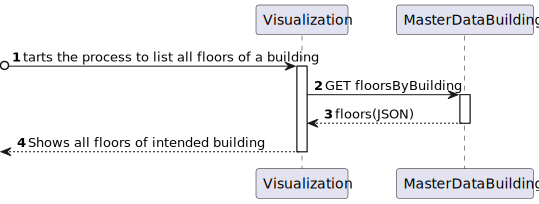
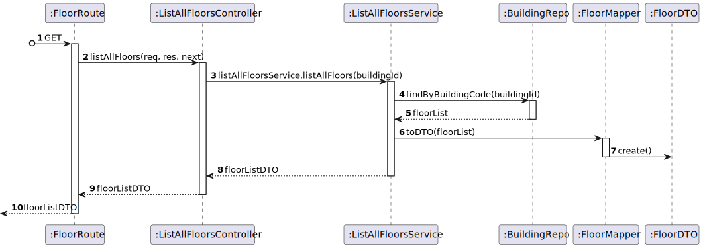

# US 210 - As a Campus Manager, I want to list all floors of a building

## 1. Context

* First time that this task is developed.
* This task is relative to system user Campus Manager .

## 2. Requirements

**US 210 -** As a Campus Manager, I want to list all floors of a building.

**Dependencies:**
- **US150 -** As a Campus Manager, I want to create a building.
- **US190 -** As a Campus Manager, I want to create building floor.

**Regarding this requirement we understand that:** <br>
As a Campus Manager, an actor of the system, I will be able to access the system and list all floors in a specified building.

## 3. Analysis

**Analyzing this User Story we understand that:**
* Campus Manager is a user role that manages the data of the routes and maps.
* Building is a structure within the campus that houses various rooms and facilities. It can be navigated by the robisep robots using corridors and elevators.
* Floor is a level within a building. Each floor can contain multiple rooms and is accessible by elevators and stairs (though robisep robots cannot use stairs).
* The floor information is based on: Floor Number, Floor Description and each floor coordinate info(wall,door,elevator,etc)
* Floor example:

|  7  |  6  |  6  |  6  |  6  |  7  |  6  |  6  |  2  |
|:---:|:---:|:---:|:---:|:---:|:---:|:---:|:---:|:---:|
|  5  |  4  |  4  |  4  |  4  |  5  |  4  |  4  |  2  |
| 13  |  2  |  2  |  9  |  2  |  2  |  9  |  2  | 14  |
|  0  |  0  |  0  |  0  |  0  |  0  |  0  |  0  | 14  |
|  7  |  6  |  6  |  6  |  6  |  6  |  8  |  0  |  2  |
|  5  |  4  |  4  |  4  |  4  |  4  |  1  |  0  | 12  |
|  5  |  4  |  4  |  4  |  4  |  4  |  1  |  0  | 12  |
|  2  |  2  |  2  |  2  |  2  |  2  |  2  |  2  |  0  |


| description.map[][] | North wall | West wall | Door | Elevator | Passageway | Room |
|:-------------------:|:----------:|:---------:|:----:|:--------:|:----------:|:----:|
|          0          |     No     |    No     |  No  |    No    |     No     |  No  |
|          1          |     No     |    Yes    |  No  |    No    |     No     |  No  |
|          2          |    Yes     |    No     |  No  |    No    |     No     |  No  |
|          3          |    Yes     |    Yes    |  No  |    No    |     No     |  No  |
|          4          |     No     |    No     |  No  |    No    |     No     | Yes  |
|          5          |     No     |    Yes    |  No  |    No    |     No     | Yes  |
|          6          |    Yes     |    No     |  No  |    No    |     No     | Yes  |
|          7          |    Yes     |    Yes    |  No  |    No    |     No     | Yes  |
|          8          |     No     |    Yes    | Yes  |    No    |     No     |  No  |
|          9          |    Yes     |    No     | Yes  |    No    |     No     |  No  |
|         10          |     No     |    Yes    | Yes  |    No    |     No     | Yes  |
|         11          |    Yes     |    No     | Yes  |    No    |     No     | Yes  |
|         12          |     No     |    No     |  No  |    No    |    Yes     |  No  |
|         13          |    Yes     |    No     |  No  |    No    |    Yes     |  No  |
|         14          |     No     |    No     |  No  |   Yes    |     No     |  No  |


### 3.1. Domain Model Excerpt


### 3.1. Domain Model Excerpt


## 4. Design

### 4.1. Realization

### Level1
###### LogicalView:


###### SceneryView:


###### ProcessView:


#### Level2

###### LogicalView:



###### ImplementationView:


###### PhysicalView:


###### ProcessView:


#### Level3
###### LogicalView:


###### ImplementationView:


###### ProcessView:


### 4.3. Applied Patterns
* Controller
* Service
* Repository
* Mapper
* DTO
* GRASP

### 4.4. Tests

**Test 1:** *Aims to verify the behavior of the controller in isolation. It creates a stubbed version of the service and checks if the controller correctly processes a request, in this case, listing all floors of a building.*
```
it("ListAllFloorsController unit test using ListAllFloorsService stub", async function() {
		// Arrange
		let body = {};
		let req: Partial<Request> = {};
		req.body = body;
		req.params = {
            buildingId: "A"
		  }
		let res: Partial<Response> = {
		  json: sinon.spy(),
		  status: sinon.stub().returnsThis(),
		  send: sinon.spy()
		};
		let next: Partial<NextFunction> = () => {};

		let listAllFloorsServiceInstance = Container.get("listAllFloorsService");

		// Stub the createBuilding method in the BuildingService
		const buildingDTO = {
			buildingName: "EdificioA",
			buildingDescription: "uma descricao",
			buildingCode: "A",
			buildingLength: 2,
			buildingWidth: 2
		  } as IBuildingDTO

		  const building = Building.create({
			buildingName: new BuildingName({ value: buildingDTO.buildingName }),
			buildingDescription: new BuildingDescription({ value: buildingDTO.buildingDescription }),
			buildingSize: new BuildingSize({ length: buildingDTO.buildingLength, width: buildingDTO.buildingWidth }),
			floors: [],
		  }, buildingDTO.buildingCode).getValue()

          const FloorDTO = {
          floorId: 1,
          floorNumber: 1,
          floorDescription: "Joi.string().max(255)",
          floorMap: {
              map: [],
              passageways: [],
              rooms: [],
              elevators: [],
              passagewaysCoords: [],
              elevatorsCoords: [],
              roomCoords: []
          }
          } as IFloorDTO

		  const floor = Floor.create(
			{
			  "floorNumber": new FloorNumber({number: FloorDTO.floorNumber}),
			  "floorDescription": new FloorDescription({ value: FloorDTO.floorDescription }),
			  "floormap": new FloorMap(
				{
				  map: [[]],
				  passageways: [],
				  rooms: [],
				  elevators: [],
				  passagewaysCoords: [],
				  elevatorsCoords: [],
				  roomsCoords: [],
				}
			  )
		  }, FloorDTO.floorId).getValue()

		  building.addFloor(floor);


		sinon.stub(listAllFloorsServiceInstance, "listAllFloors").returns(
            Result.ok<IFloorDTO[]>([FloorDTO])
        );


		const ctrl = new ListAllFloorsController(listAllFloorsServiceInstance as IListAllFloorsService);

		// Act
		await ctrl.listAllFloors(<Request>req, <Response>res, <NextFunction>next);

		// Assert
		sinon.assert.calledOnce(res.json);
		sinon.assert.calledWith(res.json, sinon.match([FloorDTO]));
	});
````

**Test 2:** *Checks the end-to-end functionality of the controller and the service. It verifies that the controller correctly interacts with the service, retrieves floor data, and returns the expected results in the response.*
```
it("ListAllFloorsController + ListAllFloorsService integration test", async function() {
		// Arrange
		let body = {};
		let req: Partial<Request> = {};
		req.body = body;
		req.params = {
            buildingId: "A"
		}
		let res: Partial<Response> = {
		  json: sinon.spy(),
		  status: sinon.stub().returnsThis(),
		  send: sinon.spy()
		};
		let next: Partial<NextFunction> = () => {};

		// Stub repo methods
		let listAllFloorsServiceInstance = Container.get("listAllFloorsService");

		// Stub the createBuilding method in the BuildingService
		const buildingDTO = {
			buildingName: "EdificioA",
			buildingDescription: "uma descricao",
			buildingCode: "A",
			buildingLength: 2,
			buildingWidth: 2
		  } as IBuildingDTO

		  const building = Building.create({
			buildingName: new BuildingName({ value: buildingDTO.buildingName }),
			buildingDescription: new BuildingDescription({ value: buildingDTO.buildingDescription }),
			buildingSize: new BuildingSize({ length: buildingDTO.buildingLength, width: buildingDTO.buildingWidth }),
			floors: [],
		  }, buildingDTO.buildingCode).getValue()

          const FloorDTO = {
          floorId: 1,
          floorNumber: 1,
          floorDescription: "Joi.string().max(255)",
          floorMap: {
              map: [],
              passageways: [],
              rooms: [],
              elevators: [],
              passagewaysCoords: [],
              elevatorsCoords: [],
              roomCoords: []
          }
          } as IFloorDTO

		  const floor = Floor.create(
			{
			  "floorNumber": new FloorNumber({number: FloorDTO.floorNumber}),
			  "floorDescription": new FloorDescription({ value: FloorDTO.floorDescription }),
			  "floormap": new FloorMap(
				{
				  map: [[]],
				  passageways: [],
				  rooms: [],
				  elevators: [],
				  passagewaysCoords: [],
				  elevatorsCoords: [],
				  roomsCoords: [],
				}
			  )
		}, FloorDTO.floorId).getValue()

		building.addFloor(floor);

        buildingRepoMock.findByBuidingCode.resolves(building);

		const listAllFloorsServiceSpy = sinon.spy(listAllFloorsServiceInstance, "listAllFloors");

		const ctrl = new ListAllFloorController(listAllFloorsServiceInstance as IListAllFloorsService);

		// Act
		await ctrl.listAllFloors(<Request>req, <Response>res, <NextFunction>next);

		// Assert
		sinon.assert.calledOnce(res.json);
		sinon.assert.calledWith(res.json,sinon.match([{
            floorDescription: "Joi.string().max(255)",
            floorId: 1,
            floorMap: {
              elevators: [],
              elevatorsCoords: [],
              map: [[]],
              passageways: [],
              passagewaysCoords: [],
              roomCoords: [],
              rooms: []
            },
            floorNumber: 1
          }]));
		sinon.assert.calledOnce(listAllFloorsServiceSpy);
	});
````

**Test 3:** *Checks how the controller handles the situation when the requested building is not found and ensures it responds with an appropriate error message.*
```
it("ListAllFloorsController + ListAllFloorsService integration test (Building Not Found)", async function() {
		// Arrange
		let body = {};
		let req: Partial<Request> = {};
		req.body = body;
		req.params = {
            buildingId: "C"
		}
		let res: Partial<Response> = {
		  json: sinon.spy(),
		  status: sinon.stub().returnsThis(),
		  send: sinon.spy()
		};
		let next: Partial<NextFunction> = () => {};

		// Stub repo methods
		let listAllFloorsServiceInstance = Container.get("listAllFloorsService");

		// Stub the createBuilding method in the BuildingService
		const buildingDTO = {
			buildingName: "EdificioA",
			buildingDescription: "uma descricao",
			buildingCode: "A",
			buildingLength: 2,
			buildingWidth: 2
		  } as IBuildingDTO

		  const building = Building.create({
			buildingName: new BuildingName({ value: buildingDTO.buildingName }),
			buildingDescription: new BuildingDescription({ value: buildingDTO.buildingDescription }),
			buildingSize: new BuildingSize({ length: buildingDTO.buildingLength, width: buildingDTO.buildingWidth }),
			floors: [],
		  }, buildingDTO.buildingCode).getValue()

          const FloorDTO = {
          floorId: 1,
          floorNumber: 1,
          floorDescription: "Joi.string().max(255)",
          floorMap: {
              map: [],
              passageways: [],
              rooms: [],
              elevators: [],
              passagewaysCoords: [],
              elevatorsCoords: [],
              roomCoords: []
          }
          } as IFloorDTO

		  const floor = Floor.create(
			{
			  "floorNumber": new FloorNumber({number: FloorDTO.floorNumber}),
			  "floorDescription": new FloorDescription({ value: FloorDTO.floorDescription }),
			  "floormap": new FloorMap(
				{
				  map: [[]],
				  passageways: [],
				  rooms: [],
				  elevators: [],
				  passagewaysCoords: [],
				  elevatorsCoords: [],
				  roomsCoords: [],
				}
			  )
		}, FloorDTO.floorId).getValue()

		building.addFloor(floor);

        buildingRepoMock.findByBuidingCode.resolves(null);

		const listAllFloorsServiceSpy = sinon.spy(listAllFloorsServiceInstance, "listAllFloors");

		const ctrl = new ListAllFloorController(listAllFloorsServiceInstance as IListAllFloorsService);

		// Act
		await ctrl.listAllFloors(<Request>req, <Response>res, <NextFunction>next);

		// Assert

		sinon.assert.calledOnce(listAllFloorsServiceSpy);
        sinon.assert.calledOnce(res.status);
        sinon.assert.calledWith(res.status,400);
        sinon.assert.calledOnce(res.send);
        sinon.assert.calledWith(res.send, sinon.match("Building C not found"));
	});
````

**Test 4:** *Verifies that the controller handles the case where a building exists but does not have any floors and responds with an appropriate error message.*
```
it("ListAllFloorsController + ListAllFloorsService integration test (Building No Floors)", async function() {
		// Arrange
		let body = {};
		let req: Partial<Request> = {};
		req.body = body;
		req.params = {
            buildingId: "C"
		}
		let res: Partial<Response> = {
		  json: sinon.spy(),
		  status: sinon.stub().returnsThis(),
		  send: sinon.spy()
		};
		let next: Partial<NextFunction> = () => {};

		// Stub repo methods
		let listAllFloorsServiceInstance = Container.get("listAllFloorsService");

		// Stub the createBuilding method in the BuildingService
		const buildingDTO = {
			buildingName: "EdificioA",
			buildingDescription: "uma descricao",
			buildingCode: "A",
			buildingLength: 2,
			buildingWidth: 2
		  } as IBuildingDTO

		  const building = Building.create({
			buildingName: new BuildingName({ value: buildingDTO.buildingName }),
			buildingDescription: new BuildingDescription({ value: buildingDTO.buildingDescription }),
			buildingSize: new BuildingSize({ length: buildingDTO.buildingLength, width: buildingDTO.buildingWidth }),
			floors: [],
		  }, buildingDTO.buildingCode).getValue()

          const FloorDTO = {
          floorId: 1,
          floorNumber: 1,
          floorDescription: "Joi.string().max(255)",
          floorMap: {
              map: [],
              passageways: [],
              rooms: [],
              elevators: [],
              passagewaysCoords: [],
              elevatorsCoords: [],
              roomCoords: []
          }
          } as IFloorDTO

        buildingRepoMock.findByBuidingCode.resolves(building);

		const listAllFloorsServiceSpy = sinon.spy(listAllFloorsServiceInstance, "listAllFloors");

		const ctrl = new ListAllFloorController(listAllFloorsServiceInstance as IListAllFloorsService);

		// Act
		await ctrl.listAllFloors(<Request>req, <Response>res, <NextFunction>next);

		// Assert

		sinon.assert.calledOnce(listAllFloorsServiceSpy);
        sinon.assert.calledOnce(res.status);
        sinon.assert.calledWith(res.status,400);
        sinon.assert.calledOnce(res.send);
        sinon.assert.calledWith(res.send, sinon.match("Building C has no floors"));
	});
````

## 5. Implementation

### ListAllFloorsController
```
export default class ListAllFloorsController implements IListAllFloorsController {

    constructor(
        @Inject(config.services.listAllFloors.name) private listAllFloorsService: IListAllFloorsService
    )
    {}

    public async listAllFloors(req: Request, res: Response, next: NextFunction) {
        try {
            const buildingId = req.params.buildingId.toString();

            const floorsOrError = await this.listAllFloorsService.listAllFloors(buildingId)

            if(floorsOrError.isFailure) {
                return res.status(400).send(floorsOrError.errorValue())
            }

            return res.status(200).json(floorsOrError.getValue())
        } catch(err) {
            throw err
        }
    }


}
````

### ListAllFloorsService
```
export default class listAllFloorsService implements IListAllFloorsService {

    constructor(
        @Inject(config.repos.building.name) private buildingRepo: IBuildingRepo
    )
    {}


    public async listAllFloors(buildingId: string): Promise<Result<IFloorDTO[]>> {


        const buildingResult = await this.buildingRepo.findByBuidingCode(new BuildingCode(buildingId))
        if(buildingResult === null) {
           return Result.fail<IFloorDTO[]>(`Building ${buildingId} not found`)
        }


        const floorsResult = buildingResult.floors

        if(floorsResult.length === 0) {
            return Result.fail<IFloorDTO[]>(`Building ${buildingId} has no floors`)
        }

        let resolve: IFloorDTO[] = []

        floorsResult.forEach(b => {
            resolve.push(FloorMaper.toDto(b))
        })

        return Result.ok<IFloorDTO[]>(resolve)
    }

}
````

## 6. Integration/Demonstration

*In this section the team should describe the efforts realized in order to integrate this functionality with the other parts/components of the system*

*It is also important to explain any scripts or instructions required to execute an demonstrate this functionality*

## 7. Observations

*This section should be used to include any content that does not fit any of the previous sections.*

*The team should present here, for instance, a critical prespective on the developed work including the analysis of alternative solutioons or related works*

*The team should include in this section statements/references regarding third party works that were used in the development this work.*
