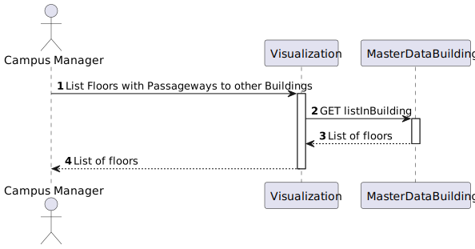
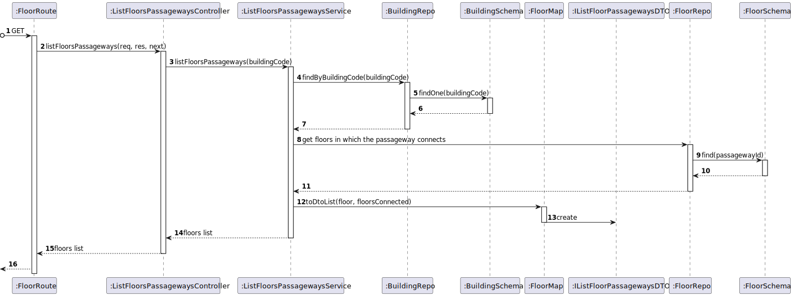

# US 220 - As a Campus Manager, I want to list the floors of a building with a passageway


## 1. Context

* This task comes in context of Sprint A.
* First time that this task is developed.
* This task is relative to system user Campus Manager.

## 2. Requirements

**US 220 -** As a Campus Manager, I want to:

* list floors of a building with a passageway.

**Client Clarifications**
> **Q**: ... seria expectável incluir informação relativa a onde a(s) passagem(ns) de cada piso vão ter; ou o pretendido é simplesmente ser possível saber quais dos pisos de um dado edifício possuem passagens para outros?
<br>
> **A**: ... esta listagem deve mostrar a informação sobre o piso (edificio, piso, descrição) e a que outros edificios/pisos tem passagem.

**Dependencies:**
- **US150 -** As a Campus Manager, I want to create a building.
- **US190 -** As a Campus Manager, I want to create building floor.
- **US240 -** As a Campus Manager, I want to create a passageway between buildings.

## 3. Analysis

Regarding this requirement we understand that: As a Campus Manager, an actor of the system, I will be able to list the floors of a building with a passageway,describing the floor and description
and also the building and floor where the passageway connects to.
* Campus Manager is a user role that manages the data of the routes and maps.
* Building is a structure within the campus that houses various rooms and facilities. It can be navigated by the robisep robots using corridors and elevators.
* Floor is a level within a building. Each floor can contain multiple rooms and is accessible by elevators and stairs (though robisep robots cannot use stairs).

### 3.1. Domain Model Excerpt


## 4. Design
### Level 1

* Logical View


* Process View


* Scenary View


### level 2

* Logical View


* Process View



* Physical View


* Implementation View


### Level 3

* Logical:


* Implementation


* Process



### 4.2. Applied Patterns
* Controller
* Service
* Repository
* Mapper
* DTO
* GRASP

### 4.3. Tests

**Test 1:** *Verifies that it is not possible to create an instance of the Example class with null values.*

```
@Test(expected = IllegalArgumentException.class)
public void ensureNullIsNotAllowed() {
	Example instance = new Example(null, null);
}
````

## 5. Implementation

**listFloorsPassagewayService:**

```
public async listFloorsPassageways(buildingCode: string): Promise<Result<IListFloorPassagewaysDTO[]>> {


        const buildingResult = await this.buildingRepo.findByBuidingCode(new BuildingCode(buildingCode))
        if (buildingResult === null) {
            return Result.fail<IListFloorPassagewaysDTO[]>(`Building ${buildingCode} not found`)
        }

        const floorsResult = buildingResult.floors

        if (floorsResult.length === 0) {
            return Result.fail<IListFloorPassagewaysDTO[]>(`Building ${buildingCode} has no floors`)
        }

        let resolve: IListFloorPassagewaysDTO[] = []

        for (var floor of floorsResult) {
            if (floor.map.passagewaysId.length > 0) {
                const floorsConnected: string[] = [];
                for (var passagewayId of floor.map.passagewaysId) {
                    const currentFloors = await this.floorRepo.findByPassageway(passagewayId)

                    for (var floor1 of currentFloors) {
                        if (floor1.floorId.toValue() !== floor.floorId.toValue()) {
                            floorsConnected.push(floor1.floorId.toString())
                            const building = await this.buildingRepo.findByFloor(Number(floor1.floorId.toValue()))
                            if (building !== null) {
                                floorsConnected.push(building.code.toString())
                            }
                        }
                    }
                }
                resolve.push(FloorMaper.toDtoList(floor, floorsConnected))
            }
        }

        return Result.ok<IListFloorPassagewaysDTO[]>(resolve)
    }
````

## 6. Integration/Demonstration

To use this US, you need to send and HTTP request with the following URI:

localhost:4000/api/floors/listFloorsPassageways/D

## 7. Observations

No additional observations.