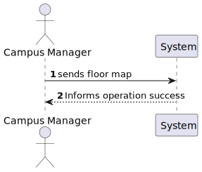
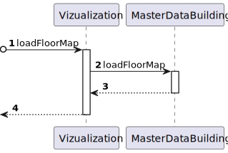
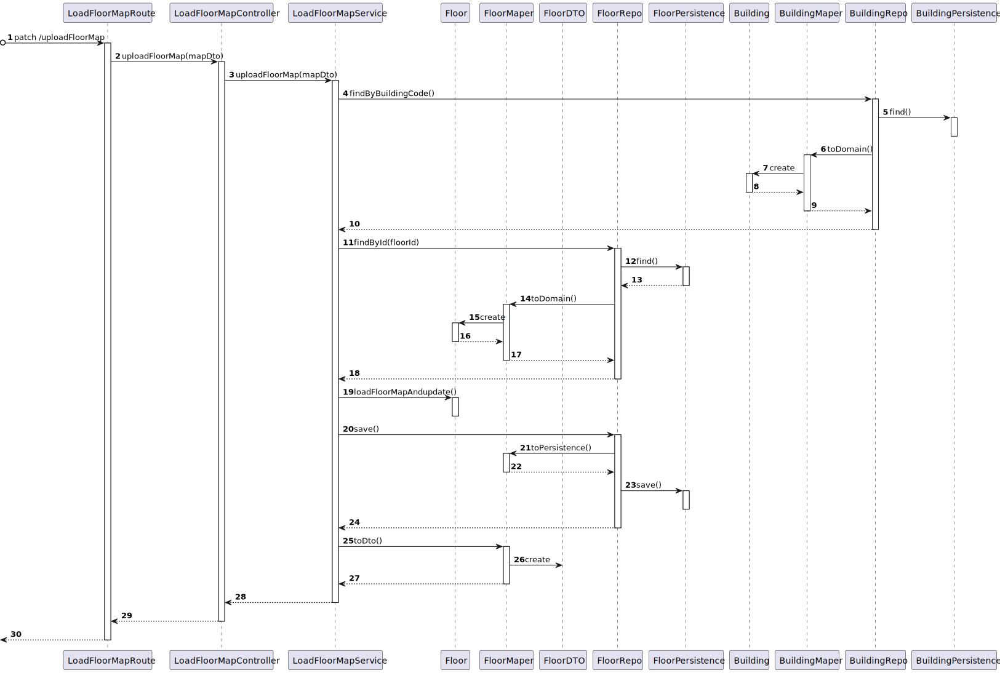

# US 230 As a Campus Manager I want to load the map of a floor

## 1. Context

* First time that this task is developed.
* This task is relative to system user Campus Manager.

## 2. Requirements

**US 230 -** As a Campus Manager, I want to:

* Load a map of a floor

**Dependencies:**
There are no Dependencies associated with this US.

## 3. Analysis

Regarding this requirement we understand that as a Campus Manager, an actor of the system, I will be able to access
the system and load a map of a floor to the system and persist it, the map of the floor will be a simple text file
which contains the layout of the floor as a series of characters

An example of a possible map configuration

|  7  |  6  |  6  |  6  |  6  |  7  |  6  |  6  |  2  |
|:---:|:---:|:---:|:---:|:---:|:---:|:---:|:---:|:---:|
|  5  |  4  |  4  |  4  |  4  |  5  |  4  |  4  |  2  |
| 13  |  2  |  2  |  9  |  2  |  2  |  9  |  2  | 14  |
|  0  |  0  |  0  |  0  |  0  |  0  |  0  |  0  | 14  |
|  7  |  6  |  6  |  6  |  6  |  6  |  8  |  0  |  2  |
|  5  |  4  |  4  |  4  |  4  |  4  |  1  |  0  | 12  |
|  5  |  4  |  4  |  4  |  4  |  4  |  1  |  0  | 12  |
|  2  |  2  |  2  |  2  |  2  |  2  |  2  |  2  |  0  |

where the values mean:

| description.map[][] | North wall | West wall | Door | Elevator | Passageway | Room |
|:-------------------:|:----------:|:---------:|:----:|:--------:|:----------:|:----:|
|          0          |     No     |    No     |  No  |    No    |     No     |  No  |
|          1          |     No     |    Yes    |  No  |    No    |     No     |  No  |
|          2          |    Yes     |    No     |  No  |    No    |     No     |  No  |
|          3          |    Yes     |    Yes    |  No  |    No    |     No     |  No  |
|          4          |     No     |    No     |  No  |    No    |     No     | Yes  |
|          5          |     No     |    Yes    |  No  |    No    |     No     | Yes  |
|          6          |    Yes     |    No     |  No  |    No    |     No     | Yes  |
|          7          |    Yes     |    Yes    |  No  |    No    |     No     | Yes  |
|          8          |     No     |    Yes    | Yes  |    No    |     No     |  No  |
|          9          |    Yes     |    No     | Yes  |    No    |     No     |  No  |
|         10          |     No     |    Yes    | Yes  |    No    |     No     | Yes  |
|         11          |    Yes     |    No     | Yes  |    No    |     No     | Yes  |
|         12          |     No     |    No     |  No  |    No    |    Yes     |  No  |
|         13          |    Yes     |    No     |  No  |    No    |    Yes     |  No  |
|         14          |     No     |    No     |  No  |   Yes    |     No     |  No  |

## 4. Design

### 4.1. Realization

### Level 1

* Logical:


* Process



* Scenery


### level 2

* Logical:


* Process



* Physical


* Implementation


### Level 3

* Logical:


* Process



* Implementation


### 4.2. Applied Patterns

* Controller
* Service
* Repository
* Mapper
* Dto

### 4.3. Tests

```typescript
    it('1. Controller with stub service valid map', async function () {
        let req: Partial<Request> = {
            body: validMap
        }
        let res: Partial<Response> = {
            status: sinon.stub().returnsThis(),
            json: sinon.spy()
        }
        let next: Partial<NextFunction> = () => { }

        const service = Container.get('loadFloorMapService') as ILoadFloorMapService

        sinon.stub(service, 'loadFloorMap')
            .returns(new Promise((resolve, reject) => { resolve(Result.ok<IFloorDTO>(validMapDtoExpected)) }))

        const controller = new LoadFloorMapController(service)

        await controller.loadFloorMap(<Request>req, <Response>res, <NextFunction>next)

        sinon.assert.calledOnce(res.status)
        sinon.assert.calledWith(res.status, 201)
        sinon.assert.calledOnce(res.json)
    })
```

```typescript
    it('2. Controller with stub service invalid map', async function () {
        let req: Partial<Request> = {
            body: invalidMapObjectisNotOnSpecifiedCoords
        }
        let res: Partial<Response> = {
            status: sinon.stub().returnsThis(),
            send: sinon.spy()
        }
        let next: Partial<NextFunction> = () => { }

        const service = Container.get('loadFloorMapService') as ILoadFloorMapService

        sinon.stub(service, 'loadFloorMap')
            .returns(new Promise((resolve, reject) => { resolve(Result.fail<IFloorDTO>(invalidMapDtoWrongFormatCoordsExpected)) }))

        const controller = new LoadFloorMapController(service)

        await controller.loadFloorMap(<Request>req, <Response>res, <NextFunction>next)

        sinon.assert.calledOnce(res.status)
        sinon.assert.calledWith(res.status, 400)
        sinon.assert.calledOnce(res.send)
    })
```

```typescript
    it('3. Service with stub repo valid map', async function () {
        const buildingRepo = Container.get('buildingRepo')
        sinon.stub(buildingRepo, 'findByBuidingCode')
            .returns(buildingResult.getValue())

        const floorRepo = Container.get('floorRepo')
        sinon.stub(floorRepo, 'findById')
            .returns(floorWithElevatorResult.getValue())

        sinon.stub(floorRepo, 'save')
            .returns(null)

        const service = Container.get('loadFloorMapService') as ILoadFloorMapService

        const actual = await service.loadFloorMap(validMap as ILoadFloorMapDto)

        sinon.assert.match(actual.isSuccess, true)
        sinon.assert.match(actual.getValue(), validMapDtoExpected)
    })
```

```typescript
    it('12. Controller + Service with stub repo valid map', async function () {
        let req: Partial<Request> = {
            body: validMap
        }
        let res: Partial<Response> = {
            status: sinon.stub().returnsThis(),
            json: sinon.spy()
        }
        let next: Partial<NextFunction> = () => { }

        const buildingRepo = Container.get('buildingRepo')
        sinon.stub(buildingRepo, 'findByBuidingCode')
            .returns(buildingResult.getValue())

        const floorRepo = Container.get('floorRepo')
        sinon.stub(floorRepo, 'findById')
            .returns(floorWithElevatorResult.getValue())

        sinon.stub(floorRepo, 'save')
            .returns(null)

        const service = Container.get('loadFloorMapService') as ILoadFloorMapService

        const controller = new LoadFloorMapController(service)

        await controller.loadFloorMap(<Request>req, <Response>res, <NextFunction>next)

        sinon.assert.calledOnce(res.status)
        sinon.assert.calledWith(res.status, 201)
        sinon.assert.calledOnce(res.json)
        sinon.assert.calledWith(res.json, validMapDtoExpected)
    })
```

## 5. Implementation

### LoadFloorMapService

```typescript
@Service()
export default class LoadFloorMapService implements ILoadFloorMapService {

    constructor(
        @Inject(config.repos.floor.name) private floorRepo: IFloorRepo,
        @Inject(config.repos.building.name) private buildingRepo: IBuildingRepo
    ) { }

    public async loadFloorMap(floorLayout: ILoadFloorMapDTO): Promise<Result<IFloorDTO>> {
        const buildingOrError = await this.buildingRepo.findByBuidingCode(new BuildingCode(floorLayout.buildingCode))
        const floorOrError = await this.floorRepo.findById(floorLayout.floorId)

        if (buildingOrError == null) {
            return Result.fail<IFloorDTO>('There is no building with that code')
        }

        if (floorOrError == null) {
            return Result.fail<IFloorDTO>('There is no floor with that ID')
        }

        if(!buildingOrError.floorsNumber.includes(Number(floorOrError.id.toValue()))) {
            return Result.fail<IFloorDTO>('The floor doesn\'t belong to the building')
        }
        

        let map: number[][] = floorLayout.map

        if (map.length > buildingOrError.size.length) {
            return Result.fail<IFloorDTO>('The floor map has a bigger length than the maximum allowed by that building')
        }

        for (let i = 0; i < map.length; i++) {
            if (map[i].length > buildingOrError.size.width) {
                return Result.fail<IFloorDTO>('The floor map has a bigger width than the maximum allowed by that building')
            }
        }

        for(const p of floorLayout.passageways) {
            if (p.length !== 5) {
                return Result.fail<IFloorDTO>('There is a problem with the coordinates of the passageway with id ' + p[0])
            }
        }

        for(const e of floorLayout.elevators) {
            if (e.length !== 3) {
                return Result.fail<IFloorDTO>('There is a problem with the coordinates of the elevator with id ' + e[0])
            }
        }

        for(const r of floorLayout.rooms) {
            if (r.length !== 5) {
                return Result.fail<IFloorDTO>('There is a problem with the coordinates of the room with id ' + r[0])
            }
        }

        let passagewaysCoords: DoubleCoords[] = []
        let elevatorsCoords: SingleCoords[] = []
        let roomsCoords: DoubleCoords[] = []

        for (let i = 0; i < floorLayout.passageways.length; i++) {
            passagewaysCoords[i] = DoubleCoords.create({
                id: floorLayout.passageways[i][0],
                x: floorLayout.passageways[i][1],
                y: floorLayout.passageways[i][2],
                x1: floorLayout.passageways[i][3],
                y1: floorLayout.passageways[i][4]
            })
        }

        for (let i = 0; i < floorLayout.elevators.length; i++) {
            elevatorsCoords[i] = SingleCoords.create({
                id: floorLayout.elevators[i][0],
                x: floorLayout.elevators[i][1],
                y: floorLayout.elevators[i][2]
            })
        }

        for (let i = 0; i < floorLayout.rooms.length; i++) {
            roomsCoords[i] = DoubleCoords.create({
                id: floorLayout.rooms[i][0],
                x: floorLayout.rooms[i][1],
                y: floorLayout.rooms[i][2],
                x1: floorLayout.rooms[i][3],
                y1: floorLayout.rooms[i][4]
            })
        }

        for (const p of passagewaysCoords) {
            if (map[p.x][p.y] !== 12 || map[p.x][p.y] !== 13 || map[p.x1][p.y1] !== 12 || map[p.x1][p.y1] !== 13) {
                return Result.fail<IFloorDTO>('There is no passageway in the coords: X1:' + p.x + ' Y1:' + p.y + ' X2:' + p.x1 + ' Y2: ' + p.y1)
            }
        }

        for (const e of elevatorsCoords) {
            if (map[e.x][e.y] !== 14) {
                return Result.fail<IFloorDTO>('There is no elevator in the coords: X1:' + e.x + ' Y1:' + e.y)
            }
        }

        for (const r of roomsCoords) {
            if (map[r.x][r.y] !== 7 || map[r.x1][r.y1] !== 4 ) {
                return Result.fail<IFloorDTO>('There is no room in the coords: X1:' + r.x + ' Y1:' + r.y + ' X2:' + r.x1 + ' Y2: ' + r.y1)
            }
        }

        const passagewaysIds = floorOrError.map.passagewaysId
        for (const p of passagewaysCoords) {
            if (!passagewaysIds.includes(Number(p.id))) {
                return Result.fail<IFloorDTO>('There is no passageway with id ' + p.id + ' in this floor')
            }
        }

        const elevatorsIds = floorOrError.map.elevatorsId
        for (const e of elevatorsCoords) {
            if (!elevatorsIds.includes(Number(e.id))) {
                return Result.fail<IFloorDTO>('There is no elevator with id ' + e.id + ' in this floor')
            }
        }

        const roomsIds = floorOrError.map.elevatorsId
        for (const r of roomsCoords) {
            if (!roomsIds.includes(Number(r.id))) {
                return Result.fail<IFloorDTO>('There is no room with id ' + r.id + ' in this floor')
            }
        }

        floorOrError.loadFloorMapAndUpdate(map, passagewaysCoords, elevatorsCoords, roomsCoords)

        await this.floorRepo.save(floorOrError)

        return Result.ok<IFloorDTO>(FloorMaper.toDto(floorOrError))
    }
}
```

## 6. Integration/Demonstration

In order to execute this US we first need to have to have a building and a floor registered in the system
then we need to send the floor layout in the following format:

```
{
    "floorId": 2,
    "buildingCode": "BGDA",
    "map": [
        [3,2,2,2,2,3,2,2,1],
        [1,0,0,0,0,1,0,0,1],
        [2,2,14,0,2,2,0,2,0],
        [0,0,0,0,0,0,0,0,0],
        [3,2,2,2,2,2,0,0,1],
        [1,0,0,0,0,0,1,0,0],
        [1,0,0,0,0,0,1,0,0],
        [2,2,2,2,2,2,0,0,0]
    ],
    "elevators": [
            [5,2,2]
             ],
    "passageways": [],
    "rooms": []

}
```

once you send the leayout of the floor if there was no errors while trying to load the map you should receive a 
a Dto of the floor containing the new map and coordinates of every object

## 7. Observations
