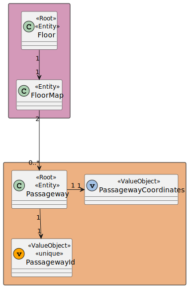
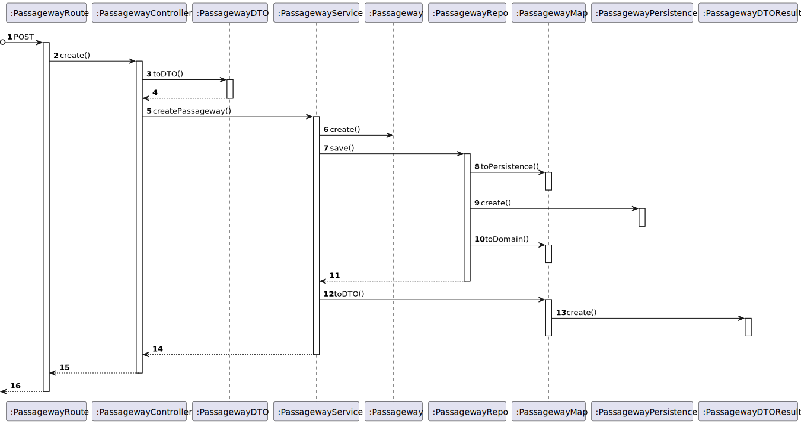

# US 240 - As a Campus Manager, I want to create a passageway between buildings.

## 1. Context

* First time that this task is developed.
* This task is relative to system user Campus Manager.

## 2. Requirements

**US 240 -** As a Campus Manager, I want to:

* Create a passageway between buildings

**Client Clarifications**
> **Q**: ... No mesmo edifício é possível ter duas passagens para outro edifício, em pisos diferentes?
<br>
> **A**: ... em cada piso podem existir várias passagens, cada uma para outro edificio, e no mesmo edificio podem existir várias passagens para um outro edificio desde que em pisos diferentes.


**Dependencies:**
- **US150 -** As a Campus Manager, I want to create a building.
- **US190 -** As a Campus Manager, I want to create building floor.

## 3. Analysis

Regarding this requirement we understand that as a Campus Manager, an actor of the system, 
I will be able to access the system and create a passageway choosing the 2 buildings in the Campus area.
A passageway is defined by its ID and the 2 buildings that it connects.

### 3.1. Domain Model Excerpt



## 4. Design

### 4.1. Realization

### Level 1

* Logical:


* Process


* Scenary


### level 2

* Logical:


* Process


* Physical


* Implementation


### Level 3

* Logical:


* Implementation


* Process



### 4.2. Applied Patterns

* Controller
* Service
* Repository
* Mapper
* DTO
* GRASP

### 4.3. Tests

**Test 1:** *Tests the controller using a stub service to create a valid passageway*

```
it('1. Controller with stub service create valid passageway', async function () {
        const createPassagewayJSON = {
            "passagewayId": 1,
            "building1Id": 10,
            "floor1Id": 5,
            "building2Id": 11,
            "floor2Id": 6,
        }

        const passagewayDto = {
            passagewayId: 1
        } as IPassagewayDTO

        const createPassagewayService = Container.get('createPassagewayService')
        sinon.stub(createPassagewayService, 'createPassageway').returns(new Promise((resolve, reject) => {
            resolve(Result.ok<IPassagewayDTO>(passagewayDto))
        }))

        let req: Partial<Request> = {}
        req.body = createPassagewayJSON

        let res: Partial<Response> = {
            status: sinon.stub().returnsThis(),
            json: sinon.spy()
        }

        let next: Partial<NextFunction> = () => { }

        const createPassagewayController = new CreatePassagewayController(createPassagewayService as ICreatePassagewayService)

        await createPassagewayController.createPassageway(<Request>req, <Response>res, <NextFunction>next)

        sinon.assert.calledOnce(res.status)
        sinon.assert.calledWith(res.status, 201)
        sinon.assert.calledOnce(res.json)
        sinon.assert.calledWith(res.json, passagewayDto)
    })
````

**Test 2:** *Tests the service using a stub repo to create a valid passageway*
    
```
it('3. Service with stub repo create valid passageway', async function () {
        const createPassagewayDTO = {
            passagewayId: 1,
            building1Id: "A",
            floor1Id: 1,
            building2Id: "B",
            floor2Id: 2,
        } as ICreatePassagewayDTO

        const building1DTO = {
            buildingName: "EdificioA",
            buildingDescription: "uma descricao",
            buildingCode: "A",
            buildingLength: 2,
            buildingWidth: 2
        } as IBuildingDTO

        const building1Result = Building.create({
            buildingName: new BuildingName({ value: building1DTO.buildingName }),
            buildingDescription: new BuildingDescription({ value: building1DTO.buildingDescription }),
            buildingSize: new BuildingSize({ length: building1DTO.buildingLength, width: building1DTO.buildingWidth }),
            floors: [],
        }, building1DTO.buildingCode)

        const building1 = building1Result.getValue()

        const building2DTO = {
            buildingName: "EdificioB",
            buildingDescription: "uma descricao",
            buildingCode: "B",
            buildingLength: 2,
            buildingWidth: 2
        } as IBuildingDTO

        const building2Result = Building.create({
            buildingName: new BuildingName({ value: building2DTO.buildingName }),
            buildingDescription: new BuildingDescription({ value: building2DTO.buildingDescription }),
            buildingSize: new BuildingSize({ length: building2DTO.buildingLength, width: building2DTO.buildingWidth }),
            floors: []
        }, building2DTO.buildingCode)

        const building2 = building2Result.getValue()

        const floorProps1 = {
            floorDescription: new FloorDescription({ value: 'Test floor' }),
            floorNumber: new FloorNumber({ number: 1 }),
            floormap: new FloorMap({
                map: [[]],
                passageways: [],
                rooms: [],
                elevators: [],
                elevatorsCoords: [],
                roomsCoords: [],
                passagewaysCoords: [],
            }),
        };
        const floor1Id = 1;
        const floor1 = Floor.create(floorProps1, floor1Id).getValue();

        const floorProps2 = {
            floorDescription: new FloorDescription({ value: 'Test floor' }),
            floorNumber: new FloorNumber({ number: 1 }),
            floormap: new FloorMap({
                map: [[]],
                passageways: [],
                rooms: [],
                elevators: [],
                elevatorsCoords: [],
                roomsCoords: [],
                passagewaysCoords: [],
            }),
        };
        const floor2Id = 2;
        const floor2 = Floor.create(floorProps2, floor2Id).getValue();

        building1.addFloor(floor1)
        building2.addFloor(floor2)

        const floorRepo = Container.get('floorRepo')
        const buildingRepo = Container.get('buildingRepo')

        passagewayRepoMock.findById.resolves(null)
        passagewayRepoMock.save.resolves(null)

        sinon.stub(buildingRepo, 'findByBuidingCode')
            .onFirstCall()
            .returns(new Promise((resolve, reject) => { resolve(building1) }))
            .onSecondCall()
            .returns(new Promise((resolve, reject) => { resolve(building2) }))


        sinon.stub(floorRepo, 'findById')
            .onFirstCall()
            .returns(floor1)
            .onSecondCall()
            .returns(floor2)

        sinon.stub(floorRepo, 'save').returns(null)

        const createPassagewayService = Container.get('createPassagewayService') as ICreatePassagewayService

        const actual = await createPassagewayService.createPassageway(createPassagewayDTO)

        sinon.assert.match(actual.isSuccess, true)
    })
````

## 5. Implementation

**createPassagewayService:**

```
public async createPassageway(createPassagewayDTO: ICreatePassagewayDTO): Promise<Result<IPassagewayDTO>> {

        try{

            let passagewayExists= await this.passagewayRepo.findById(createPassagewayDTO.passagewayId);
            if(passagewayExists != null) {
                return Result.fail<IPassagewayDTO>("Passageway already exists.");
            }

            let building1Result = await this.buildingRepo.findByBuidingCode(new BuildingCode(createPassagewayDTO.building1Id.toString()))
            if(building1Result == null) return Result.fail<IPassagewayDTO>("Building dont exists.");
            
            let building2Result = await this.buildingRepo.findByBuidingCode(new BuildingCode(createPassagewayDTO.building2Id.toString()))
            if(building2Result == null) return Result.fail<IPassagewayDTO>("Building dont exists.");

            if(building1Result.code.toString() === building2Result.code.toString()){
                return Result.fail<IPassagewayDTO>("Buildings are the same.");
            }
            
            if (!(building1Result.floorsNumber.includes(createPassagewayDTO.floor1Id) && building2Result.floorsNumber.includes(createPassagewayDTO.floor2Id))) {
                return Result.fail<IPassagewayDTO>("Building dont have this floors.");
            }
            
            const PassagewayOrError = await Passageway.create(createPassagewayDTO);

            if (PassagewayOrError.isFailure) {
                return Result.fail<IPassagewayDTO>(PassagewayOrError.errorValue())
            }
            
            const passagewayResult = PassagewayOrError.getValue()

            const floor1Result = await this.floorRepo.findById(createPassagewayDTO.floor1Id);
            floor1Result.addPassageway(passagewayResult);
            
            const floor2Result = await this.floorRepo.findById(createPassagewayDTO.floor2Id);
            floor2Result.addPassageway(passagewayResult);
         

            await this.passagewayRepo.save(passagewayResult);

            await this.floorRepo.save(floor1Result);
            await this.floorRepo.save(floor2Result);


            const PassagewayDtoResult = PassagewayMap.toDto(passagewayResult) as IPassagewayDTO
            return Result.ok<IPassagewayDTO>(PassagewayDtoResult)

        } catch(e) {
            throw e
        }
    }
````

## 6. Integration/Demonstration

## 7. Observations

No additional observations.