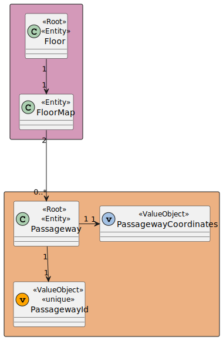

# US 250 - As a Campus Manager, I want to edit the passageway between buildings.

## 1. Context

* First time that this task is developed.
* This task is relative to system user Campus Manager.

## 2. Requirements

**US 250 -** As a Campus Manager, I want to:

* Edit a passageway between buildings

**Dependencies:**
- **US240 -** As a Campus Manager, I want to create a passageway between buildings.

## 3. Analysis

*In this section, the team should report the study/analysis/comparison that was done in order to take the best design decisions for the requirement. This section should also include supporting diagrams/artifacts (such as domain model; use case diagrams, etc.),*

### 3.1. Domain Model Excerpt



## 4. Design

### 4.1. Realization

### Level 1

* Logical:


* Process


* Scenary


### level 2

* Logical:


* Process


* Physical


* Implementation


### Level 3

* Logical:


* Implementation


* Process


### 4.2. Applied Patterns

### 4.3. Tests

**Test 1:** *Verifies that it is not possible to create an instance of the Example class with null values.*

```
@Test(expected = IllegalArgumentException.class)
public void ensureNullIsNotAllowed() {
	Example instance = new Example(null, null);
}
````

## 5. Implementation

*In this section the team should present, if necessary, some evidencies that the implementation is according to the design. It should also describe and explain other important artifacts necessary to fully understand the implementation like, for instance, configuration files.*

*It is also a best practice to include a listing (with a brief summary) of the major commits regarding this requirement.*

## 6. Integration/Demonstration

## 7. Observations