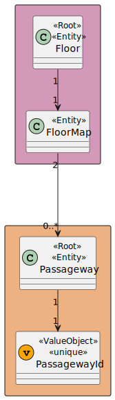
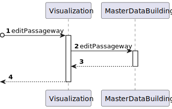
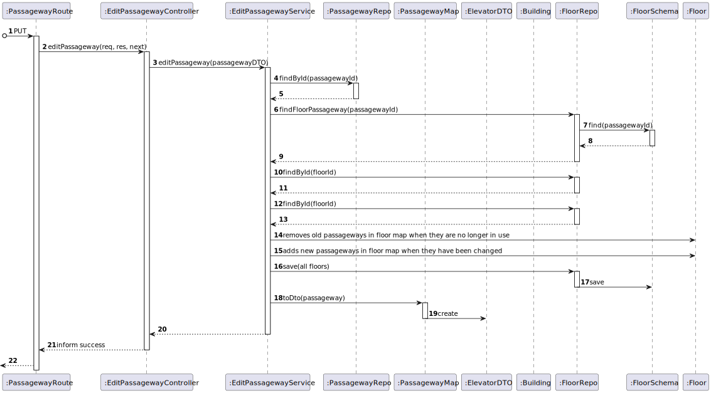

# US 250 - As a Campus Manager, I want to edit the passageway between buildings.

## 1. Context

* First time that this task is developed.
* This task is relative to system user Campus Manager.

## 2. Requirements

**US 250 -** As a Campus Manager, I want to:

* Edit a passageway between buildings

**Client Clarifications**
> **Q**: ... o que é que pretende que seja possivel editar numa passagem entre edificios?
<br>
> **A**: ... deve ser possivel corrigir todos os dados da passagem.
<br>
> **Q**: ... o que pretende indicar no que se refere à passagem entre edifícios? Seria apenas os edifícios e os pisos referentes à mesma, ou deve ser dito mais alguma coisa acerca de uma passagem?
<br>
> **A**: ... apenas os edificios e os pisos que estão ligados por essa passagem.

**Dependencies:**
- **US150 -** As a Campus Manager, I want to create a building.
- **US190 -** As a Campus Manager, I want to create building floor.
- **US240 -** As a Campus Manager, I want to create a passageway between buildings.

## 3. Analysis

Regarding this requirement we understand that: As a Campus Manager, an actor of the system, I will be able to edit a passageway
between buildings, changing the points where it connects to.
* Campus Manager is a user role that manages the data of the routes and maps.
* Building is a structure within the campus that houses various rooms and facilities. It can be navigated by the robisep robots using corridors and elevators.
* Floor is a level within a building. Each floor can contain multiple rooms and is accessible by elevators and stairs (though robisep robots cannot use stairs).
* Passageway is a connection between two buildings.

### 3.1. Domain Model Excerpt



## 4. Design

### 4.1. Realization

### Level 1

* Logical:


* Process


* Scenary


### level 2

* Logical:


* Process



* Physical


* Implementation


### Level 3

* Logical:


* Implementation


* Process



### 4.2. Applied Patterns

* Controller
* Service
* Repository
* Mapper
* DTO
* GRASP

### 4.3. Tests

**Test 1:** *Tests the controller using a stub service to edit passageways*

```
it('editPassagewayController unit test using editPassagewayService stub', async function () {
        // Arrange
        let body = {
            "passagewayId": 5,
            "floor1Id": 1,
            "floor2Id": 3,
        };
        let req: Partial<Request> = {};
        req.body = body;
        let res: Partial<Response> = {
            json: sinon.spy(),
            status: sinon.stub().returnsThis(),
            send: sinon.spy()
        };
        let next: Partial<NextFunction> = () => {};

        const PassagewayDTO = {
            passagewayId: 5,
            building1Id: "A",
            floor1Id: 1,
            building2Id: "B",
            floor2Id: 3,
        } as IEditPassagewayDTO


        let editPassagewayServiceInstance = Container.get("editPassagewayService");
        sinon.stub(editPassagewayServiceInstance, "editPassageway").returns(Result.ok <IPassagewayDTO>(PassagewayDTO));

        const ctrl = new EditPassagewayController(editPassagewayServiceInstance as IEditPassagewayService);

        // Act
        await ctrl.editPassageway(<Request>req, <Response>res, <NextFunction>next);

        // Assert
        sinon.assert.calledOnce(res.json);
        sinon.assert.calledWith(res.json, sinon.match({
            passagewayId: 5,
            building1Id: "A",
            floor1Id: 1,
            building2Id: "B",
            floor2Id: 3,
        }));

    });
````

## 5. Implementation

**EditPassagewayService:**

```
public async editPassageway(passagewayDTO:IEditPassagewayDTO): Promise<Result<IPassagewayDTO>> {
        try{
            const passageway = await this.passagewayRepo.findById(passagewayDTO.passagewayId)

            if (passageway === undefined) throw new Error("Passageway does not exist!")

            const currentFloors : Floor[] = await this.floorRepo.findByPassageway(Number(passageway.id.toValue()))

            const floor1 = await this.floorRepo.findById(passagewayDTO.floor1Id)
            const floor2 = await this.floorRepo.findById(passagewayDTO.floor2Id)
            let index = 0
            let isFloor1 = false
            let isFloor2 = false


            for(var floor of currentFloors){
                if(floor.floorId.toValue() !== floor1.floorId.toValue() && floor.floorId.toValue() !== floor2.floorId.toValue()) {
                    floor.removePassageway(passageway)
                    await this.floorRepo.save(floor);
                    index++
                }else if (floor.floorId.toValue() !== floor1.floorId.toValue()){
                    isFloor2 = true
                }else{
                    isFloor1 = true
                }
            }

            if(isFloor1 && index>0){
                floor2.addPassageway(passageway)
            }else if(isFloor2 && index > 0){
                floor1.addPassageway(passageway)
            } else if(index>0){
                floor1.addPassageway(passageway)
                floor2.addPassageway(passageway)
            }

            await this.floorRepo.save(floor1);
            await this.floorRepo.save(floor2);

            const passagewayDtoResult = PassagewayMap.toDto(passageway) as IPassagewayDTO

            return Result.ok<IPassagewayDTO>(passagewayDtoResult)

        } catch(e) {
            throw e
        }
    }
````

**Test 2:** *Tests the service using a stub repo to edit passageways*

```
it("editPassagewayController + editPassagewayService integration test (All values)", async function() {
        // Arrange
        let body = {
            "passagewayId": 5,
            "floor1Id": 1,
            "floor2Id": 3,
        };
        let req: Partial<Request> = {
            body: body
        };
        let res: Partial<Response> = {
            json: sinon.spy(),
            status: sinon.stub().returnsThis(),
            send: sinon.spy()
        };
        let next: Partial<NextFunction> = () => {};

        // Stub repo methods
        const createPassagewayDTO = {
            passagewayId: 1,
            building1Id: "A",
            floor1Id: 1,
            building2Id: "B",
            floor2Id: 2,
        } as ICreatePassagewayDTO

        const passageway = Passageway.create(
            {
                passagewayId: createPassagewayDTO.passagewayId,
                building1Id: createPassagewayDTO.building1Id,
                floor1Id: createPassagewayDTO.floor1Id,
                building2Id: createPassagewayDTO.building2Id,
                floor2Id: createPassagewayDTO.floor2Id,
            }).getValue()

        const buildingDTO = {
            buildingName: "EdificioA",
            buildingDescription: "uma descricao",
            buildingCode: "A",
            buildingLength: 2,
            buildingWidth: 2
        } as IBuildingDTO

        const building = Building.create({
            buildingName: new BuildingName({ value: buildingDTO.buildingName }),
            buildingDescription: new BuildingDescription({ value: buildingDTO.buildingDescription }),
            buildingSize: new BuildingSize({ length: buildingDTO.buildingLength, width: buildingDTO.buildingWidth }),
            floors: [],
        }, buildingDTO.buildingCode).getValue()


        const building2DTO = {
            buildingName: "EdificioB",
            buildingDescription: "uma descricao",
            buildingCode: "B",
            buildingLength: 2,
            buildingWidth: 2
        } as IBuildingDTO

        const building2 = Building.create({
            buildingName: new BuildingName({ value: building2DTO.buildingName }),
            buildingDescription: new BuildingDescription({ value: building2DTO.buildingDescription }),
            buildingSize: new BuildingSize({ length: building2DTO.buildingLength, width: building2DTO.buildingWidth }),
            floors: [],
        }, building2DTO.buildingCode).getValue()


        const floorProps1 = {
            floorDescription: new FloorDescription({ value: 'Test floor' }),
            floorNumber: new FloorNumber({ number: 1 }),
            floormap: new FloorMap({
                map: [[]],
                passageways: [],
                rooms: [],
                elevators: [],
                elevatorsCoords: [],
                roomsCoords: [],
                passagewaysCoords: [],
            }),
        };
        const floor1Id = 1;
        const floor1 = Floor.create(floorProps1, floor1Id).getValue();

        const floorProps2 = {
            floorDescription: new FloorDescription({ value: 'Test floor' }),
            floorNumber: new FloorNumber({ number: 1 }),
            floormap: new FloorMap({
                map: [[]],
                passageways: [],
                rooms: [],
                elevators: [],
                elevatorsCoords: [],
                roomsCoords: [],
                passagewaysCoords: [],
            }),
        };
        const floor2Id = 2;
        const floor2 = Floor.create(floorProps2, floor2Id).getValue();

        const floorProps3 = {
            floorDescription: new FloorDescription({ value: 'Test floor' }),
            floorNumber: new FloorNumber({ number: 2 }),
            floormap: new FloorMap({
                map: [[]],
                passageways: [],
                rooms: [],
                elevators: [],
                elevatorsCoords: [],
                roomsCoords: [],
                passagewaysCoords: [],
            }),
        };
        const floor3Id = 3;
        const floor3 = Floor.create(floorProps3, floor3Id).getValue();

        building.addFloor(floor1)
        building2.addFloor(floor2)
        building2.addFloor(floor3)
        floor1.addPassageway(passageway)
        floor2.addPassageway(passageway)


        buildingRepoMock.findByFloorId.resolves(building);
        buildingRepoMock.findByFloorId.resolves(building2);
        floorRepoMock.findById.resolves(floor1);
        floorRepoMock.findById.resolves(floor2);
        floorRepoMock.findById.resolves(floor3);
        passagewayRepoMock.findById.resolves(passageway);
        floorRepoMock.findByPassageway.resolves([floor1, floor2]);

        let editPassagewayServiceInstance = Container.get("editPassagewayService");
        const editPassagewayServiceSpy = sinon.spy(editPassagewayServiceInstance, "editPassageway");

        const ctrl = new EditPassagewayController(editPassagewayServiceInstance as IEditPassagewayService);

        await ctrl.editPassageway(<Request>req, <Response>res, <NextFunction>next);

        sinon.assert.calledOnce(editPassagewayServiceSpy);
        sinon.assert.calledOnce(res.json);
        sinon.assert.calledWith(res.json, sinon.match({
            passagewayId: 1
        }));
    });
````

## 5. Implementation

**EditPassagewayService:**

```
public async editPassageway(passagewayDTO:IEditPassagewayDTO): Promise<Result<IPassagewayDTO>> {
        try{
            const passageway = await this.passagewayRepo.findById(passagewayDTO.passagewayId)

            if (passageway === undefined) throw new Error("Passageway does not exist!")

            const currentFloors : Floor[] = await this.floorRepo.findByPassageway(Number(passageway.id.toValue()))

            const floor1 = await this.floorRepo.findById(passagewayDTO.floor1Id)
            const floor2 = await this.floorRepo.findById(passagewayDTO.floor2Id)
            let index = 0
            let isFloor1 = false
            let isFloor2 = false


            for(var floor of currentFloors){
                if(floor.floorId.toValue() !== floor1.floorId.toValue() && floor.floorId.toValue() !== floor2.floorId.toValue()) {
                    floor.removePassageway(passageway)
                    await this.floorRepo.save(floor);
                    index++
                }else if (floor.floorId.toValue() !== floor1.floorId.toValue()){
                    isFloor2 = true
                }else{
                    isFloor1 = true
                }
            }

            if(isFloor1 && index>0){
                floor2.addPassageway(passageway)
            }else if(isFloor2 && index > 0){
                floor1.addPassageway(passageway)
            } else if(index>0){
                floor1.addPassageway(passageway)
                floor2.addPassageway(passageway)
            }

            await this.floorRepo.save(floor1);
            await this.floorRepo.save(floor2);

            const passagewayDtoResult = PassagewayMap.toDto(passageway) as IPassagewayDTO

            return Result.ok<IPassagewayDTO>(passagewayDtoResult)

        } catch(e) {
            throw e
        }
    }
````

## 6. Integration/Demonstration

To use this US, you need to send and HTTP request with the following JSON:

Using this URI: localhost:4000/api/passageways/editPassageway

````
{
            "passagewayId": 8,
            "floor1Id": 2,
            "floor2Id": 3
}
````

## 7. Observations

No additional observations.