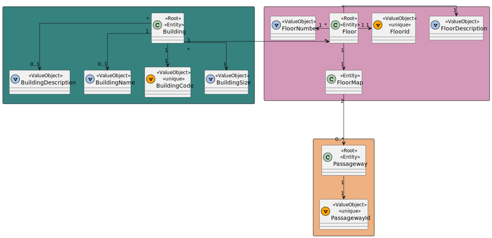
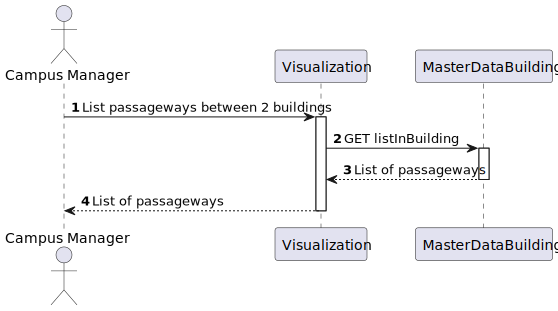

# US 260 - As a Campus Manager, I want to list passageways between 2 buildings.


## 1. Context

* This task comes in context of Sprint A.
* First time that this task is developed.
* This task is relative to system user Campus Manager.

## 2. Requirements

**US 260 -** As a Campus Manager, I want to:

* list passageways between 2 buildings.

**Dependencies:**
- **US150 -** As a Campus Manager, I want to create a building.
- **US190 -** As a Campus Manager, I want to create building floor.
- **US240 -** As a Campus Manager, I want to create a passageway between buildings.

## 3. Analysis
* Campus Manager is a user role that manages the data of the routes and maps.
* Building is a structure within the campus that houses various rooms and facilities. It can be navigated by the robisep robots using corridors and elevators.
* Floor is a level within a building. Each floor can contain multiple rooms and is accessible by elevators and stairs (though robisep robots cannot use stairs).
* Passageway allows movement between buildings. Both robisep robots and droneisep drones can use passages for navigation.

Regarding this requirement we understand that: As a Campus Manager, an actor of the system, I will be able to list the floors of a building with a passageway,describing the floor and description
and also the building and floor where the passageway connects to.
* Campus Manager is a user role that manages the data of the routes and maps.
* Building is a structure within the campus that houses various rooms and facilities. It can be navigated by the robisep robots using corridors and elevators.
* Floor is a level within a building. Each floor can contain multiple rooms and is accessible by elevators and stairs (though robisep robots cannot use stairs).
* Passageway is a connection between two buildings.

### 3.1. Domain Model Excerpt



## 4. Design
### Level 1

* Logical View


* Process View


* Scenary View


### level 2

* Logical View


* Process View



* Physical View


* Implementation View


### Level 3

* Logical:


* Implementation


* Process


### 4.2. Applied Patterns
* Controller
* Service
* Repository
* Mapper
* DTO
* GRASP

### 4.3. Tests

**Test 1:** *Verifies that it is not possible to create an instance of the Example class with null values.*

```
@Test(expected = IllegalArgumentException.class)
public void ensureNullIsNotAllowed() {
	Example instance = new Example(null, null);
}
````

## 5. Implementation

**listPassagewaysBetween2BuildingsService:**

```
public async listPassagewaysBetween2BuildingsService(building1Code: string, building2Code: string): Promise<Result<IListPassagewaysBetween2BuildingsDTO[]>> {
        try{
            const building1 = await this.buildingRepo.findByBuidingCode(new BuildingCode(building1Code))
            if (!building1) return Result.fail<IListPassagewaysBetween2BuildingsDTO[]>('Building does not exist!')
            
            const building2 = await this.buildingRepo.findByBuidingCode(new BuildingCode(building2Code))
            if (!building2) return Result.fail<IListPassagewaysBetween2BuildingsDTO[]>('Building does not exist!')
            
            let passagewaysList: IListPassagewaysBetween2BuildingsDTO[] = []
            for (var floor of building1.floors) {
                for (var passagewayId of floor.props.floormap.passagewaysId) {
                    const floorOrUndefined = building2.floors.find((floor) => floor.map.passagewaysId.find((aPassagewayId) => aPassagewayId === passagewayId))
                    
                    if (floorOrUndefined !== undefined){
                        passagewaysList.push(PassagewayMap.toDtoList(await this.passagewayRepo.findById(passagewayId), Number(floor.floorNumber), Number(floorOrUndefined.floorNumber)))
                    } 
                }
            }

            if (passagewaysList.length === 0) return Result.fail<IListPassagewaysBetween2BuildingsDTO[]>('No passageways found!')
            
            return Result.ok<IListPassagewaysBetween2BuildingsDTO[]>(passagewaysList)
        } catch(e) {
            throw e
        }
    }
````

## 6. Integration/Demonstration

*In this section the team should describe the efforts realized in order to integrate this functionality with the other parts/components of the system*

*It is also important to explain any scripts or instructions required to execute an demonstrate this functionality*

## 7. Observations

No additional observations.