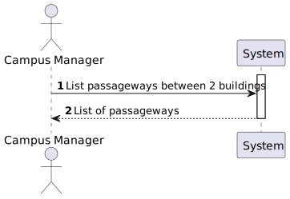
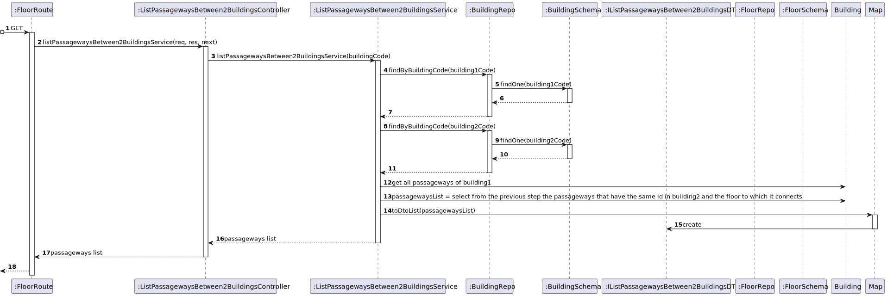

# US 260 - As a Campus Manager, I want to list passageways between 2 buildings.


## 1. Context

* This task comes in context of Sprint A.
* First time that this task is developed.
* This task is relative to system user Campus Manager.

## 2. Requirements

**US 260 -** As a Campus Manager, I want to:

* list passageways between 2 buildings.

**Dependencies:**
- **US150 -** As a Campus Manager, I want to create a building.
- **US190 -** As a Campus Manager, I want to create building floor.
- **US240 -** As a Campus Manager, I want to create a passageway between buildings.

## 3. Analysis
* Campus Manager is a user role that manages the data of the routes and maps.
* Building is a structure within the campus that houses various rooms and facilities. It can be navigated by the robisep robots using corridors and elevators.
* Floor is a level within a building. Each floor can contain multiple rooms and is accessible by elevators and stairs (though robisep robots cannot use stairs).
* Passageway allows movement between buildings. Both robisep robots and droneisep drones can use passages for navigation.

Regarding this requirement we understand that: As a Campus Manager, an actor of the system, I will be able to list the floors of a building with a passageway,describing the floor and description
and also the building and floor where the passageway connects to.
* Campus Manager is a user role that manages the data of the routes and maps.
* Building is a structure within the campus that houses various rooms and facilities. It can be navigated by the robisep robots using corridors and elevators.
* Floor is a level within a building. Each floor can contain multiple rooms and is accessible by elevators and stairs (though robisep robots cannot use stairs).
* Passageway is a connection between two buildings.

### 3.1. Domain Model Excerpt


## 4. Design

### 4.1. Realization

### Level1
###### LogicalView:


###### SceneryView:


###### ProcessView:


#### Level2

###### LogicalView:


###### ImplementationView:


###### PhysicalView:


###### ProcessView:


#### Level3
###### LogicalView:


###### ImplementationView:


###### ProcessView:


### 4.2. Applied Patterns
* Controller
* Service
* Repository
* Mapper
* DTO
* GRASP

### 4.3. Tests

**Test 1:** *Verifies that controller class returns the right response to a valid get request.*

``` typescript
    it('1. Controller with stub service returns passageway', async function () {
        const passagewayResult1 = {
            passagewayId: 1,
            floorNumberBuilding1: 1,
            floorNumberBuilding2: 1
        } as IListPassagewaysBetween2BuildingsDTO

        const result = [passagewayResult1]

        let req: Partial<Request> = {}
        req.params = {
            building1Code: building.getValue().code.toString(),
            building2Code: building2.getValue().code.toString()
        }

        let res: Partial<Response> = {
            status: sinon.stub().returnsThis(),
            json: sinon.spy()
        }

        let next: Partial<NextFunction> = () => { }

        const listPassagewaysBetween2BuildingsService = Container.get('listPassagewaysBetween2BuildingsService')

        sinon.stub(listPassagewaysBetween2BuildingsService, 'listPassagewaysBetween2Buildings').returns(new Promise((resolve, reject) => { resolve(Result.ok<IListPassagewaysBetween2BuildingsDTO[]>(result)) }))

        const listPassagewaysBetween2BuildingsController = new ListPassagewaysBetween2BuildingsController (listPassagewaysBetween2BuildingsService as IListPassagewaysBetween2BuildingsService)

        await listPassagewaysBetween2BuildingsController.listPassagewaysBetween2Buildings(<Request>req, <Response>res, <NextFunction>next)

        sinon.assert.calledOnce(res.status)
        sinon.assert.calledWith(res.status, 200)
        sinon.assert.calledOnce(res.json)
        sinon.assert.calledWith(res.json, sinon.match(result))
    })
```

**Test 2:** *Verifies that controller class returns the right response when there are no passageways in the system.*

``` typescript
it('2. Controller with stub service returns no passageway', async function () {
        let req: Partial<Request> = {}
        req.params = {
            building1Code: building.getValue().code.toString(),
            building2Code: building2.getValue().code.toString()
        }

        let res: Partial<Response> = {
            status: sinon.stub().returnsThis(),
            send: sinon.spy()
        }

        let next: Partial<NextFunction> = () => { }

        const listPassagewaysBetween2BuildingsService = Container.get('listPassagewaysBetween2BuildingsService')

        sinon.stub(listPassagewaysBetween2BuildingsService, 'listPassagewaysBetween2Buildings').returns(new Promise((resolve, reject) => { resolve(Result.fail<IListPassagewaysBetween2BuildingsDTO[]>('No passageways found!')) }))

        const listPassagewaysBetween2BuildingsController = new ListPassagewaysBetween2BuildingsController (listPassagewaysBetween2BuildingsService as IListPassagewaysBetween2BuildingsService)

        await listPassagewaysBetween2BuildingsController.listPassagewaysBetween2Buildings(<Request>req, <Response>res, <NextFunction>next)
        sinon.assert.calledOnce(res.status)
        sinon.assert.calledWith(res.status, 400)
        sinon.assert.calledOnce(res.send)
    })
```

**Test 3:** *Verifies that service class returns the right list when there are passageways in the system.*

``` typescript
    it('3. Service with stub repo lists passageway', async function () {
        const passagewayResult = {
            passagewayId: 1,
            floorNumberBuilding1: 1,
            floorNumberBuilding2: 1
        } as IListPassagewaysBetween2BuildingsDTO
        
        const expected = [passagewayResult]

        const buildingRepo = Container.get('buildingRepo')
        sinon.stub(buildingRepo, 'findByBuidingCode')
            .onFirstCall()
            .returns(new Promise((resolve, reject) => { resolve(building.getValue()) }))
            .onSecondCall()
            .returns(new Promise((resolve, reject) => { resolve(building2.getValue()) }))
            
        const listPassagewaysBetween2BuildingsService = Container.get('listPassagewaysBetween2BuildingsService') as IListPassagewaysBetween2BuildingsService

        const actual = await listPassagewaysBetween2BuildingsService.listPassagewaysBetween2Buildings(building.getValue().code.toString(), building2.getValue().code.toString())

        sinon.assert.match(actual.getValue(), expected)
    })

```

**Test 3:** *Verifies that controller and service classes return the right list when there are passageways in the system.*

``` typescript
    it('5. Controller + Service with stub repo returns passageway', async function () {
        const passagewayResult1 = {
            passagewayId: 1,
            floorNumberBuilding1: 1,
            floorNumberBuilding2: 1
        } as IListPassagewaysBetween2BuildingsDTO
    

        const result = [passagewayResult1]

        let req: Partial<Request> = {}
        req.params = {
            building1Code: building.getValue().code.toString(),
            building2Code: building2.getValue().code.toString()
        }

        let res: Partial<Response> = {
            status: sinon.stub().returnsThis(),
            json: sinon.spy()
        }

        let next: Partial<NextFunction> = () => { }

        const buildingRepo = Container.get('buildingRepo')
        sinon.stub(buildingRepo, 'findByBuidingCode')
            .onFirstCall()
            .returns(new Promise((resolve, reject) => { resolve(building.getValue()) }))
            .onSecondCall()
            .returns(new Promise((resolve, reject) => { resolve(building2.getValue()) }))

        const listPassagewaysBetween2BuildingsService = Container.get('listPassagewaysBetween2BuildingsService') as IListPassagewaysBetween2BuildingsService

        const listPassagewaysBetween2BuildingsController = new ListPassagewaysBetween2BuildingsController (listPassagewaysBetween2BuildingsService as IListPassagewaysBetween2BuildingsService)

        await listPassagewaysBetween2BuildingsController.listPassagewaysBetween2Buildings(<Request>req, <Response>res, <NextFunction>next)

        sinon.assert.calledOnce(res.status)
        sinon.assert.calledWith(res.status, 200)
        sinon.assert.calledOnce(res.json)
        sinon.assert.calledWith(res.json, sinon.match(result))
    })

```

## 5. Implementation

**listPassagewaysBetween2BuildingsService:**

``` typescript
@Service()
export default class ListPassagewaysBetween2BuildingsService implements IListPassagewaysBetween2BuildingsService {

    constructor(
        @Inject(config.repos.passageway.name) private passagewayRepo: IPassagewayRepo,
        @Inject(config.repos.building.name) private buildingRepo: IBuildingRepo
    ) { }

    public async listPassagewaysBetween2Buildings(building1Code: string, building2Code: string): Promise<Result<IListPassagewaysBetween2BuildingsDTO[]>> {
        try{
            const building1 = await this.buildingRepo.findByBuidingCode(new BuildingCode(building1Code))
            if (!building1) return Result.fail<IListPassagewaysBetween2BuildingsDTO[]>('Building does not exist!')
            
            const building2 = await this.buildingRepo.findByBuidingCode(new BuildingCode(building2Code))
            if (!building2) return Result.fail<IListPassagewaysBetween2BuildingsDTO[]>('Building does not exist!')
            
            let passagewaysList: IListPassagewaysBetween2BuildingsDTO[] = []
            for (var floor of building1.floors) {
                for (var passageway of floor.props.floormap.props.passageways) {
                    const floorOrUndefined = building2.floors.find((floor) => floor.map.passagewaysId.find((aPassagewayId) => aPassagewayId === passageway.id.toValue()))
                    
                    if (floorOrUndefined !== undefined){
                        passagewaysList.push(PassagewayMap.toDtoList(passageway, floor.floorNumber.number, floorOrUndefined.floorNumber.number))
                    } 
                }
            }

            if (passagewaysList.length === 0) return Result.fail<IListPassagewaysBetween2BuildingsDTO[]>('No passageways found!')
            
            return Result.ok<IListPassagewaysBetween2BuildingsDTO[]>(passagewaysList)
        } catch(e) {
            throw e
        }
    }
}
```

## 6. Integration/Demonstration

To use this US, you need to send and HTTP request with the following URI:

localhost:4000/api/passageways/list/building1/:building1Code/building2/:building1Code

The paramaters ":building1Code" and ":building2Code" are mandatory and corresponds to the buildings which the passageways connect.

## 7. Observations

No additional observations.
