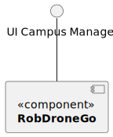
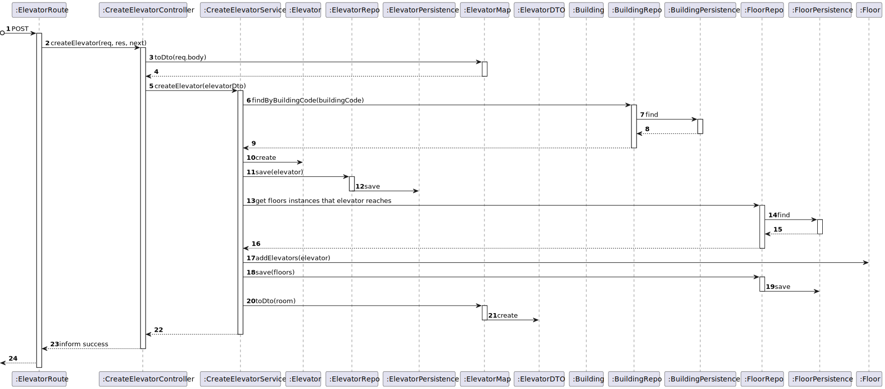

# US 270 - As a Campus Manager, I want to create an elevator in a building.

## 1. Context

* First time that this task is developed.
* This task is relative to system user Campus Manager.

## 2. Requirements

**US 270 -** As a Campus Manager, I want to create an elevator in a building.

**Client Clarifications**
>**Question**: "Como tal, gostaria de saber que atributos deveria ter o elevador, para além de uma lista de pisos aos quais consegue aceder dentro do seu edifício. Algumas das ideias que me surgiram foram o piso em que estava localizado naquele momento, número de série, fabricante ou descrição."<br><br>
>**Answer**: "- edificio (obrigatório)<br>
			- número identificativo (obrigatório, único no edificio)<br>
			-lista de pisos do edificio servidos pelo elevador (obrigatório)<br>
			- marca (opcional, alfanumerico, 50 caracteres)<br>
			- modelo (opcional, mas obrigatório se marca for introduzido, alfanumerico, 50 caracteres)<br>
			- número de série do fabricante (opcional, alfanumerico, 50 caracteres)<br>
			- breve descrição (opcional, alfanumerico, 250 caracteres)"<br>

>**Question**: "Relativamente à funcionalidade de criar elevador, no seguimento da sua resposta em (https://moodle.isep.ipp.pt/mod/forum/discuss.php?d=25298#p32051), gostaríamos que clarificasse quais das propriedades que indicou serem alfanuméricas podem conter espaços; por exemplo, nós acharíamos que seria sensato a descrição poder conter espaços."<br>
"Adicionalmente, gostaria de saber se o identificador numérico que referiu deve ser fornecido ao sistema ou gerado automaticamente pelo mesmo, dado que este deve ser único dentro de cada edifício."<br><br>
>**Answer**: "
bom dia,
todos os atributos alfanumercos podme conter espaços à exceção do número de série
o número indeitifcativo do elevador deve ser gerado sequencialmente pelo sistema tendo em conta o edifico, por exemplo, existirá o elevador 1 do edificio B e o elevador 1 do edificio A"<br>

**Dependencies:**
- **US150 -** As a Campus Manager, I want to create a building.

**Regarding this requirement we understand that:** <br>
As a Campus Manager, an actor of the system, I will be able to access the system and create a building in the Campus area.

## 3. Analysis

**Analyzing this User Story we understand that:**
* Campus Manager is a user role that manages the data of the routes and maps.
* Building is a structure within the campus that houses various rooms and facilities. It can be navigated by the robisep robots using corridors and elevators.

### 3.1. Domain Model Excerpt


## 4. Design

### Level1
###### LogicalView:


###### SceneryView:


###### ProcessView:


#### Level2

###### LogicalView:


###### ImplementationView:


###### PhysicalView:


###### ProcessView:


#### Level3
###### LogicalView:


###### ImplementationView:


###### ProcessView:


### 4.2. Applied Patterns
* Controller
* Service
* Repository
* Mapper
* DTO
* GRASP


### 4.3. Tests

**Test 1:** *Tests the controller using a stub service to create a valid elevator*

```
it('Controller unit test with stub service, valid elevator', async function () {
        let body = {
            "elevatorId": 20,
            "elevatorBrand": "Apple",
            "elevatorIdentificationNumber": 35,
            "elevatorDescription": 'This is an elevator',
            "elevatorModel": 'Ieli',
            "elevatorSerialNumber": '445'
        }

        let expected = {
            "elevatorId": 20,
            "elevatorBrand": "Apple",
            "elevatorIdentificationNumber": 35,
            "elevatorDescription": 'This is an elevator',
            "elevatorModel": 'Ieli',
            "elevatorSerialNumber": '445'
        }

        let req: Partial<Request> = {}
        req.body = body

        let res: Partial<Response> = {
            json: sinon.spy()
        }

        let next: Partial<NextFunction> = () => { }

        let createElevatorService = Container.get('createElevatorService')
        sinon.stub(createElevatorService, 'createElevator').returns(Result.ok<IElevatorDTO>({
            elevatorId: 20,
            elevatorBrand: 'Apple',
            elevatorIdentificationNumber: 35,
            elevatorDescription: 'This is an elevator',
            elevatorModel: 'Ieli',
            elevatorSerialNumber: '445'
        } as IElevatorDTO))

        const createElevatorController = new CreateElevatorController(createElevatorService as ICreateElevatorService)

        await createElevatorController.createElevator(<Request>req, <Response>res, <NextFunction>next)

        sinon.assert.calledOnce(res.json)
        sinon.match(expected)
    })
````

**Test 2:** *Tests the elevator description over the max allowed word limit*

```
it('Create elevator test, elevator description over word limit (250+ words)', async function () {
        const elevatorDescription: string = 'A'.repeat(251);
        const result: Result<ElevatorDescription> = ElevatorDescription.create(elevatorDescription);

        assert.equal(result.isFailure,true)
        assert.equal(result.error,'Elevator description must be shorter than 250 words')
    })
````
**Test 3:** *This test is for creating a valid elevator and checking if it succeeds.*
```
it('Create elevator test, valid elevator', async function () {
        const elevatorDto = {
            elevatorId: 20,
            elevatorBrand: 'Apple',
            elevatorIdentificationNumber: 35,
            elevatorDescription: 'This is an elevator',
            elevatorModel: 'Ieli',
            elevatorSerialNumber: '445'
        } as IElevatorDTO

        const elevator = Elevator.create({
            elevatorIdentificationNumber: new ElevatorIdentificationNumber({ identificationNumber: elevatorDto.elevatorIdentificationNumber }),
            elevatorBrand: new ElevatorBrand({ brand: elevatorDto.elevatorBrand }),
            elevatorDescription: new ElevatorDescription({ description: elevatorDto.elevatorDescription }),
            elevatorModel: new ElevatorModel({ model: elevatorDto.elevatorModel }),
            elevatorSerialNumber: new ElevatorSerialNumber({ serialNumber: elevatorDto.elevatorSerialNumber })
        }, new ElevatorID(elevatorDto.elevatorId))

        assert.equal(elevator.isSuccess, true)
    })
````

**Test 4:** *Tests the controller's functionality while stubbing the createElevatorService and ensuring the correct response is sent.*
```
it('Controller unit test with stub service, valid elevator', async function () {
        let body = {
            "elevatorId": 20,
            "elevatorBrand": "Apple",
            "elevatorIdentificationNumber": 35,
            "elevatorDescription": 'This is an elevator',
            "elevatorModel": 'Ieli',
            "elevatorSerialNumber": '445'
        }

        let expected = {
            "elevatorId": 20,
            "elevatorBrand": "Apple",
            "elevatorIdentificationNumber": 35,
            "elevatorDescription": 'This is an elevator',
            "elevatorModel": 'Ieli',
            "elevatorSerialNumber": '445'
        }

        let req: Partial<Request> = {}
        req.body = body

        let res: Partial<Response> = {
            json: sinon.spy(),
            status: sinon.stub().returnsThis(),
            send: sinon.spy()
        }

        let next: Partial<NextFunction> = () => { }

        let createElevatorService = Container.get('createElevatorService')

        sinon.stub(createElevatorService, 'createElevator').returns(Result.ok<IElevatorDTO>({
            elevatorId: 20,
            elevatorBrand: 'Apple',
            elevatorIdentificationNumber: 35,
            elevatorDescription: 'This is an elevator',
            elevatorModel: 'Ieli',
            elevatorSerialNumber: '445'
        } as IElevatorDTO))

        const createElevatorController = new CreateElevatorController(createElevatorService as ICreateElevatorService)

        await createElevatorController.createElevator(<Request>req, <Response>res, <NextFunction>next)

        sinon.assert.calledOnce(res.json)
        sinon.match(expected)
    })
````

**Test 5:** *Integration test that simulates creating an elevator, checks if the service is called, and verifies the response.*
```
it("createElevatorController +createElevatorService integration test", async function() {
        // Arrange
        let body = {
            "elevatorId": 20,
            "elevatorBrand": "Apple",
            "elevatorIdentificationNumber": 35,
            "elevatorDescription": 'This is an elevator',
            "elevatorModel": 'Ieli',
            "elevatorSerialNumber": '445',
            "buildingCode": "A",
            "floorIds": [1]
        };
        let req: Partial<Request> = {
          body: body
        };
        let res: Partial<Response> = {
          json: sinon.spy(),
          status: sinon.stub().returnsThis(),
          send: sinon.spy()
        };
        let next: Partial<NextFunction> = () => {};

        // Stub repo methods
        const elevatorDTO = {
            elevatorId: 20,
            elevatorBrand: 'Apple',
            elevatorIdentificationNumber: 35,
            elevatorDescription: 'This is an elevator',
            elevatorModel: 'Ieli',
            elevatorSerialNumber: '445'
        } as IElevatorDTO

        const buildingDTO = {
            buildingCode: "bgdA1",
            buildingName: "buildingTest",
            buildingDescription: "this is a building",
            buildingLength: 10,
            buildingWidth: 10,
            buildingFloors: []
        } as IBuildingDTO

        const building = Building.create({
            buildingName: new BuildingName({ value: buildingDTO.buildingName }),
            buildingDescription: new BuildingDescription({ value: buildingDTO.buildingDescription }),
            buildingSize: new BuildingSize({ length: buildingDTO.buildingLength, width: buildingDTO.buildingWidth }),
            floors: [],
        }, buildingDTO.buildingCode).getValue()

        const floor = Floor.create(
            {
              "floorNumber": new FloorNumber({number: 1}),
              "floorDescription": new FloorDescription({ value: 'Test floor' }),
              "floormap": new FloorMap(
                {
                  map: [[]],
                  passageways: [],
                  rooms: [],
                  elevators: [],
                  passagewaysCoords: [],
                  elevatorsCoords: [],
                  roomsCoords: [],
                }
              )
          }, 1 ).getValue();

        building.addFloor(floor)


        elevatorRepoMock.findById.resolves(null);
        buildingRepoMock.findByBuidingCode.resolves(building);
        floorRepoMock.findById.resolves(floor);

        let createElevatorServiceInstance = Container.get("createElevatorService");
        const createElevatorServiceSpy = sinon.spy(createElevatorServiceInstance, "createElevator");

        const ctrl = new CreateElevatorController(createElevatorServiceInstance as ICreateElevatorService);

        // Act
        await ctrl.createElevator(<Request>req, <Response>res, <NextFunction>next);

        // Assert
        sinon.assert.calledOnce(createElevatorServiceSpy);
        sinon.assert.calledOnce(res.json);
        sinon.assert.calledWith(res.json, sinon.match({
            elevatorBrand: "Apple",
            elevatorDescription: "This is an elevator",
            elevatorId: 20,
            elevatorIdentificationNumber: 1,
            elevatorModel: "Ieli",
            elevatorSerialNumber: "445"
          }));
    });
````

**Test 6:** *Checks how the controller handles a scenario where an elevator with the same ID already exists.*
```
it("createElevatorController +createElevatorService integration test (An Elevator with this Id already exists!)", async function() {
        // Arrange
        let body = {
            "elevatorId": 20,
            "elevatorBrand": "Apple",
            "elevatorIdentificationNumber": 35,
            "elevatorDescription": 'This is an elevator',
            "elevatorModel": 'Ieli',
            "elevatorSerialNumber": '445',
            "buildingCode": "A",
            "floorIds": [1]
        };
        let req: Partial<Request> = {
          body: body
        };
        let res: Partial<Response> = {
          json: sinon.spy(),
          status: sinon.stub().returnsThis(),
          send: sinon.spy()
        };
        let next: Partial<NextFunction> = () => {};

        // Stub repo methods
        const elevatorDTO = {
            elevatorId: 20,
            elevatorBrand: 'Apple',
            elevatorIdentificationNumber: 35,
            elevatorDescription: 'This is an elevator',
            elevatorModel: 'Ieli',
            elevatorSerialNumber: '445'
        } as IElevatorDTO

        const buildingDTO = {
            buildingCode: "bgdA1",
            buildingName: "buildingTest",
            buildingDescription: "this is a building",
            buildingLength: 10,
            buildingWidth: 10,
            buildingFloors: []
        } as IBuildingDTO

        const building = Building.create({
            buildingName: new BuildingName({ value: buildingDTO.buildingName }),
            buildingDescription: new BuildingDescription({ value: buildingDTO.buildingDescription }),
            buildingSize: new BuildingSize({ length: buildingDTO.buildingLength, width: buildingDTO.buildingWidth }),
            floors: [],
        }, buildingDTO.buildingCode).getValue()

        const floor = Floor.create(
            {
              "floorNumber": new FloorNumber({number: 1}),
              "floorDescription": new FloorDescription({ value: 'Test floor' }),
              "floormap": new FloorMap(
                {
                  map: [[]],
                  passageways: [],
                  rooms: [],
                  elevators: [],
                  passagewaysCoords: [],
                  elevatorsCoords: [],
                  roomsCoords: [],
                }
              )
          }, 1 ).getValue();

        building.addFloor(floor)


        elevatorRepoMock.findById.resolves(Elevator.create({
            elevatorIdentificationNumber: new ElevatorIdentificationNumber({ identificationNumber: 1 }),
            elevatorBrand: new ElevatorBrand({ brand: 'Apple' }),
            elevatorDescription: new ElevatorDescription({ description: 'This is an elevator' }),
            elevatorModel: new ElevatorModel({ model: 'Ieli' }),
            elevatorSerialNumber: new ElevatorSerialNumber({ serialNumber: '445' })
            }, new ElevatorID(20)).getValue());
        buildingRepoMock.findByBuidingCode.resolves(building);
        floorRepoMock.findById.resolves(floor);

        let createElevatorServiceInstance = Container.get("createElevatorService");
        const createElevatorServiceSpy = sinon.spy(createElevatorServiceInstance, "createElevator");

        const ctrl = new CreateElevatorController(createElevatorServiceInstance as ICreateElevatorService);

        // Act
        await ctrl.createElevator(<Request>req, <Response>res, <NextFunction>next);

        // Assert
        sinon.assert.calledOnce(createElevatorServiceSpy);
        sinon.assert.calledOnce(res.status);
        sinon.assert.calledWith(res.status,400);
        sinon.assert.calledOnce(res.send);
        sinon.assert.calledWith(res.send, sinon.match("An Elevator with this Id already exists!"));

    });
````

**Test 7:** *Simulates an elevator creation when the building specified doesn't exist.*
```
it("createElevatorController +createElevatorService integration test (Building does not exist!)", async function() {
        // Arrange
        let body = {
            "elevatorId": 20,
            "elevatorBrand": "Apple",
            "elevatorIdentificationNumber": 35,
            "elevatorDescription": 'This is an elevator',
            "elevatorModel": 'Ieli',
            "elevatorSerialNumber": '445',
            "buildingCode": "A",
            "floorIds": [1]
        };
        let req: Partial<Request> = {
          body: body
        };
        let res: Partial<Response> = {
          json: sinon.spy(),
          status: sinon.stub().returnsThis(),
          send: sinon.spy()
        };
        let next: Partial<NextFunction> = () => {};

        // Stub repo methods
        const elevatorDTO = {
            elevatorId: 20,
            elevatorBrand: 'Apple',
            elevatorIdentificationNumber: 35,
            elevatorDescription: 'This is an elevator',
            elevatorModel: 'Ieli',
            elevatorSerialNumber: '445'
        } as IElevatorDTO

        const buildingDTO = {
            buildingCode: "bgdA1",
            buildingName: "buildingTest",
            buildingDescription: "this is a building",
            buildingLength: 10,
            buildingWidth: 10,
            buildingFloors: []
        } as IBuildingDTO

        const building = Building.create({
            buildingName: new BuildingName({ value: buildingDTO.buildingName }),
            buildingDescription: new BuildingDescription({ value: buildingDTO.buildingDescription }),
            buildingSize: new BuildingSize({ length: buildingDTO.buildingLength, width: buildingDTO.buildingWidth }),
            floors: [],
        }, buildingDTO.buildingCode).getValue()

        const floor = Floor.create(
            {
              "floorNumber": new FloorNumber({number: 1}),
              "floorDescription": new FloorDescription({ value: 'Test floor' }),
              "floormap": new FloorMap(
                {
                  map: [[]],
                  passageways: [],
                  rooms: [],
                  elevators: [],
                  passagewaysCoords: [],
                  elevatorsCoords: [],
                  roomsCoords: [],
                }
              )
          }, 1 ).getValue();

        building.addFloor(floor)


        elevatorRepoMock.findById.resolves(null);
        buildingRepoMock.findByBuidingCode.resolves(null);
        floorRepoMock.findById.resolves(floor);

        let createElevatorServiceInstance = Container.get("createElevatorService");
        const createElevatorServiceSpy = sinon.spy(createElevatorServiceInstance, "createElevator");

        const ctrl = new CreateElevatorController(createElevatorServiceInstance as ICreateElevatorService);

        // Act
        await ctrl.createElevator(<Request>req, <Response>res, <NextFunction>next);

        // Assert
        sinon.assert.calledOnce(createElevatorServiceSpy);
        sinon.assert.calledOnce(res.status);
        sinon.assert.calledWith(res.status,400);
        sinon.assert.calledOnce(res.send);
        sinon.assert.calledWith(res.send, sinon.match("Building does not exist!"));

    });
````

**Test 8:** *simulates an elevator creation for a non-existing floor..*
```
it("createElevatorController +createElevatorService integration test (Floor does not exist!)", async function() {
        // Arrange
        let body = {
            "elevatorId": 20,
            "elevatorBrand": "Apple",
            "elevatorIdentificationNumber": 35,
            "elevatorDescription": 'This is an elevator',
            "elevatorModel": 'Ieli',
            "elevatorSerialNumber": '445',
            "buildingCode": "A",
            "floorIds": [1]
        };
        let req: Partial<Request> = {
          body: body
        };
        let res: Partial<Response> = {
          json: sinon.spy(),
          status: sinon.stub().returnsThis(),
          send: sinon.spy()
        };
        let next: Partial<NextFunction> = () => {};

        // Stub repo methods
        const elevatorDTO = {
            elevatorId: 20,
            elevatorBrand: 'Apple',
            elevatorIdentificationNumber: 35,
            elevatorDescription: 'This is an elevator',
            elevatorModel: 'Ieli',
            elevatorSerialNumber: '445'
        } as IElevatorDTO

        const buildingDTO = {
            buildingCode: "bgdA1",
            buildingName: "buildingTest",
            buildingDescription: "this is a building",
            buildingLength: 10,
            buildingWidth: 10,
            buildingFloors: []
        } as IBuildingDTO

        const building = Building.create({
            buildingName: new BuildingName({ value: buildingDTO.buildingName }),
            buildingDescription: new BuildingDescription({ value: buildingDTO.buildingDescription }),
            buildingSize: new BuildingSize({ length: buildingDTO.buildingLength, width: buildingDTO.buildingWidth }),
            floors: [],
        }, buildingDTO.buildingCode).getValue()

        const floor = Floor.create(
            {
              "floorNumber": new FloorNumber({number: 1}),
              "floorDescription": new FloorDescription({ value: 'Test floor' }),
              "floormap": new FloorMap(
                {
                  map: [[]],
                  passageways: [],
                  rooms: [],
                  elevators: [],
                  passagewaysCoords: [],
                  elevatorsCoords: [],
                  roomsCoords: [],
                }
              )
          }, 1 ).getValue();

        building.addFloor(floor)


        elevatorRepoMock.findById.resolves(null);
        buildingRepoMock.findByBuidingCode.resolves(building);
        floorRepoMock.findById.resolves(null);

        let createElevatorServiceInstance = Container.get("createElevatorService");
        const createElevatorServiceSpy = sinon.spy(createElevatorServiceInstance, "createElevator");

        const ctrl = new CreateElevatorController(createElevatorServiceInstance as ICreateElevatorService);

        // Act
        await ctrl.createElevator(<Request>req, <Response>res, <NextFunction>next);

        // Assert
        sinon.assert.calledOnce(createElevatorServiceSpy);
        sinon.assert.calledOnce(res.status);
        sinon.assert.calledWith(res.status,400);
        sinon.assert.calledOnce(res.send);
        sinon.assert.calledWith(res.send, sinon.match("Floor does not exist!"));

    });
````

**Test 9:** *Tests the case where elevator creation is attempted without specifying a model when the brand is provided.*
```
it("createElevatorController +createElevatorService integration test ('Brand was provided so Model is also required!')", async function() {
        // Arrange
        let body = {
            "elevatorId": 20,
            "elevatorBrand": "Apple",
            "elevatorIdentificationNumber": 35,
            "elevatorDescription": 'This is an elevator',
            "elevatorSerialNumber": '445',
            "buildingCode": "A",
            "floorIds": [1]
        };
        let req: Partial<Request> = {
          body: body
        };
        let res: Partial<Response> = {
          json: sinon.spy(),
          status: sinon.stub().returnsThis(),
          send: sinon.spy()
        };
        let next: Partial<NextFunction> = () => {};

        // Stub repo methods
        const elevatorDTO = {
            elevatorId: 20,
            elevatorBrand: 'Apple',
            elevatorIdentificationNumber: 35,
            elevatorDescription: 'This is an elevator',
            elevatorModel: 'Ieli',
            elevatorSerialNumber: '445'
        } as IElevatorDTO

        const buildingDTO = {
            buildingCode: "bgdA1",
            buildingName: "buildingTest",
            buildingDescription: "this is a building",
            buildingLength: 10,
            buildingWidth: 10,
            buildingFloors: []
        } as IBuildingDTO

        const building = Building.create({
            buildingName: new BuildingName({ value: buildingDTO.buildingName }),
            buildingDescription: new BuildingDescription({ value: buildingDTO.buildingDescription }),
            buildingSize: new BuildingSize({ length: buildingDTO.buildingLength, width: buildingDTO.buildingWidth }),
            floors: [],
        }, buildingDTO.buildingCode).getValue()

        const floor = Floor.create(
            {
              "floorNumber": new FloorNumber({number: 1}),
              "floorDescription": new FloorDescription({ value: 'Test floor' }),
              "floormap": new FloorMap(
                {
                  map: [[]],
                  passageways: [],
                  rooms: [],
                  elevators: [],
                  passagewaysCoords: [],
                  elevatorsCoords: [],
                  roomsCoords: [],
                }
              )
          }, 1 ).getValue();

        building.addFloor(floor)


        elevatorRepoMock.findById.resolves(null);
        buildingRepoMock.findByBuidingCode.resolves(building);
        floorRepoMock.findById.resolves(floor);

        let createElevatorServiceInstance = Container.get("createElevatorService");
        const createElevatorServiceSpy = sinon.spy(createElevatorServiceInstance, "createElevator");

        const ctrl = new CreateElevatorController(createElevatorServiceInstance as ICreateElevatorService);

        // Act
        await ctrl.createElevator(<Request>req, <Response>res, <NextFunction>next);

        // Assert
        sinon.assert.calledOnce(createElevatorServiceSpy);
        sinon.assert.calledOnce(res.status);
        sinon.assert.calledWith(res.status,400);
        sinon.assert.calledOnce(res.send);
        sinon.assert.calledWith(res.send, sinon.match("Brand was provided so Model is also required!"));

    });
````

## 5. Implementation

**createElevatorService:**

```
public async createElevator(elevatorDto: ICreateElevatorDTO): Promise<Result<IElevatorDTO>> {
try{
if (await this.elevatorRepo.findById(elevatorDto.elevatorId) !== null) return Result.fail<IElevatorDTO>('An Elevator with this Id already exists!')

            const building = await this.buildingRepo.findByBuidingCode(new BuildingCode(elevatorDto.buildingCode))
            if (!building) return Result.fail<IElevatorDTO>('Building does not exist!')

           let maxIdNum = 1

            for (var floor of building.floors) {
                for (var elevatorId of floor.props.floormap.elevatorsId){
                    const elevator = await this.elevatorRepo.findById(elevatorId)
                    if (maxIdNum <= elevator.props.elevatorIdentificationNumber.identificationNumber){
                        maxIdNum = elevator.props.elevatorIdentificationNumber.identificationNumber + 1
                    }
                }
            }

            let floors: Floor[] = [];
            for (var floorId of elevatorDto.floorIds) {
                const floor = await this.floorRepo.findById(floorId)
                if (floor === null) return Result.fail<IElevatorDTO>('Floor does not exist!')
                if (building.props.floors.find((floorInList) => floorInList.id.toValue() === floor.id.toValue()) === undefined){ return Result.fail<IElevatorDTO>('Floor with id ' + floor.floorId.toValue() + ' does not belong in building ' + building.code.toValue())}
                floors.push(floor)
            }

            if (elevatorDto.elevatorBrand !== undefined && elevatorDto.elevatorModel === undefined) return Result.fail<IElevatorDTO>('Brand was provided so Model is also required!')

            const elevatorOrError = await Elevator.create(
                {
                    elevatorIdentificationNumber: ElevatorIdentificationNumber.create(maxIdNum).getValue(),
                    elevatorBrand: ElevatorBrand.create(elevatorDto.elevatorBrand).getValue(),
                    elevatorDescription: ElevatorDescription.create(elevatorDto.elevatorDescription).getValue(),
                    elevatorModel: ElevatorModel.create(elevatorDto.elevatorModel).getValue(),
                    elevatorSerialNumber: ElevatorSerialNumber.create(elevatorDto.elevatorSerialNumber).getValue()
                }, ElevatorID.create(elevatorDto.elevatorId).getValue())


            if (elevatorOrError.isFailure) {
                return Result.fail<IElevatorDTO>(elevatorOrError.errorValue())
            }

            const elevatorResult = elevatorOrError.getValue();
            await this.elevatorRepo.save(elevatorResult);

            for (var floor of floors){
                floor.addElevators(elevatorResult)
                await this.floorRepo.save(floor);
            }

            const ElevatorDtoResult = ElevatorMap.toDto(elevatorResult) as IElevatorDTO

            return Result.ok<IElevatorDTO>(ElevatorDtoResult)

        } catch(e) {
            throw e
        }
    }
````

## 6. Integration/Demonstration

To use this US, you need to send and HTTP request with the following JSON:

Using this URI: localhost:4000/api/elevators/create

```
{
    "elevatorId": 5,
    "elevatorBrand": "Apple",
    "elevatorDescription": "um elevador",
    "elevatorModel": "iPhone",
    "elevatorSerialNumber": "string",
    "buildingCode": "A",
    "floorIds": [1]
}
```

## 7. Observations

No additional observations.
