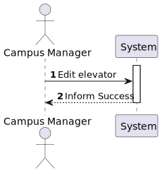
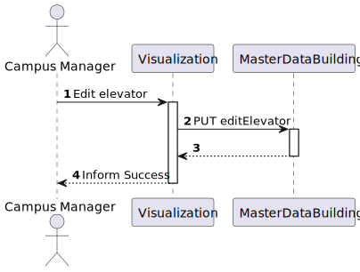
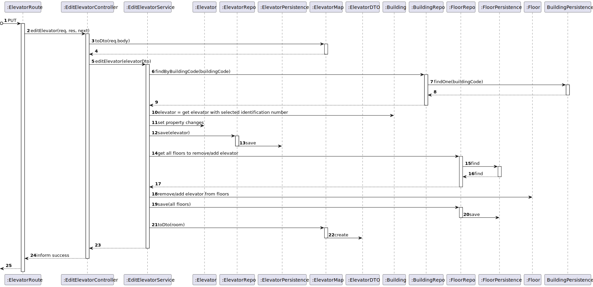

# US 280 - As a Campus Manager, I want to edit an elevator in a building

## 1. Context

* This task comes in context of Sprint A.
* First time that this task is developed.
* This task is relative to system user Campus Manager.

## 2. Requirements

**US 280 -** As a Campus Manager, I want to:

* edit an elevator in a building.

**Client Clarifications**
>**Question**: "Em relação às User Stories de edição, temos já uma ideia das informações que são opcionais, mas queremos ter a certeza daquilo que é editável ou não. Posto isto, poderia indicar que informações pretende editar nas US160, US200, US250 e US280?"<br>
><br> **Answer** : "... requisito 280 - editar elevador - todas as informações à exceção do edificio a que o piso se refere"

**Dependencies:**
* This User Stories requires that there are buildings, floors and elevators created, so it has dependencies on US150, US190 and US270.

## 3. Analysis
Regarding this requirement we understand that: As a Campus Manager, an actor of the system, I will be able to edit the
information of an elevator, such as brand, description, model, identification number, serial number and floors that it goes. 
* Campus Manager is a user role that manages the data of the routes and maps.
* Building is a structure within the campus that houses various rooms and facilities. It can be navigated by the robisep robots using corridors and elevators.
* Floor is a level within a building. Each floor can contain multiple rooms and is accessible by elevators and stairs (though robisep robots cannot use stairs).
* Elevator is a transport device for moving between different floors of a building.

### 3.1. Domain Model Excerpt


## 4. Design
### Level 1

* Logical View


* Process View



* Scenary View


### Level 2

* Logical View


* Process View



* Physical View


* Implementation View


### Level 3

* Logical:


* Implementation


* Process



### 4.2. Applied Patterns
* Controller
* Service
* Repository
* Mapper
* DTO
* GRASP

### 4.3. Tests

**Test 1:** *Verifies controller class behavior when editing a valid Elevator.*

``` typescript
	it('1. Controller valid edit (elevator exist on database)', async function () {
        const serviceReturns = {
            elevatorId: 1,
            elevatorIdentificationNumber: 1,
            elevatorBrand: "brand1",
            elevatorDescription: "description changed",
            elevatorModel: "a model",
            elevatorSerialNumber: "111"
        } as IElevatorDTO

        const elevatorDTOJSONExpected = {
            "elevatorId": 1,
            "elevatorIdentificationNumber": 1,
            "elevatorBrand": "brand1",
            "elevatorDescription": "description changed",
            "elevatorModel": "a model",
            "elevatorSerialNumber": "111"
        } 

        const elevatorDTOJSON = {
            "elevatorId": 1,
            "elevatorIdentificationNumber": 1,
            "elevatorBrand": "brand1",
            "elevatorDescription": "a description",
            "elevatorModel": "a model",
            "elevatorSerialNumber": "111"
        } 

        const elevatorDTO2 = {
            elevatorId: 1,
            elevatorIdentificationNumber: 1,
            elevatorBrand: "brand1",
            elevatorDescription: "a description",
            elevatorModel: "a model",
            elevatorSerialNumber: "111"
        } as IElevatorDTO

        let req: Partial<Request> = {}
        req.body = elevatorDTOJSON

        let res: Partial<Response> = {
            status: sinon.stub().returnsThis(),
            json: sinon.spy()
        }

        let next: Partial<NextFunction> = () => { }

        const editElevatorService = Container.get('editElevatorService')

        sinon.stub(editElevatorService, 'editElevator')
            .withArgs(elevatorDTO2)
            .returns(new Promise((resolve, reject) => { resolve(Result.ok<IElevatorDTO>(serviceReturns)) }))


        const editElevatorController = new EditElevatorController(editElevatorService as IEditElevatorService)

        await editElevatorController.editElevator(<Request>req, <Response>res, <NextFunction>next)

        sinon.assert.calledOnce(res.status)
        sinon.assert.calledWith(res.status, 201)
        sinon.assert.calledOnce(res.json)
        sinon.assert.calledWith(res.json, sinon.match(elevatorDTOJSONExpected))
    })
```

**Test 2:** *Verifies controller class behavior in the case of editing an invalid Elevator.*

``` typescript
	it('2. Controller valid edit (elevator doesn\'t exist on database)', async function () {
        const elevatorDTO2 = {
            elevatorId: 1,
            elevatorIdentificationNumber: 1,
            elevatorBrand: "brand1",
            elevatorDescription: "a description",
            elevatorModel: "a model",
            elevatorSerialNumber: "111"
        } as IElevatorDTO

        const elevatorDTOJSON = {
            "elevatorId": 1,
            "elevatorIdentificationNumber": 1,
            "elevatorBrand": "brand1",
            "elevatorDescription": "a description",
            "elevatorModel": "a model",
            "elevatorSerialNumber": "111"
        } 

        let req: Partial<Request> = {}
        req.body = elevatorDTOJSON 

        let res: Partial<Response> = {
            status: sinon.stub().returnsThis(),
            send: sinon.spy()
        }

        let next: Partial<NextFunction> = () => { }

        const editElevatorService = Container.get('editElevatorService')

        sinon.stub(editElevatorService, 'editElevator')
            .withArgs(elevatorDTO2)
            .returns(new Promise((resolve, reject) => { resolve(Result.fail<IElevatorDTO>('Elevator does not exist!')) }))


        const editElevatorController = new EditElevatorController(editElevatorService as IEditElevatorService)

        await editElevatorController.editElevator(<Request>req, <Response>res, <NextFunction>next)

        sinon.assert.calledOnce(res.status)
        sinon.assert.calledWith(res.status, 400)
        sinon.assert.calledOnce(res.send)
    })
```

**Test 3:** *Verifies correct editing of a valid Elevator in service class.*

``` typescript
	it('3. Service valid edit (elevator exist on database)', async function () {
        floorRepoMock.findById.resolves(floor.getValue())
        
        const buildingRepo = Container.get('buildingRepo')
        sinon.stub(buildingRepo, 'findByBuidingCode').returns(new Promise((resolve, reject) => {resolve(building.getValue())}))

        const changes = {
            elevatorIdentificationNumber: 1,
            elevatorDescription: "changed description",
            buildingCode: "A"
        } as IEditElevatorDTO

        const expected = {
            elevatorId: 1,
            elevatorIdentificationNumber: 1,
            elevatorBrand: "brand1",
            elevatorDescription: "changed description",
            elevatorModel: "a model",
            elevatorSerialNumber: "111"
        } as IElevatorDTO

        const editElevatorService = Container.get('editElevatorService') as IEditElevatorService

        const actual = await editElevatorService.editElevator(changes)

        sinon.assert.match(actual.getValue(), expected)
    })
```

**Test 4:** *Verifies correct editing of a valid Elevator using controller and service classes together.*

``` typescript
	it('5. Controller + Service valid edit (elevator exist on database)', async function () { 
        const changes = {
            "elevatorIdentificationNumber": 1,
            "elevatorDescription": "changed description",
            "buildingCode": "A"
        }

        const expected = {
            elevatorId: 1,
            elevatorIdentificationNumber: 1,
            elevatorBrand: "brand1",
            elevatorDescription: "changed description",
            elevatorModel: "a model",
            elevatorSerialNumber: "111"
        } as IElevatorDTO

        let req: Partial<Request> = {}
        req.body = changes 

        let res: Partial<Response> = {
            status: sinon.stub().returnsThis(),
            json: sinon.spy()
        }

        let next: Partial<NextFunction> = () => { }

        const buildingRepo = Container.get('buildingRepo')
        sinon.stub(buildingRepo, 'findByBuidingCode').returns(new Promise((resolve, reject) => {resolve(building.getValue())}))

        const editElevatorService = Container.get('editElevatorService') as IEditElevatorService

        const editElevatorController = new EditElevatorController(editElevatorService as IEditElevatorService)

        await editElevatorController.editElevator(<Request>req, <Response>res, <NextFunction>next)

        sinon.assert.calledOnce(res.status)
        sinon.assert.calledWith(res.status, 201)
        sinon.assert.calledOnce(res.json)
        sinon.assert.calledWith(res.json, sinon.match(expected))
    })
```
## 5. Implementation
### Class EditElevatorService
``` typescript
	@Service()
export default class EditElevatorService implements IEditElevatorService {

    constructor(
        @Inject(config.repos.elevator.name) private elevatorRepo: IElevatorRepo,
        @Inject(config.repos.building.name) private buildingRepo: IBuildingRepo,
        @Inject(config.repos.floor.name) private floorRepo: IFloorRepo
    ) { }

    public async editElevator(elevatorDto: IEditElevatorDTO): Promise<Result<IElevatorDTO>> {
        try{
            const building = await this.buildingRepo.findByBuidingCode(new BuildingCode(elevatorDto.buildingCode))
            if (!building) return Result.fail<IElevatorDTO>('Building does not exist!')

            let theElevator: Elevator = undefined
            for (var floor of building.floors) {
                for (var elevator of floor.props.floormap.props.elevators){
                    if (elevator.props.elevatorIdentificationNumber.identificationNumber === elevatorDto.elevatorIdentificationNumber){
                        theElevator = elevator
                        break;
                    }
                }
            }

            if (theElevator === undefined) return Result.fail<IElevatorDTO>('Elevator does not exist!')

            if (elevatorDto.elevatorBrand !== undefined){
                if (elevatorDto.elevatorModel === undefined && theElevator.props.elevatorModel === null) return Result.fail<IElevatorDTO>('Brand was provided so Model is required!')

                const brandOrError = ElevatorBrand.create(elevatorDto.elevatorBrand)

                if (brandOrError.isFailure) return Result.fail<IElevatorDTO>(brandOrError.errorValue())

                theElevator.props.elevatorBrand = brandOrError.getValue()
                
                if (elevatorDto.elevatorModel !== undefined) {
                    const modelOrError = ElevatorModel.create(elevatorDto.elevatorModel)
                    if (modelOrError.isFailure) return Result.fail<IElevatorDTO>(modelOrError.errorValue())
                    
                    theElevator.props.elevatorModel = modelOrError.getValue()
                }
            }

            if (elevatorDto.elevatorDescription !== undefined) {
                const descriptionOrError =  ElevatorDescription.create(elevatorDto.elevatorDescription)
                if (descriptionOrError.isFailure) return Result.fail<IElevatorDTO>(descriptionOrError.errorValue())

                theElevator.props.elevatorDescription =descriptionOrError.getValue()
            }

            if (elevatorDto.elevatorSerialNumber !== undefined) {
                const serialNumberOrError = ElevatorSerialNumber.create(elevatorDto.elevatorSerialNumber)
                if (serialNumberOrError.isFailure) return Result.fail<IElevatorDTO>(serialNumberOrError.errorValue())

                theElevator.props.elevatorSerialNumber = serialNumberOrError.getValue()
            }

            await this.elevatorRepo.save(theElevator);

            if (elevatorDto.floorsIdToRemove !== undefined) {
                let floors: Floor[] = [];
                for (var floorId of elevatorDto.floorsIdToRemove) {
                    const floor = await this.floorRepo.findById(floorId)
                    if (floor === null) return Result.fail<IElevatorDTO>('Floor does not exist!')
                    floors.push(floor)
                }

                const floorsOfElevator = await this.floorRepo.findByElevator(Number(theElevator.id.toValue()))
                if (floorsOfElevator.length === 1) return Result.fail<IElevatorDTO>('Remove floor is not possible because elevator is only associated with one floor!')
    
                for (var floor of floors){
                    floor.removeElevator(theElevator)
                    await this.floorRepo.save(floor);
                }
            }

            if (elevatorDto.floorsIdToAdd !== undefined) {
                let floors: Floor[] = [];
                for (var floorId of elevatorDto.floorsIdToAdd) {
                    const floor = await this.floorRepo.findById(floorId)
                    if (floor === null) return Result.fail<IElevatorDTO>('Floor does not exist!')
                    if (building.props.floors.find((floorInList) => floorInList.id.toValue() === floor.id.toValue()) === undefined){ return Result.fail<IElevatorDTO>('Floor with id ' + floor.floorId.toValue() + ' does not belong in building ' + building.code.toValue())}
                    floors.push(floor)
                }
    
                for (var floor of floors){
                    floor.addElevators(theElevator)
                    await this.floorRepo.save(floor);
                }
            }
            
            const elevatorDtoResult = ElevatorMap.toDto(theElevator) as IElevatorDTO

            return Result.ok<IElevatorDTO>(elevatorDtoResult)

        } catch(e) {
            throw e
        }
    }
}
```


## 6. Integration/Demonstration

To use this US, you need to send an HTTP request.

Using this URI: localhost:4000/api/elevators/edit

With the following JSON
```
{
    "elevatorIdentificationNumber": 1,
    "elevatorBrand": "a brand",
    "elevatorDescription": "a description",
    "elevatorModel": "a model",
    "elevatorSerialNumber": "X1Z",
    "buildingCode": "A",
    "floorsIdToAdd": [4],
    "floorsIdToRemove": [1]
}
```
The paramaters "elevatorIdentificationNumber" and "buildingCode" are mandatory because they are using to identify the elevator to be edited. All the ohters are optional and do not need to be given.
## 7. Observations

No observations.