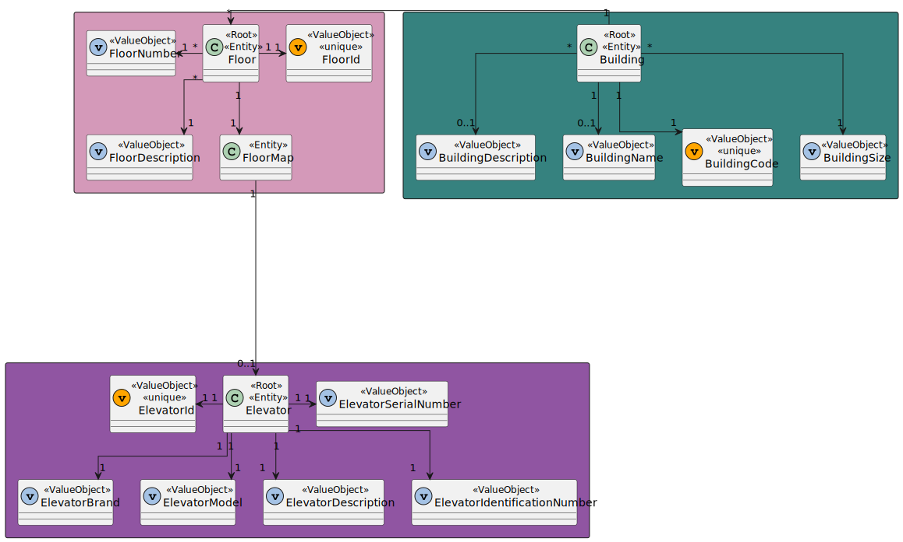
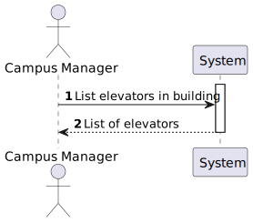
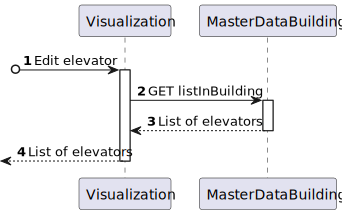
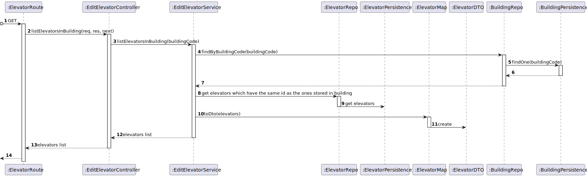

# US 290 - As a Campus Manager, I want to list elevators in building

## 1. Context

* This task comes in context of Sprint A.
* First time that this task is developed.
* This task is relative to system user Campus Manager.

## 2. Requirements

**US 290 -** As a Campus Manager, I want to:

* list elevators in a building.

**Client Clarifications**
>**Question**: "...Que informacoes pretende, então, ver sobre esse elevador?"<br>
><br> **Answer** : "...pretende-se listar todas as informações do elevador."


**Dependencies:**
* This User Stories requires that there are buildings, floors and elevators created, so it has dependencies on US150, US190 and US270.

## 3. Analysis

Regarding this requirement we understand that: As a Campus Manager, an actor of the system, I will be able to list the
information of elevators of a building, such as brand, description, model, identification number, serial number and floors that it goes.
* Campus Manager is a user role that manages the data of the routes and maps.
* Building is a structure within the campus that houses various rooms and facilities. It can be navigated by the robisep robots using corridors and elevators.
* Floor is a level within a building. Each floor can contain multiple rooms and is accessible by elevators and stairs (though robisep robots cannot use stairs).
* Elevator is a transport device for moving between different floors of a building.

### 3.1. Domain Model Excerpt



## 4. Design

### 4.1. Realization

### Level1
###### LogicalView:


###### SceneryView:


###### ProcessView:


#### Level2

###### LogicalView:


###### ImplementationView:


###### PhysicalView:


###### ProcessView:


#### Level3
###### LogicalView:


###### ImplementationView:


###### ProcessView:


### 4.2. Applied Patterns
* Controller
* Service
* Repository
* Mapper
* DTO
* GRASP

### 4.3. Tests

**Test 1:** *Verifies that controller class returns the right response to a valid get request.*

``` typescript
	it('1. Controller with stub service returns 2 elevators', async function () {
        const elevatorResult1 = {
            elevatorId: elevator1.getValue().id.toValue(),
            elevatorIdentificationNumber: elevator1.getValue().elevatorIdentificationNumber.identificationNumber,
            elevatorBrand: elevator1.getValue().elevatorBrand.brand,
            elevatorDescription: elevator1.getValue().elevatorDescription.description,
            elevatorModel: elevator1.getValue().elevatorModel.model,
            elevatorSerialNumber: elevator1.getValue().elevatorSerialNumber.serialNumber,
            floorsNumber: [1]
        } as IListElevatorsInBuildingDTO

        const elevatorResult2 = {
            elevatorId: elevator2.getValue().id.toValue(),
            elevatorIdentificationNumber: elevator2.getValue().elevatorIdentificationNumber.identificationNumber,
            elevatorBrand: elevator2.getValue().elevatorBrand.brand,
            elevatorDescription: elevator2.getValue().elevatorDescription.description,
            elevatorModel: elevator2.getValue().elevatorModel.model,
            elevatorSerialNumber: elevator2.getValue().elevatorSerialNumber.serialNumber,
            floorsNumber: [1]
        } as IListElevatorsInBuildingDTO

        const result = [elevatorResult1, elevatorResult2]

        let req: Partial<Request> = {}
        req.params = {buildingCode: building.getValue().code.toString()}

        let res: Partial<Response> = {
            status: sinon.stub().returnsThis(),
            json: sinon.spy()
        }

        let next: Partial<NextFunction> = () => { }

        const listElevatorsInBuildingService = Container.get('listElevatorsInBuildingService')

        sinon.stub(listElevatorsInBuildingService, 'listElevatorsInBuilding').returns(new Promise((resolve, reject) => { resolve(Result.ok<IListElevatorsInBuildingDTO[]>(result)) }))

        const listElevatorsInBuildingController = new ListElevatorsInBuildingController(listElevatorsInBuildingService as IListElevatorsInBuildingService)

        await listElevatorsInBuildingController.listElevatorsInBuilding(<Request>req, <Response>res, <NextFunction>next)

        sinon.assert.calledOnce(res.status)
        sinon.assert.calledWith(res.status, 200)
        sinon.assert.calledOnce(res.json)
        sinon.assert.calledWith(res.json, sinon.match(result))
    })
```

**Test 2:** *Verifies that controller class returns the right response when there are no elevators in the system.*

``` typescript
	it('2. Controller with stub service returns no elevators', async function () {
        let req: Partial<Request> = {}
        req.params = {buildingCode: building.getValue().code.toString()}

        let res: Partial<Response> = {
            status: sinon.stub().returnsThis(),
            send: sinon.spy()
        }

        let next: Partial<NextFunction> = () => { }

        const listElevatorsInBuildingService = Container.get('listElevatorsInBuildingService')

        sinon.stub(listElevatorsInBuildingService, 'listElevatorsInBuilding').returns(new Promise((resolve, reject) => { resolve(Result.fail<IListElevatorsInBuildingDTO[]>('No elevators found!')) }))

        const listElevatorsInBuildingController = new ListElevatorsInBuildingController(listElevatorsInBuildingService as IListElevatorsInBuildingService)

        await listElevatorsInBuildingController.listElevatorsInBuilding(<Request>req, <Response>res, <NextFunction>next)
        sinon.assert.calledOnce(res.status)
        sinon.assert.calledWith(res.status, 400)
        sinon.assert.calledOnce(res.send)
    })
```

**Test 3:** *Verifies that service class returns the right list when there are elevators in the system.*

``` typescript
	it('3. Service with stub repo lists 2 elevators', async function () {
        const elevatorResult1 = {
            elevatorId: elevator1.getValue().id.toValue(),
            elevatorIdentificationNumber: elevator1.getValue().elevatorIdentificationNumber.identificationNumber,
            elevatorBrand: elevator1.getValue().elevatorBrand.brand,
            elevatorDescription: elevator1.getValue().elevatorDescription.description,
            elevatorModel: elevator1.getValue().elevatorModel.model,
            elevatorSerialNumber: elevator1.getValue().elevatorSerialNumber.serialNumber,
            floorsNumber: [1]
        } as IListElevatorsInBuildingDTO

        const elevatorResult2 = {
            elevatorId: elevator2.getValue().id.toValue(),
            elevatorIdentificationNumber: elevator2.getValue().elevatorIdentificationNumber.identificationNumber,
            elevatorBrand: elevator2.getValue().elevatorBrand.brand,
            elevatorDescription: elevator2.getValue().elevatorDescription.description,
            elevatorModel: elevator2.getValue().elevatorModel.model,
            elevatorSerialNumber: elevator2.getValue().elevatorSerialNumber.serialNumber,
            floorsNumber: [1]
        } as IListElevatorsInBuildingDTO
        
        const expected = [elevatorResult1, elevatorResult2]

        const buildingRepo = Container.get('buildingRepo')
        sinon.stub(buildingRepo, 'findByBuidingCode').returns(new Promise((resolve, reject) => {resolve(building.getValue())}))

        const listElevatorsInBuildingService = Container.get('listElevatorsInBuildingService') as IListElevatorsInBuildingService

        const actual = await listElevatorsInBuildingService.listElevatorsInBuilding(building.getValue().code.toString())

        sinon.assert.match(actual.getValue(), expected)
    })
```

**Test 4:** *Verifies that controller and service classes return the right list when there are elevators in the system.*

``` typescript
	it('5. Controller + Service with stub repo return 2 elevators', async function () {
        const elevatorResult1 = {
            elevatorId: elevator1.getValue().id.toValue(),
            elevatorIdentificationNumber: elevator1.getValue().elevatorIdentificationNumber.identificationNumber,
            elevatorBrand: elevator1.getValue().elevatorBrand.brand,
            elevatorDescription: elevator1.getValue().elevatorDescription.description,
            elevatorModel: elevator1.getValue().elevatorModel.model,
            elevatorSerialNumber: elevator1.getValue().elevatorSerialNumber.serialNumber,
            floorsNumber: [1]
        } as IListElevatorsInBuildingDTO

        const elevatorResult2 = {
            elevatorId: elevator2.getValue().id.toValue(),
            elevatorIdentificationNumber: elevator2.getValue().elevatorIdentificationNumber.identificationNumber,
            elevatorBrand: elevator2.getValue().elevatorBrand.brand,
            elevatorDescription: elevator2.getValue().elevatorDescription.description,
            elevatorModel: elevator2.getValue().elevatorModel.model,
            elevatorSerialNumber: elevator2.getValue().elevatorSerialNumber.serialNumber,
            floorsNumber: [1]
        } as IListElevatorsInBuildingDTO

        const result = [elevatorResult1, elevatorResult2]

        let req: Partial<Request> = {}
        req.params = {buildingCode: building.getValue().code.toString()}

        let res: Partial<Response> = {
            status: sinon.stub().returnsThis(),
            json: sinon.spy()
        }

        let next: Partial<NextFunction> = () => { }

        const buildingRepo = Container.get('buildingRepo')
        sinon.stub(buildingRepo, 'findByBuidingCode').returns(new Promise((resolve, reject) => {resolve(building.getValue())}))

        const listElevatorsInBuildingService = Container.get('listElevatorsInBuildingService') as IListElevatorsInBuildingService

        const listElevatorsInBuildingController = new ListElevatorsInBuildingController(listElevatorsInBuildingService as IListElevatorsInBuildingService)

        await listElevatorsInBuildingController.listElevatorsInBuilding(<Request>req, <Response>res, <NextFunction>next)

        sinon.assert.calledOnce(res.status)
        sinon.assert.calledWith(res.status, 200)
        sinon.assert.calledOnce(res.json)
        sinon.assert.calledWith(res.json, sinon.match(result))
    })
```

## 5. Implementation
### Class ListElevatorsInBuildingService
``` typescript
@Service()
export default class ListElevatorsInBuildingService implements IListElevatorsInBuildingService {

    constructor(
        @Inject(config.repos.building.name) private buildingRepo: IBuildingRepo,
    ) { }

    public async listElevatorsInBuilding(buildingCode: string): Promise<Result<IListElevatorsInBuildingDTO[]>> {
        try{
            const building = await this.buildingRepo.findByBuidingCode(new BuildingCode(buildingCode))
            if (building === null) return Result.fail<IListElevatorsInBuildingDTO[]>('Building does not exist!')

            let elevatorsList: IListElevatorsInBuildingDTO[] = []
            for (var floor of building.floors) {
                for (var anElevator of floor.props.floormap.props.elevators){
                    const elevatorDto = ElevatorMap.toDtoList(anElevator, [floor.props.floorNumber.number])

                    const elevatorOrUndefined = elevatorsList.find((elevator) => elevator.elevatorId === elevatorDto.elevatorId)
                    if (elevatorOrUndefined === undefined){
                        elevatorsList.push(elevatorDto)
                    } else {
                        elevatorOrUndefined.floorsNumber.push(elevatorDto.floorsNumber.at(0))
                    }
                }
            }

            if (elevatorsList.length === 0) return Result.fail<IListElevatorsInBuildingDTO[]>('No elevators found!')

            return Result.ok<IListElevatorsInBuildingDTO[]>(elevatorsList)

        } catch(e) {
            throw e
        }
    }
}
```

## 6. Integration/Demonstration
To use this US, you need to send an HTTP request.

Using this URI: localhost:4000/api/elevators/listInBuilding/:buildingCode

The paramaters ":buildingCode" is mandatory and corresponds to the building in which the elevators are.

## 7. Observations

No observations.