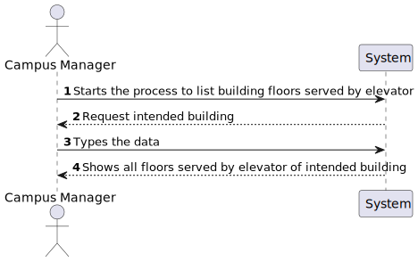

# US 300 - As a Campus Manager, I want to list building floors served by elevator

## 1. Context

* First time that this task is developed.
* This task is relative to system user Fleet Manager .

## 2. Requirements

**US 190 -** As a Campus Manager, I want to list building floors served by elevator

**Dependencies:**
- **US150 -** As a Campus Manager, I want to create a building.
- **US190 -** As a Campus Manager, I want to create building floor.
- **US270 -** As a Campus Manager, I want to create an elevator in a building


**Regarding this requirement we understand that:** <br>
As a Campus Manager, an actor of the system, I will be able to access the system and specify a building and list building floors served by elevator.

## 3. Analysis

**Analyzing this User Story we understand that:**
* Campus Manager is a user role that manages the data of the routes and maps.
* Building is a structure within the campus that houses various rooms and facilities. It can be navigated by the robisep robots using corridors and elevators.
* Floor is a level within a building. Each floor can contain multiple rooms and is accessible by elevators and stairs (though robisep robots cannot use stairs).
* Elevator is a transport device for moving between different floors of a building. The robisep robots are capable of using elevators to navigate multi-story buildings.


### 3.1. Domain Model Excerpt


### 3.2. System Sequence Diagram


## 4. Design

### 4.1. Realization


### 4.2. Class Diagram


### 4.3. Applied Patterns

### 4.4. Tests

**Test 1:** *Verifies that it is not possible to create an instance of the Example class with null values.*

```
@Test(expected = IllegalArgumentException.class)
public void ensureNullIsNotAllowed() {
	Example instance = new Example(null, null);
}
````

## 5. Implementation

*In this section the team should present, if necessary, some evidencies that the implementation is according to the design. It should also describe and explain other important artifacts necessary to fully understand the implementation like, for instance, configuration files.*

*It is also a best practice to include a listing (with a brief summary) of the major commits regarding this requirement.*

## 6. Integration/Demonstration

*In this section the team should describe the efforts realized in order to integrate this functionality with the other parts/components of the system*

*It is also important to explain any scripts or instructions required to execute an demonstrate this functionality*

## 7. Observations

*This section should be used to include any content that does not fit any of the previous sections.*

*The team should present here, for instance, a critical prespective on the developed work including the analysis of alternative solutioons or related works*

*The team should include in this section statements/references regarding third party works that were used in the development this work.*
