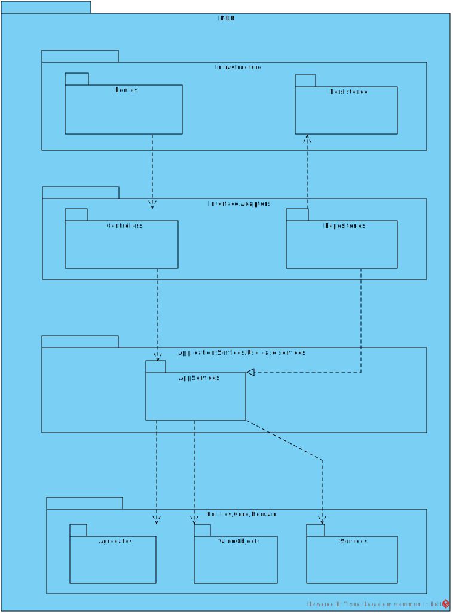

# US 310 - As a Campus Manager, I want to create a room in a floor of a building

## 1. Context

* This task comes in context of Sprint A.
* First time that this task is developed.
* This task is relative to system user Campus Manager.

## 2. Requirements

**US 310 -** As a Campus Manager, I want to:

* create a room in a floor of a building

**Client Clarifications**
>**Question**: "Bom dia,
Relativamente à informação fornecida pelo cliente referente à US310, ele diz "o requisito 310 Criar sala permite definir um sala num dado piso de um edifício, exemplo sala "B310" no 3º piso do edifício B", este nome da sala é suposto ser criado automaticamente uma vez que a sala saberá o piso em que se encontra e o piso sabe o edifício em que está, sendo apenas preciso verificar o número de salas que esse piso já  tem para saber o número da nova sala ou somos nós que introduzimos o nome da sala e colocamos onde queremos conforme o nome que lhe demos?"<br><br>
>**Answer**: "bom dia
esse nome é introduzido pelo utilizador. não existe semantica prédefinida conhecido do sistema"<br>

>**Question**: "Caro cliente, deveria o nome da sala ser único?"<br><br>
>**Answer**: "bom dia, sim"<br>

>**Question**: "Bom dia caro cliente,
Em relação aos atributos que definem uma sala, quais são os limites desejados para o seu nome e descrição.
Ainda, existem algum tamanho mínimo para criar uma sala?
Cumprimentos."<br><br>
>**Answer**: "bom dia,<br>
 nome - max 50 caracteres<br>
descrição - max 250 caracteres<br>
tamanho minimo da sala - 1 célula"<br>

>**Question**: "Será possível esclarecer como funcionarão estas user stories? Com a 230 (Carregar mapa do piso) o nosso entendimento foi que as células seriam carregadas já com a criação de salas e pisos, e assim sendo não faria sentido as outras duas user stories, onde é pedido para criar um piso de um edifício e uma sala. Não entendemos o que é pretendido  com as us's 190 e 310."<br><br>
>**Answer**: "... o requisito 310 Criar sala permite definir um sala num dado piso de um edificio, exemplo sala "B310" no 3º piso do edificio B, com uma categorização dessa sala (Gabinete, Anfiteatro, Laboratório, Outro) e uma breve descrição, ex., "Laboratório de Engenharia de Qualidade""<br>

>**Question**: "Em relação ao requisito 310, para além do que foi dito, devem também ser especificadas as dimensões e posições das salas dentro do piso? Isso ajudaria a evitar a sobreposição de salas com elevadores e até mesmo com outras salas."<br><br>
>**Answer**: "
bom dia
essa informação é necessária para o sistema como indicado no RFP. pode ser recolhida ao criar a sala no requisito 310 ou pode fazer parte do ficheiro que é carregado no requisito 230"<br>


>**Question**: "No requisito 310, quando diz "com uma categorização dessa sala (Gabinete, Anfiteatro, Laboratório, Outro)", devemos tratar a categorização como algo que possa ser criado independentemente da sala, para poder ser gerido, como o nível de acesso de um utilizador, ou é apenas informativo e introduzido livremente pelo utilizador?"<br><br>
>**Answer**: "as categorias são de uma lista especifica. neste momento não é necessário existir manutenção dessa lista devendo apenas existir os 4 valores indicados, no entanto será interessante deixarem o sistema "aberto" para essa possibilidade no futuro"<br>


**Dependencies:**
* This User Stories requires that there are buildings and floors created, so it has dependencies on US150 and US190.

## 3. Analysis
* Campus Manager is a user role that manages the data of the routes and maps.
* Building is a structure within the campus that houses various rooms and facilities. It can be navigated by the robisep robots using corridors and elevators.
* Floor is a level within a building. Each floor can contain multiple rooms and is accessible by elevators and stairs (though robisep robots cannot use stairs).
* Room is a part of a the floor defined by Name, and two sets of coordinates from oposite corners.

### 3.1. Domain Model Excerpt


## 4. Design

### 4.1. Realization

### Level1
###### LogicalView:


###### SceneryView:


###### ProcessView:


#### Level2

###### LogicalView:


###### ImplementationView:


###### PhysicalView:


###### ProcessView:


#### Level3
###### LogicalView:


###### ImplementationView:


###### ProcessView:


### 4.2. Applied Patterns
* Controller
* Service
* Repository
* Mapper
* DTO
* GRASP

### 4.3. Tests

**Test 1:** *Tests the controller using a stub service to create a valid room*

```
it('Controller unit test with stub service, valid room', async function () {
        let body = {
            "roomName": "A101",
            "roomDescription": "This is a room",
            "roomCategory": "Other",
            "floorId": 1
        }

        let expected = {
            "roomName": "A101",
            "roomDescription": "This is a room",
            "roomCategory": "Other",
            "floorId": 1
        }

        let req: Partial<Request> = {}
        req.body = body

        let res: Partial<Response> = {
            json: sinon.spy(),
            status: sinon.stub().returnsThis(),
            send: sinon.spy()
        }

        let next: Partial<NextFunction> = () => { }

        let createRoomService = Container.get('createRoomService')

        sinon.stub(createRoomService, 'createRoom').returns(Result.ok<IRoomDTO>({
            roomName: "A101",
            roomDescription: "This is a room",
            roomCategory: "Other"
        } as IRoomDTO))

        const createRoomController = new CreateRoomController(createRoomService as ICreateRoomService)

        await createRoomController.createRoom(<Request>req, <Response>res, <NextFunction>next)

        sinon.assert.calledOnce(res.json)
        sinon.match(expected)
    })
````

**Test 2:** *Tests the room description over the max allowed word limit*

```
it('Create room test, room description over word limit (250+ words)', async function () {
        const roomDescription: string = 'A'.repeat(251);
        const result: Result<RoomDescription> = RoomDescription.create(roomDescription);

        assert.equal(result.isFailure,true)
        assert.equal(result.error,'Description must be less than 250 characters!')
    })
````

**Test 3:** *Tests the service using a stub repo to create rooms*
```
it("createRoomController +createRoomService integration test", async function() {
        let body = {
            "roomName": "A101",
            "roomDescription": "This is a room",
            "roomCategory": "Other",
            "floorId": 1
        }
        let req: Partial<Request> = {
            body: body
        };
        let res: Partial<Response> = {
            json: sinon.spy(),
            status: sinon.stub().returnsThis(),
            send: sinon.spy()
        };
        let next: Partial<NextFunction> = () => {};

        const roomDTO = {
            roomName: "A101",
            roomDescription: "This is a room",
            roomCategory: "Other"
        } as IRoomDTO

        const buildingDTO = {
            buildingCode: "bgdA1",
            buildingName: "buildingTest",
            buildingDescription: "this is a building",
            buildingLength: 10,
            buildingWidth: 10,
            buildingFloors: []
        } as IBuildingDTO

        const building = Building.create({
            buildingName: new BuildingName({ value: buildingDTO.buildingName }),
            buildingDescription: new BuildingDescription({ value: buildingDTO.buildingDescription }),
            buildingSize: new BuildingSize({ length: buildingDTO.buildingLength, width: buildingDTO.buildingWidth }),
            floors: [],
        }, buildingDTO.buildingCode).getValue()

        const floor = Floor.create(
            {
                "floorNumber": new FloorNumber({number: 1}),
                "floorDescription": new FloorDescription({ value: 'Test floor' }),
                "floormap": new FloorMap(
                    {
                        map: [[]],
                        passageways: [],
                        rooms: [],
                        elevators: [],
                        passagewaysCoords: [],
                        elevatorsCoords: [],
                        roomsCoords: [],
                    }
                )
            }, 1 ).getValue();

        building.addFloor(floor)


        roomRepoMock.findById.resolves(null);
        buildingRepoMock.findByBuidingCode.resolves(building);
        floorRepoMock.findById.resolves(floor);

        let createRoomServiceInstance = Container.get("createRoomService");
        const createRoomServiceSpy = sinon.spy(createRoomServiceInstance, "createRoom");

        const ctrl = new CreateRoomController(createRoomServiceInstance as ICreateRoomService);

        // Act
        await ctrl.createRoom(<Request>req, <Response>res, <NextFunction>next);

        // Assert
        sinon.assert.calledOnce(createRoomServiceSpy);
        sinon.assert.calledOnce(res.json);
        sinon.assert.calledWith(res.json, sinon.match({
            roomName: "A101",
            roomDescription: "This is a room",
            roomCategory: "Other"
        }));
    });
````

## 5. Implementation

**createRoomService:**

```
public async createRoom(roomDto: ICreateRoomDTO): Promise<Result<IRoomDTO>> {
        try{
            if(await this.roomRepo.findById(roomDto.roomName) !== null) return Result.fail<IRoomDTO>('A Room with this Name already exists!')

            const floor = await this.floorRepo.findById(roomDto.floorId)
            if (floor === null) return Result.fail<IRoomDTO>('Floor does not exist!')

            const roomOrError = await Room.create(
                {
                   roomDescription: RoomDescription.create(roomDto.roomDescription).getValue(),
                   roomCategory: RoomCategory.create(roomDto.roomCategory).getValue()
                }, RoomName.create(roomDto.roomName).getValue())

            if (roomOrError.isFailure) {
                return Result.fail<IRoomDTO>(roomOrError.errorValue())
            }

            const roomResult = roomOrError.getValue();
            await this.roomRepo.save(roomResult);

            floor.addRoom(roomResult)

            await this.floorRepo.save(floor);

            const roomDtoResult = RoomMap.toDto(roomResult) as IRoomDTO

            return Result.ok<IRoomDTO>(roomDtoResult)

        } catch(e) {
            throw e
        }
    }
````

## 6. Integration/Demonstration

To use this US, you need to send and HTTP request with the following JSON:

Using this URI: localhost:4000/api/rooms/createRoom

````
{
"roomName": "A101",
"roomDescription": "uma sala",
"roomCategory": "Laboratory",
"floorId": "1"
}
````

## 7. Observations

No additional observations.
