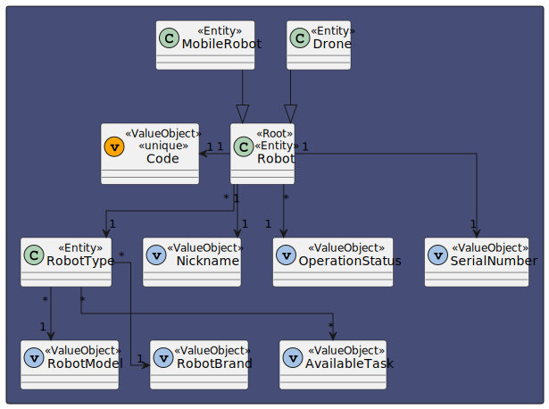
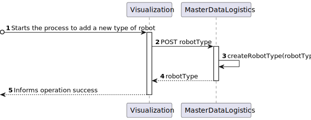
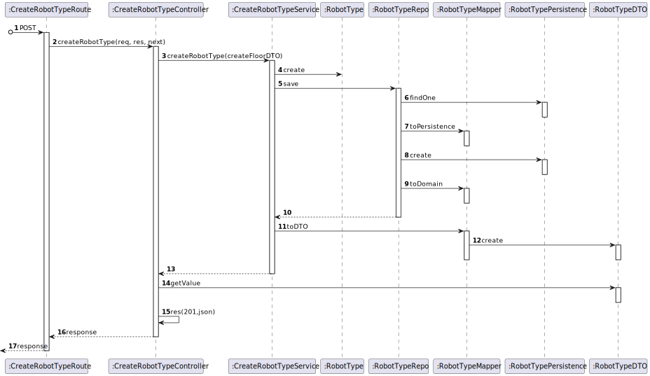

# US 350 - As a fleet manager, I want to add a new type of robot indicating its designation and what types of tasks it can perform from the predefined list of tasks.

## 1. Context

* First time that this task is developed.
* This task is relative to system user Fleet Manager .

## 2. Requirements

**US 350 -** As a fleet manager, I want to add a new type of robot indicating its designation and what types of tasks it can perform from the predefined list of tasks.

> **Q**: Que tipo de tarefas um robot pode realizar? <br>
> **A**: De momento apenas existem dois tipos de tarefas conhecidas que o sistema deve suportar: vigilância e entrega de objectos <br>


**Dependencies:**
There are no Dependencies associated with this US.

**Regarding this requirement we understand that:** <br>
As a Fleet Manager, an actor of the system, I will be able to access the system and start the process to create a new robot, first we will indicate the type and then the available task

## 3. Analysis

**Analyzing this User Story we understand that:**
* Fleet Manager is a user role that manages the data of the robots and drones and the types of tasks.
* Robisep is a type of mobile robot that can move through the corridors and elevators of the buildings, but not stairs. It can perform tasks such as surveillance, cleaning, or delivery of items.
* The available task type are surveillance and delivery of objects
* The robot type has a Code, a Brand and a Model.
* ex1."Tipo A: Robot marca X modelo Y com capacidade de executar tarefas de vigilância"
* ex2."Tipo B: Robot marca W modelo Z com capacidade de executar tarefas de vigilância e pickeup&delivery"


### 3.1. Domain Model Excerpt



## 4. Design

### 4.1. Realization

### Level1
###### LogicalView:


###### SceneryView:


###### ProcessView:


#### Level2

###### LogicalView:


###### ImplementationView:


###### PhysicalView:


###### ProcessView:


#### Level3
###### LogicalView:


###### ImplementationView:


###### ProcessView:


### 4.3. Applied Patterns
* Controller
* Service
* Repository
* Mapper
* DTO
* GRASP

### 4.4. Tests

**Test 1:** *Verifies that the RobotType.create method can correctly create a RobotType instance when provided with valid data. The test checks if the instance has the expected properties and values.*
```
it('should create a RobotType instance with valid input', function () {
        // Arrange
        const robotTypeDTO: ICreateRobotTypeDTO = {
            "robotTypeID": "k4",
            "robotBrand": "Joi.string().max(0).required()",
            "robotModel": " Joi.string().max(100).required()",
            "availableTasks": ["Floor surveillance","Object transport"]
        };

        // Act
        const result = RobotType.create(robotTypeDTO, robotTypeDTO.robotTypeID);

        // Assert
        assert.ok(result.isSuccess);
        assert.ok(result.getValue() instanceof RobotType);
        assert.strictEqual(result.getValue().id.toString(), robotTypeDTO.robotTypeID);
        assert.strictEqual(result.getValue().props.robotBrand.brand, robotTypeDTO.robotBrand);
        assert.strictEqual(result.getValue().props.robotModel.model, robotTypeDTO.robotModel);
        assert.strictEqual(result.getValue().props.availableTasks[0].props.Type, robotTypeDTO.availableTasks[0]);
        assert.strictEqual(result.getValue().props.availableTasks[1].props.Type, robotTypeDTO.availableTasks[1]);
    });
````

**Test 2:** *Ensures that the RobotType.create method correctly identifies and rejects invalid input for the robotBrand property.*
```
it('should fail to create a RobotType instance with invalid robotBrand', function () {
        // Arrange
        const robotTypeDTO1: ICreateRobotTypeDTO = {
            "robotTypeID": "k4",
            "robotBrand": "",
            "robotModel": " Joi.string().max(100).required()",
            "availableTasks": ["Floor surveillance","Object transport"]
        };

        const robotTypeDTO2: ICreateRobotTypeDTO = {
            "robotTypeID": "k4",
            "robotBrand": 'a'.repeat(51),
            "robotModel": " Joi.string().max(100).required()",
            "availableTasks": ["Floor surveillance","Object transport"]
        };

        // Act
        const result1 = RobotType.create(robotTypeDTO1, robotTypeDTO1.robotTypeID);
        const result2 = RobotType.create(robotTypeDTO2, robotTypeDTO2.robotTypeID);

        // Assert
        assert.ok(result1.isFailure);
        assert.ok(result2.isFailure);
    });
````

**Test 3:** *Validates that the RobotType.create method accurately detects and rejects invalid robotModel input.*
```
it('should fail to create a RobotType instance with invalid robotModel', function () {
        // Arrange
        const robotTypeDTO1: ICreateRobotTypeDTO = {
            "robotTypeID": "k4",
            "robotBrand": "Joi.string().max(0).required()",
            "robotModel": "",
            "availableTasks": ["Floor surveillance","Object transport"]
        };

        const robotTypeDTO2: ICreateRobotTypeDTO = {
            "robotTypeID": "k4",
            "robotBrand": "Joi.string().max(0).required()",
            "robotModel": 'a'.repeat(101),
            "availableTasks": ["Floor surveillance","Object transport"]
        };

        // Act
        const result1 = RobotType.create(robotTypeDTO1, robotTypeDTO1.robotTypeID);
        const result2 = RobotType.create(robotTypeDTO2, robotTypeDTO2.robotTypeID);

        // Assert
        assert.ok(result1.isFailure);
        assert.ok(result2.isFailure);
    });
````

**Test 4:** *Ensures that the RobotType.create method correctly handles invalid availableTasks input and returns an error when necessary.*
```
it('should fail to create a RobotType instance with invalid availableTasks', function () {
        // Arrange
        const robotTypeDTO1: ICreateRobotTypeDTO = {
            "robotTypeID": "k4",
            "robotBrand": "Joi.string().max(0).required()",
            "robotModel": "Joi.string().max(0).required()",
            "availableTasks": ["Floor surv2eillance","Object transport"]
        };

        const robotTypeDTO2: ICreateRobotTypeDTO = {
            "robotTypeID": "k4",
            "robotBrand": "Joi.string().max(0).required()",
            "robotModel": "Joi.string().max(0).required()",
            "availableTasks": ["Floor surveillance","Object transport","Floor surveillance"]
        };

        // Act
        const result1 = RobotType.create(robotTypeDTO1, robotTypeDTO1.robotTypeID);
        const result2 = RobotType.create(robotTypeDTO2, robotTypeDTO2.robotTypeID);

        // Assert
        assert.ok(result1.isFailure);
        assert.ok(result2.isFailure);
    });
````

**Test 5:** *Test focuses on the controller in isolation by stubbing the service. It checks if the controller processes a request to create a robot type with valid input data and returns the expected result.*
```
it('createRobotTypeController unit test using createRobotTypeService stub', async function () {
        // Arrange
        let body = {
            "robotTypeID": "k4",
            "robotBrand": "Joi.string().max(0).required()",
            "robotModel": " Joi.string().max(100).required()",
            "availableTasks": ["Floor surveillance","Object transport"]
        };
        let req: Partial<Request> = {};
          req.body = body;
        let res: Partial<Response> = {
          json: sinon.spy(),
          status: sinon.stub().returnsThis(),
          send: sinon.spy()
        };
        let next: Partial<NextFunction> = () => {};

        const robotTypeDTO: IRobotTypeDTO = {
            "robotTypeID": "k4",
            "robotBrand": "Joi.string().max(0).required()",
            "robotModel": " Joi.string().max(100).required()",
            "availableTasks": ["Floor surveillance","Object transport"]
        };


        let createRobotTypeServiceInstance = Container.get("createRobotTypeService");
        sinon.stub(createRobotTypeServiceInstance, "createRobotType").returns(Promise.resolve(Result.ok<IRobotTypeDTO>(robotTypeDTO)));

        const ctrl = new createRobotTypeController(createRobotTypeServiceInstance as ICreateRobotTypeService);

        // Act
        await ctrl.createRobotType(<Request>req, <Response>res, <NextFunction>next);

        // Assert
        sinon.assert.calledOnce(res.json);
        sinon.assert.calledWith(res.json, sinon.match({
            "robotTypeID": "k4",
            "robotBrand": "Joi.string().max(0).required()",
            "robotModel": " Joi.string().max(100).required()",
            "availableTasks": ["Floor surveillance","Object transport"]
        }));

    });
````

**Test 6:** *Tests the end-to-end functionality of the controller and the service, ensuring that the controller correctly interacts with the service and returns the expected result.*
```
it("createRobotTypeController +createRobotTypeService integration test", async function() {
        // Arrange
        let body = {
            "robotTypeID": "k4",
            "robotBrand": "Joi.string().max(0).required()",
            "robotModel": " Joi.string().max(100).required()",
            "availableTasks": ["Floor surveillance","Object transport"]
        };
        let req: Partial<Request> = {
          body: body
        };
        let res: Partial<Response> = {
          json: sinon.spy(),
          status: sinon.stub().returnsThis(),
          send: sinon.spy()
        };
        let next: Partial<NextFunction> = () => {};

        // Stub repo methods
        const robotTypeDTO: IRobotTypeDTO = {
            "robotTypeID": "k4",
            "robotBrand": "Joi.string().max(0).required()",
            "robotModel": " Joi.string().max(100).required()",
            "availableTasks": ["Floor surveillance","Object transport"]
        };

        robotTypeRepoMock.findById.resolves(null);

        let createRobotTypeServiceInstance = Container.get("createRobotTypeService");
        const createRobotTypeServiceSpy = sinon.spy(createRobotTypeServiceInstance, "createRobotType");

        const ctrl = new createRobotTypeController(createRobotTypeServiceInstance as ICreateRobotTypeService);

        // Act
        await ctrl.createRobotType(<Request>req, <Response>res, <NextFunction>next);

        // Assert
        sinon.assert.calledOnce(res.json);
        sinon.assert.calledWith(res.json, sinon.match({
            "robotTypeID": "k4",
            "robotBrand": "Joi.string().max(0).required()",
            "robotModel": " Joi.string().max(100).required()",
            "availableTasks": ["Floor surveillance","Object transport"]
        }));
        sinon.assert.calledOnce(createRobotTypeServiceSpy);

      });
````

**Test 7:** *Test checks how the controller handles the situation when a robot type with the same ID already exists and ensures it responds with an appropriate error message.*
```
it("createRobotTypeController +createRobotTypeService integration test (RobotType already exists)", async function() {
        // Arrange
        let body = {
            "robotTypeID": "k4",
            "robotBrand": "Joi.string().max(0).required()",
            "robotModel": " Joi.string().max(100).required()",
            "availableTasks": ["Floor surveillance","Object transport"]
        };
        let req: Partial<Request> = {
          body: body
        };
        let res: Partial<Response> = {
          json: sinon.spy(),
          status: sinon.stub().returnsThis(),
          send: sinon.spy()
        };
        let next: Partial<NextFunction> = () => {};

        // Stub repo methods
        const robotTypeDTO: IRobotTypeDTO = {
            "robotTypeID": "k4",
            "robotBrand": "Joi.string().max(0).required()",
            "robotModel": " Joi.string().max(100).required()",
            "availableTasks": ["Floor surveillance","Object transport"]
        };

        robotTypeRepoMock.findById.resolves(robotTypeDTO);

        let createRobotTypeServiceInstance = Container.get("createRobotTypeService");
        const createRobotTypeServiceSpy = sinon.spy(createRobotTypeServiceInstance, "createRobotType");

        const ctrl = new createRobotTypeController(createRobotTypeServiceInstance as ICreateRobotTypeService);

        // Act
        await ctrl.createRobotType(<Request>req, <Response>res, <NextFunction>next);

        // Assert
        sinon.assert.calledOnce(createRobotTypeServiceSpy);
        sinon.assert.calledOnce(res.status);
        sinon.assert.calledWith(res.status,400);
        sinon.assert.calledOnce(res.send);
        sinon.assert.calledWith(res.send, sinon.match("RobotType already exists"));

      });
````

## 5. Implementation

*In this section the team should present, if necessary, some evidencies that the implementation is according to the design. It should also describe and explain other important artifacts necessary to fully understand the implementation like, for instance, configuration files.*

*It is also a best practice to include a listing (with a brief summary) of the major commits regarding this requirement.*

## 6. Integration/Demonstration

*In this section the team should describe the efforts realized in order to integrate this functionality with the other parts/components of the system*

*It is also important to explain any scripts or instructions required to execute an demonstrate this functionality*

## 7. Observations

*This section should be used to include any content that does not fit any of the previous sections.*

*The team should present here, for instance, a critical prespective on the developed work including the analysis of alternative solutioons or related works*

*The team should include in this section statements/references regarding third party works that were used in the development this work.*
