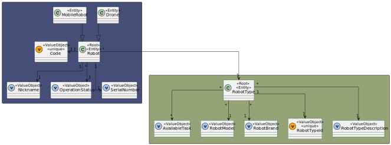
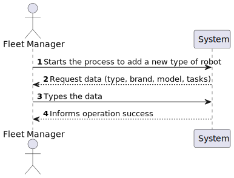

# US 350 - As a fleet manager, I want to add a new type of robot indicating its designation and what types of tasks it can perform from the predefined list of tasks.

## 1. Context

* First time that this task is developed.
* This task is relative to system user Fleet Manager .

## 2. Requirements

**US 350 -** As a fleet manager, I want to add a new type of robot indicating its designation and what types of tasks it can perform from the predefined list of tasks.

> **Q**: Que tipo de tarefas um robot pode realizar? <br>
> **A**: De momento apenas existem dois tipos de tarefas conhecidas que o sistema deve suportar: vigilância e entrega de objectos <br>

> **Q**: Pretende alguma regra de negócio para o limite de caracteres para o tipo, marca e modelo? <br>
> **A**: tipo de robot: obrigatório, alfanum+ericos, maximo 25 caracteres
marca: obrigatório, maximo 50 caracteres
modelo: obrigatório, máximo 100 caracteres <br>

> **Q**: Poderia explicar as diferenças entre estas duas user stories, US350 e US360? <br>
> **A**: o requisito 350 permite definir que tipos de robots existem. por exemplo "Tipo A: Robot marca X modelo Y com capacidade de executar tarefas de vigilância" e "Tipo B: Robot marca W modelo Z com capacidade de executar tarefas de vigilância e pickeup&delivery" <br>


**Dependencies:**
There are no Dependencies associated with this US.

**Regarding this requirement we understand that:** <br>
As a Fleet Manager, an actor of the system, I will be able to access the system and start the process to create a new robot, first we will indicate the type and then the available task

## 3. Analysis

**Analyzing this User Story we understand that:**
* Fleet Manager is a user role that manages the data of the robots and drones and the types of tasks.
* Robisep is a type of mobile robot that can move through the corridors and elevators of the buildings, but not stairs. It can perform tasks such as surveillance, cleaning, or delivery of items.
* The available task type are surveillance and delivery of objects
* The robot type has a Code, a Brand and a Model.
* ex1."Tipo A: Robot marca X modelo Y com capacidade de executar tarefas de vigilância"
* ex2."Tipo B: Robot marca W modelo Z com capacidade de executar tarefas de vigilância e pickeup&delivery"


### 3.1. Domain Model Excerpt



## 4. Design

### 4.1. Realization

### Level1
###### LogicalView:


###### SceneryView:


###### ProcessView:


#### Level2

###### LogicalView:


###### ImplementationView:


###### PhysicalView:


###### ProcessView:


#### Level3
###### LogicalView:


###### ImplementationView:


###### ProcessView:


### 4.3. Applied Patterns
* Controller
* Service
* Repository
* Mapper
* DTO
* GRASP

### 4.4. Tests

**Test 1:** *Verifies that the RobotType.create method can correctly create a RobotType instance when provided with valid data. The test checks if the instance has the expected properties and values.*
```
it('should create a RobotType instance with valid input', function () {
        // Arrange
        const robotTypeDTO: ICreateRobotTypeDTO = {
            "robotTypeID": "k4",
            "robotBrand": "Joi.string().max(0).required()",
            "robotModel": " Joi.string().max(100).required()",
            "availableTasks": ["Floor surveillance","Object transport"]
        };

        // Act
        const result = RobotType.create(robotTypeDTO, robotTypeDTO.robotTypeID);

        // Assert
        assert.ok(result.isSuccess);
        assert.ok(result.getValue() instanceof RobotType);
        assert.strictEqual(result.getValue().id.toString(), robotTypeDTO.robotTypeID);
        assert.strictEqual(result.getValue().props.robotBrand.brand, robotTypeDTO.robotBrand);
        assert.strictEqual(result.getValue().props.robotModel.model, robotTypeDTO.robotModel);
        assert.strictEqual(result.getValue().props.availableTasks[0].props.Type, robotTypeDTO.availableTasks[0]);
        assert.strictEqual(result.getValue().props.availableTasks[1].props.Type, robotTypeDTO.availableTasks[1]);
    });
````

**Test 2:** *Ensures that the RobotType.create method correctly identifies and rejects invalid input for the robotBrand property.*
```
it('should fail to create a RobotType instance with invalid robotBrand', function () {
        // Arrange
        const robotTypeDTO1: ICreateRobotTypeDTO = {
            "robotTypeID": "k4",
            "robotBrand": "",
            "robotModel": " Joi.string().max(100).required()",
            "availableTasks": ["Floor surveillance","Object transport"]
        };

        const robotTypeDTO2: ICreateRobotTypeDTO = {
            "robotTypeID": "k4",
            "robotBrand": 'a'.repeat(51),
            "robotModel": " Joi.string().max(100).required()",
            "availableTasks": ["Floor surveillance","Object transport"]
        };

        // Act
        const result1 = RobotType.create(robotTypeDTO1, robotTypeDTO1.robotTypeID);
        const result2 = RobotType.create(robotTypeDTO2, robotTypeDTO2.robotTypeID);

        // Assert
        assert.ok(result1.isFailure);
        assert.ok(result2.isFailure);
    });
````

**Test 3:** *Validates that the RobotType.create method accurately detects and rejects invalid robotModel input.*
```
it('should fail to create a RobotType instance with invalid robotModel', function () {
        // Arrange
        const robotTypeDTO1: ICreateRobotTypeDTO = {
            "robotTypeID": "k4",
            "robotBrand": "Joi.string().max(0).required()",
            "robotModel": "",
            "availableTasks": ["Floor surveillance","Object transport"]
        };

        const robotTypeDTO2: ICreateRobotTypeDTO = {
            "robotTypeID": "k4",
            "robotBrand": "Joi.string().max(0).required()",
            "robotModel": 'a'.repeat(101),
            "availableTasks": ["Floor surveillance","Object transport"]
        };

        // Act
        const result1 = RobotType.create(robotTypeDTO1, robotTypeDTO1.robotTypeID);
        const result2 = RobotType.create(robotTypeDTO2, robotTypeDTO2.robotTypeID);

        // Assert
        assert.ok(result1.isFailure);
        assert.ok(result2.isFailure);
    });
````

**Test 4:** *Ensures that the RobotType.create method correctly handles invalid availableTasks input and returns an error when necessary.*
```
it('should fail to create a RobotType instance with invalid availableTasks', function () {
        // Arrange
        const robotTypeDTO1: ICreateRobotTypeDTO = {
            "robotTypeID": "k4",
            "robotBrand": "Joi.string().max(0).required()",
            "robotModel": "Joi.string().max(0).required()",
            "availableTasks": ["Floor surv2eillance","Object transport"]
        };

        const robotTypeDTO2: ICreateRobotTypeDTO = {
            "robotTypeID": "k4",
            "robotBrand": "Joi.string().max(0).required()",
            "robotModel": "Joi.string().max(0).required()",
            "availableTasks": ["Floor surveillance","Object transport","Floor surveillance"]
        };

        // Act
        const result1 = RobotType.create(robotTypeDTO1, robotTypeDTO1.robotTypeID);
        const result2 = RobotType.create(robotTypeDTO2, robotTypeDTO2.robotTypeID);

        // Assert
        assert.ok(result1.isFailure);
        assert.ok(result2.isFailure);
    });
````

**Test 5:** *Test focuses on the controller in isolation by stubbing the service. It checks if the controller processes a request to create a robot type with valid input data and returns the expected result.*
```
it('createRobotTypeController unit test using createRobotTypeService stub', async function () {
        // Arrange
        let body = {
            "robotTypeID": "k4",
            "robotBrand": "Joi.string().max(0).required()",
            "robotModel": " Joi.string().max(100).required()",
            "availableTasks": ["Floor surveillance","Object transport"]
        };
        let req: Partial<Request> = {};
          req.body = body;
        let res: Partial<Response> = {
          json: sinon.spy(),
          status: sinon.stub().returnsThis(),
          send: sinon.spy()
        };
        let next: Partial<NextFunction> = () => {};

        const robotTypeDTO: IRobotTypeDTO = {
            "robotTypeID": "k4",
            "robotBrand": "Joi.string().max(0).required()",
            "robotModel": " Joi.string().max(100).required()",
            "availableTasks": ["Floor surveillance","Object transport"]
        };


        let createRobotTypeServiceInstance = Container.get("createRobotTypeService");
        sinon.stub(createRobotTypeServiceInstance, "createRobotType").returns(Promise.resolve(Result.ok<IRobotTypeDTO>(robotTypeDTO)));

        const ctrl = new createRobotTypeController(createRobotTypeServiceInstance as ICreateRobotTypeService);

        // Act
        await ctrl.createRobotType(<Request>req, <Response>res, <NextFunction>next);

        // Assert
        sinon.assert.calledOnce(res.json);
        sinon.assert.calledWith(res.json, sinon.match({
            "robotTypeID": "k4",
            "robotBrand": "Joi.string().max(0).required()",
            "robotModel": " Joi.string().max(100).required()",
            "availableTasks": ["Floor surveillance","Object transport"]
        }));

    });
````

**Test 6:** *Tests the end-to-end functionality of the controller and the service, ensuring that the controller correctly interacts with the service and returns the expected result.*
```
it("createRobotTypeController +createRobotTypeService integration test", async function() {
        // Arrange
        let body = {
            "robotTypeID": "k4",
            "robotBrand": "Joi.string().max(0).required()",
            "robotModel": " Joi.string().max(100).required()",
            "availableTasks": ["Floor surveillance","Object transport"]
        };
        let req: Partial<Request> = {
          body: body
        };
        let res: Partial<Response> = {
          json: sinon.spy(),
          status: sinon.stub().returnsThis(),
          send: sinon.spy()
        };
        let next: Partial<NextFunction> = () => {};

        // Stub repo methods
        const robotTypeDTO: IRobotTypeDTO = {
            "robotTypeID": "k4",
            "robotBrand": "Joi.string().max(0).required()",
            "robotModel": " Joi.string().max(100).required()",
            "availableTasks": ["Floor surveillance","Object transport"]
        };

        robotTypeRepoMock.findById.resolves(null);

        let createRobotTypeServiceInstance = Container.get("createRobotTypeService");
        const createRobotTypeServiceSpy = sinon.spy(createRobotTypeServiceInstance, "createRobotType");

        const ctrl = new createRobotTypeController(createRobotTypeServiceInstance as ICreateRobotTypeService);

        // Act
        await ctrl.createRobotType(<Request>req, <Response>res, <NextFunction>next);

        // Assert
        sinon.assert.calledOnce(res.json);
        sinon.assert.calledWith(res.json, sinon.match({
            "robotTypeID": "k4",
            "robotBrand": "Joi.string().max(0).required()",
            "robotModel": " Joi.string().max(100).required()",
            "availableTasks": ["Floor surveillance","Object transport"]
        }));
        sinon.assert.calledOnce(createRobotTypeServiceSpy);

      });
````

**Test 7:** *Test checks how the controller handles the situation when a robot type with the same ID already exists and ensures it responds with an appropriate error message.*
```
it("createRobotTypeController +createRobotTypeService integration test (RobotType already exists)", async function() {
        // Arrange
        let body = {
            "robotTypeID": "k4",
            "robotBrand": "Joi.string().max(0).required()",
            "robotModel": " Joi.string().max(100).required()",
            "availableTasks": ["Floor surveillance","Object transport"]
        };
        let req: Partial<Request> = {
          body: body
        };
        let res: Partial<Response> = {
          json: sinon.spy(),
          status: sinon.stub().returnsThis(),
          send: sinon.spy()
        };
        let next: Partial<NextFunction> = () => {};

        // Stub repo methods
        const robotTypeDTO: IRobotTypeDTO = {
            "robotTypeID": "k4",
            "robotBrand": "Joi.string().max(0).required()",
            "robotModel": " Joi.string().max(100).required()",
            "availableTasks": ["Floor surveillance","Object transport"]
        };

        robotTypeRepoMock.findById.resolves(robotTypeDTO);

        let createRobotTypeServiceInstance = Container.get("createRobotTypeService");
        const createRobotTypeServiceSpy = sinon.spy(createRobotTypeServiceInstance, "createRobotType");

        const ctrl = new createRobotTypeController(createRobotTypeServiceInstance as ICreateRobotTypeService);

        // Act
        await ctrl.createRobotType(<Request>req, <Response>res, <NextFunction>next);

        // Assert
        sinon.assert.calledOnce(createRobotTypeServiceSpy);
        sinon.assert.calledOnce(res.status);
        sinon.assert.calledWith(res.status,400);
        sinon.assert.calledOnce(res.send);
        sinon.assert.calledWith(res.send, sinon.match("RobotType already exists"));

      });
````

## 5. Implementation

### CreateRobotTypeController
```
public async createRobotType(req: Request, res: Response, next: NextFunction) {
        try {
            const robotOrError = await this.service.createRobotType(req.body as ICreateRobotTypeDTO) as Result<IRobotTypeDTO>

            if (robotOrError.isFailure) {
                return res.status(400).send(robotOrError.errorValue())
            }

            const robotTypeDTO = robotOrError.getValue();
            return res.status(201).json(robotTypeDTO);

        }catch (e){
            return next(e);
        }
    }
}
````

### CreateRobotTypeService
```
export default class createRobotTypeService implements ICreateRobotTypeService {

    constructor(
        @Inject(config.repos.robotType.name) private robotTypeRepo: IRobotTypeRepo
    ) { }


    public async createRobotType(robotTypeDTO: ICreateRobotTypeDTO): Promise<Result<IRobotTypeDTO>> {

        try {
            const robotTypeExists = await this.robotTypeRepo.findById(robotTypeDTO.robotTypeID)
            if(robotTypeExists != null){
                return Result.fail<IRobotTypeDTO>("RobotType already exists")
            }

            const robotTypeOrError = RobotType.create(robotTypeDTO,robotTypeDTO.robotTypeID)
            if (robotTypeOrError.isFailure) {
                return Result.fail<IRobotTypeDTO>(robotTypeOrError.errorValue())
            }

            const robotTypeResult = robotTypeOrError.getValue()
            await this.robotTypeRepo.save(robotTypeResult);
            const robotTypeDtoResult = RobotTypeMap.toDto(robotTypeResult) as IRobotTypeDTO

            return Result.ok<IRobotTypeDTO>(robotTypeDtoResult)

        } catch (e) {
            throw e
        }
    }
}
````

## 6. Integration/Demonstration
To use this US, you need to send an HTTP request.

Using this URI: localhost:4000/api/robotTypes/createRobotType

With the following JSON
```
{
    "robotTypeID": "k4",
    "robotBrand": "Joi.string().max(0).required()",
    "robotModel": " Joi.string().max(100).required()",
    "availableTasks": ["Floor surveillance","Object transport"]
}
````

## 7. Observations
