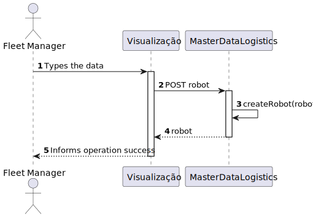

# US 360 - As a fleet manager, I want to add a new robot to the fleet indicating its type, name, etc.

## 1. Context

* First time that this task is developed.
* This task is relative to system user Fleet Manager .

## 2. Requirements

**US 360 -** As a fleet manager, I want to add a new robot to the fleet indicating its type, name, etc.

> **Q**: ... Poderia explicar as diferenças entre estas duas user stories, US350 e US360? <br>
> **A**: ... o requisito 360 permite indicar que robots existem e de que tipo cada um é, por exemplo "Robot 'ABC32' do tipo A", "Robot 'Brian2' do tipo A" e "Robot 'Stew' do tipo B" <br>


**Dependencies:**
- **US 350 -** As a fleet manager, I want to add a new type of robot indicating its designation and what types of tasks it can perform from the predefined list of tasks.

**Regarding this requirement we understand that:** <br>
As a Fleet Manager, an actor of the system, I will be able to access the system and choose one robot, put them in the fleet specifying his type and name.

## 3. Analysis

**Analyzing this User Story we understand that:**
* Fleet Manager is a user role that manages the data of the robots and drones and the types of tasks.
* Robisep is a type of mobile robot that can move through the corridors and elevators of the buildings, but not stairs. It can perform tasks such as surveillance, cleaning, or delivery of items.
* The robot type has a Code, a Brand and a Model.
* ex1."Tipo A: Robot marca X modelo Y com capacidade de executar tarefas de vigilância"
* ex2."Tipo B: Robot marca W modelo Z com capacidade de executar tarefas de vigilância e pickeup&delivery"


### 3.1. Domain Model Excerpt


## 4. Design

### 4.1. Realization

### Level 1

* Logical:


* Process


* Scenary


### level 2

* Logical:


* Process



* Physical


* Implementation


### Level 3

* Logical:


* Implementation


* Process


### 4.2. Applied Patterns

* Controller
* Service
* Repository
* Mapper
* DTO
* GRASP

### 4.3. Tests

**Test 1:** *Verifies that it is not possible to create an instance of the Example class with null values.*

```
@Test(expected = IllegalArgumentException.class)
public void ensureNullIsNotAllowed() {
	Example instance = new Example(null, null);
}
````

## 5. Implementation

**createRobotService:**

```

````

## 6. Integration/Demonstration

*In this section the team should describe the efforts realized in order to integrate this functionality with the other parts/components of the system*

*It is also important to explain any scripts or instructions required to execute an demonstrate this functionality*

## 7. Observations

No additional observations.