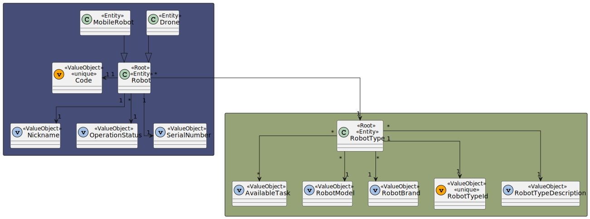
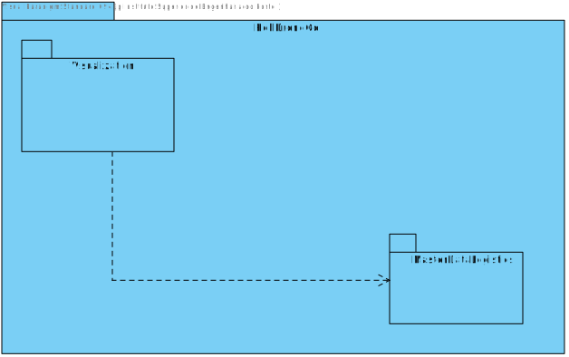

# US 360 - As a fleet manager, I want to add a new robot to the fleet indicating its type, name, etc.

## 1. Context

* First time that this task is developed.
* This task is relative to system user Fleet Manager .

## 2. Requirements

**US 360 -** As a fleet manager, I want to add a new robot to the fleet indicating its type, name, etc.

> **Q**: ... Poderia explicar as diferenças entre estas duas user stories, US350 e US360? <br>
> **A**: ... o requisito 360 permite indicar que robots existem e de que tipo cada um é, por exemplo "Robot 'ABC32' do tipo A", "Robot 'Brian2' do tipo A" e "Robot 'Stew' do tipo B" <br>


**Dependencies:**
- **US 350 -** As a fleet manager, I want to add a new type of robot indicating its designation and what types of tasks it can perform from the predefined list of tasks.

**Regarding this requirement we understand that:** <br>
As a Fleet Manager, an actor of the system, I will be able to access the system and choose one robot, put them in the fleet specifying his type and name.

## 3. Analysis

**Analyzing this User Story we understand that:**
* Fleet Manager is a user role that manages the data of the robots and drones and the types of tasks.
* Robisep is a type of mobile robot that can move through the corridors and elevators of the buildings, but not stairs. It can perform tasks such as surveillance, cleaning, or delivery of items.
* The robot type has a Code, a Brand and a Model.
* ex1."Tipo A: Robot marca X modelo Y com capacidade de executar tarefas de vigilância"
* ex2."Tipo B: Robot marca W modelo Z com capacidade de executar tarefas de vigilância e pickeup&delivery"


### 3.1. Domain Model Excerpt



## 4. Design

### 4.1. Realization

### Level1
###### LogicalView:


###### SceneryView:


###### ProcessView:


#### Level2

###### LogicalView:


###### ImplementationView:


###### PhysicalView:


###### ProcessView:


#### Level3
###### LogicalView:


###### ImplementationView:


###### ProcessView:


### 4.2. Applied Patterns

* Controller
* Service
* Repository
* Mapper
* DTO
* GRASP

### 4.3. Tests

**Test 1:** *Ensures that the Robot.create method can correctly create a Robot instance when provided with valid data. The test validates the properties and values of the created instance.*
```
it('should create a new Robot instance with valid input', function () {
        // Arrange
        const robotTypeDTO: ICreateRobotTypeDTO = {
            "robotTypeID": "k4",
            "robotBrand": "Joi.string().max(0).required()",
            "robotModel": " Joi.string().max(100).required()",
            "availableTasks": ["Floor surveillance","Object transport"]
        };
        const robotType = RobotType.create(robotTypeDTO, robotTypeDTO.robotTypeID).getValue();

        const robotDTO: ICreateRobotDTO = {
            "code":"code1",
            "nickname": "marsupial",
            "type": "k4",
            "serialNumber": "maxC",
            "description": "Joi.string().max(250)"
        };


        // Act
        const result = Robot.create(robotDTO, robotType, robotDTO.code);

        // Assert
        assert.ok(result.isSuccess);
        assert.ok(result.getValue() instanceof Robot);
        assert.strictEqual(result.getValue().id.toString(), robotDTO.code);
        assert.strictEqual(result.getValue().props.nickname.nickname, robotDTO.nickname);
        assert.strictEqual(result.getValue().props.type.id.toString(), robotDTO.type);
        assert.strictEqual(result.getValue().props.serialNumber.serialNumber, robotDTO.serialNumber);
        assert.strictEqual(result.getValue().props.description.description, robotDTO.description);
        assert.strictEqual(result.getValue().props.operationStatus.status, true);
    });
````

**Test 2:** *Validates that the Robot.create method correctly identifies and rejects invalid input for the nickname property.*
```
it('should fail to create a new Robot instance with invalid input (Nickname)', function () {
         // Arrange
         const robotTypeDTO: ICreateRobotTypeDTO = {
            "robotTypeID": "k4",
            "robotBrand": "Joi.string().max(0).required()",
            "robotModel": " Joi.string().max(100).required()",
            "availableTasks": ["Floor surveillance","Object transport"]
        };
        const robotType = RobotType.create(robotTypeDTO, robotTypeDTO.robotTypeID).getValue();

        const robotDTO: ICreateRobotDTO = {
            "code":"code1",
            "nickname": 'a'.repeat(31),
            "type": "k4",
            "serialNumber": "maxC",
            "description": "Joi.string().max(250)"
        };


        // Act
        const result = Robot.create(robotDTO, robotType, robotDTO.code);

        // Assert
        assert.ok(result.isFailure);
    });
````

**Test 3:** *Ensures that the Robot.create method accurately detects and rejects invalid input for the serialNumber property.*
```
it('should fail to create a new Robot instance with invalid input (SerialNumber)', function () {
        // Arrange
        const robotTypeDTO: ICreateRobotTypeDTO = {
           "robotTypeID": "k4",
           "robotBrand": "Joi.string().max(0).required()",
           "robotModel": " Joi.string().max(100).required()",
           "availableTasks": ["Floor surveillance","Object transport"]
       };
       const robotType = RobotType.create(robotTypeDTO, robotTypeDTO.robotTypeID).getValue();

       const robotDTO: ICreateRobotDTO = {
           "code":"code1",
           "nickname": "marsupial",
           "type": "k4",
           "serialNumber": 'a'.repeat(51),
           "description": "Joi.string().max(250)"
       };


       // Act
       const result = Robot.create(robotDTO, robotType, robotDTO.code);

       // Assert
       assert.ok(result.isFailure);
   });
````

**Test 4:** *Verifies that the Robot.create method handles invalid description input correctly and returns an error as expected.*
```
it('should fail to create a new Robot instance with invalid input (Description)', function () {
    // Arrange
    const robotTypeDTO: ICreateRobotTypeDTO = {
       "robotTypeID": "k4",
       "robotBrand": "Joi.string().max(0).required()",
       "robotModel": " Joi.string().max(100).required()",
       "availableTasks": ["Floor surveillance","Object transport"]
    };
    const robotType = RobotType.create(robotTypeDTO, robotTypeDTO.robotTypeID).getValue();

    const robotDTO: ICreateRobotDTO = {
       "code":"code1",
       "nickname": "marsupial",
       "type": "k4",
       "serialNumber": "maxC",
       "description": 'a'.repeat(251)
    };


    // Act
    const result = Robot.create(robotDTO, robotType, robotDTO.code);

    // Assert
    assert.ok(result.isFailure);
    });
````

**Test 5:** *Test focuses on the controller in isolation by stubbing the service. It checks if the controller processes a request to create a robot with valid input data and returns the expected result.*
```
it('createRobotController unit test using createRobotService stub', async function () {
        // Arrange
        let body = {
            "code":"code1",
            "nickname": "marsupial",
            "type": "k4",
            "serialNumber": "maxC",
            "description": "Joi.string().max(250)"
         };
        let req: Partial<Request> = {};
          req.body = body;
        let res: Partial<Response> = {
          json: sinon.spy(),
          status: sinon.stub().returnsThis(),
          send: sinon.spy()
        };
        let next: Partial<NextFunction> = () => {};

        const robotDTO: IRobotDTO = {
            "code":"code1",
            "nickname": "marsupial",
            "type": "k4",
            "serialNumber": "maxC",
            "description": "Joi.string().max(250)",
            "operationStatus": true
         };


        let createRobotServiceInstance = Container.get("createRobotService");
        sinon.stub(createRobotServiceInstance, "createRobot").returns(Promise.resolve(Result.ok<IRobotDTO>(robotDTO)));

        const ctrl = new createRobotController(createRobotServiceInstance as ICreateRobotService);

        // Act
        await ctrl.createRobot(<Request>req, <Response>res, <NextFunction>next);

        // Assert
        sinon.assert.calledOnce(res.json);
        sinon.assert.calledWith(res.json, sinon.match({
            "code": "code1",
            "nickname": "marsupial",
            "type": "k4",
            "serialNumber": "maxC",
            "description": "Joi.string().max(250)",
            "operationStatus": true
        }));

    });
````

**Test 6:** *Tests the end-to-end functionality of the controller and the service, ensuring that the controller correctly interacts with the service and returns the expected result.*
```
it("createRobotController +createRobotService integration test", async function() {
        // Arrange
        let body = {
            "code":"code1",
            "nickname": "marsupial",
            "type": "k4",
            "serialNumber": "maxC",
            "description": "Joi.string().max(250)"
         };
        let req: Partial<Request> = {
          body: body
        };
        let res: Partial<Response> = {
          json: sinon.spy(),
          status: sinon.stub().returnsThis(),
          send: sinon.spy()
        };
        let next: Partial<NextFunction> = () => {};

        // Stub repo methods
        const robotTypeDTO: ICreateRobotTypeDTO = {
            "robotTypeID": "k4",
            "robotBrand": "Joi.string().max(0).required()",
            "robotModel": " Joi.string().max(100).required()",
            "availableTasks": ["Floor surveillance","Object transport"]
        };
        const robotType = RobotType.create(robotTypeDTO, robotTypeDTO.robotTypeID).getValue();

        const robotDTO: ICreateRobotDTO = {
            "code":"code1",
            "nickname": "marsupial",
            "type": "k4",
            "serialNumber": "maxC",
            "description": "Joi.string().max(250)"
        };

        robotRepoMock.findById.resolves(null);
        robotTypeRepoMock.findById.resolves(robotType);
        robotRepoMock.findByNickname.resolves(null);
        robotRepoMock.findBySerialNumberAndType.resolves(false);

        let createRobotServiceInstance = Container.get("createRobotService");
        const createRobotServiceSpy = sinon.spy(createRobotServiceInstance, "createRobot");

        const ctrl = new createRobotController(createRobotServiceInstance as ICreateRobotService);

        // Act
        await ctrl.createRobot(<Request>req, <Response>res, <NextFunction>next);

        // Assert
        sinon.assert.calledOnce(res.json);
        sinon.assert.calledWith(res.json, sinon.match({
            "code": "code1",
            "nickname": "marsupial",
            "type": "k4",
            "serialNumber": "maxC",
            "description": "Joi.string().max(250)",
            "operationStatus": true
        }));
        sinon.assert.calledOnce(createRobotServiceSpy);
    });
````

**Test 7:** *Test checks how the controller handles the situation when a robot with the same code already exists and ensures it responds with an appropriate error message.*
```
it("createRobotController +createRobotService integration test (Robot already exists)", async function() {
        // Arrange
        let body = {
            "code":"code1",
            "nickname": "marsupial",
            "type": "k4",
            "serialNumber": "maxC",
            "description": "Joi.string().max(250)"
         };
        let req: Partial<Request> = {
          body: body
        };
        let res: Partial<Response> = {
          json: sinon.spy(),
          status: sinon.stub().returnsThis(),
          send: sinon.spy()
        };
        let next: Partial<NextFunction> = () => {};

        // Stub repo methods
        const robotTypeDTO: ICreateRobotTypeDTO = {
            "robotTypeID": "k4",
            "robotBrand": "Joi.string().max(0).required()",
            "robotModel": " Joi.string().max(100).required()",
            "availableTasks": ["Floor surveillance","Object transport"]
        };
        const robotType = RobotType.create(robotTypeDTO, robotTypeDTO.robotTypeID).getValue();

        const robotDTO: ICreateRobotDTO = {
            "code":"code1",
            "nickname": "marsupial",
            "type": "k4",
            "serialNumber": "maxC",
            "description": "Joi.string().max(250)"
        };

        robotRepoMock.findById.resolves(robotDTO);
        robotTypeRepoMock.findById.resolves(robotType);
        robotRepoMock.findByNickname.resolves(null);
        robotRepoMock.findBySerialNumberAndType.resolves(false);

        let createRobotServiceInstance = Container.get("createRobotService");
        const createRobotServiceSpy = sinon.spy(createRobotServiceInstance, "createRobot");

        const ctrl = new createRobotController(createRobotServiceInstance as ICreateRobotService);

        // Act
        await ctrl.createRobot(<Request>req, <Response>res, <NextFunction>next);

        // Assert
        sinon.assert.calledOnce(createRobotServiceSpy);
        sinon.assert.calledOnce(res.status);
        sinon.assert.calledWith(res.status,400);
        sinon.assert.calledOnce(res.send);
        sinon.assert.calledWith(res.send, sinon.match("Robot already exists"));
    });
````

**Test 8:** *Test validates how the controller handles the case when the specified robot type is not found and ensures it responds with an appropriate error message.*
```
it("createRobotController +createRobotService integration test (Robot Type not found)", async function() {
        // Arrange
        let body = {
            "code":"code1",
            "nickname": "marsupial",
            "type": "k4",
            "serialNumber": "maxC",
            "description": "Joi.string().max(250)"
         };
        let req: Partial<Request> = {
          body: body
        };
        let res: Partial<Response> = {
          json: sinon.spy(),
          status: sinon.stub().returnsThis(),
          send: sinon.spy()
        };
        let next: Partial<NextFunction> = () => {};

        // Stub repo methods
        const robotTypeDTO: ICreateRobotTypeDTO = {
            "robotTypeID": "k4",
            "robotBrand": "Joi.string().max(0).required()",
            "robotModel": " Joi.string().max(100).required()",
            "availableTasks": ["Floor surveillance","Object transport"]
        };
        const robotType = RobotType.create(robotTypeDTO, robotTypeDTO.robotTypeID).getValue();

        const robotDTO: ICreateRobotDTO = {
            "code":"code1",
            "nickname": "marsupial",
            "type": "k4",
            "serialNumber": "maxC",
            "description": "Joi.string().max(250)"
        };

        robotRepoMock.findById.resolves(null);
        robotTypeRepoMock.findById.resolves(null);
        robotRepoMock.findByNickname.resolves(null);
        robotRepoMock.findBySerialNumberAndType.resolves(false);

        let createRobotServiceInstance = Container.get("createRobotService");
        const createRobotServiceSpy = sinon.spy(createRobotServiceInstance, "createRobot");

        const ctrl = new createRobotController(createRobotServiceInstance as ICreateRobotService);

        // Act
        await ctrl.createRobot(<Request>req, <Response>res, <NextFunction>next);

        // Assert
        sinon.assert.calledOnce(createRobotServiceSpy);
        sinon.assert.calledOnce(res.status);
        sinon.assert.calledWith(res.status,400);
        sinon.assert.calledOnce(res.send);
        sinon.assert.calledWith(res.send, sinon.match("Robot Type not found"));
    });
````

**Test 9:** *Tests how the controller handles the situation when a robot with the same nickname already exists and ensures it responds with an appropriate error message.*
```
 it("createRobotController +createRobotService integration test (Robot with this nickname already exists)", async function() {
        // Arrange
        let body = {
            "code":"code1",
            "nickname": "marsupial",
            "type": "k4",
            "serialNumber": "maxC",
            "description": "Joi.string().max(250)"
         };
        let req: Partial<Request> = {
          body: body
        };
        let res: Partial<Response> = {
          json: sinon.spy(),
          status: sinon.stub().returnsThis(),
          send: sinon.spy()
        };
        let next: Partial<NextFunction> = () => {};

        // Stub repo methods
        const robotTypeDTO: ICreateRobotTypeDTO = {
            "robotTypeID": "k4",
            "robotBrand": "Joi.string().max(0).required()",
            "robotModel": " Joi.string().max(100).required()",
            "availableTasks": ["Floor surveillance","Object transport"]
        };
        const robotType = RobotType.create(robotTypeDTO, robotTypeDTO.robotTypeID).getValue();

        const robotDTO: ICreateRobotDTO = {
            "code":"code1",
            "nickname": "marsupial",
            "type": "k4",
            "serialNumber": "maxC",
            "description": "Joi.string().max(250)"
        };

        robotRepoMock.findById.resolves(null);
        robotTypeRepoMock.findById.resolves(robotType);
        robotRepoMock.findByNickname.resolves(robotDTO);
        robotRepoMock.findBySerialNumberAndType.resolves(false);

        let createRobotServiceInstance = Container.get("createRobotService");
        const createRobotServiceSpy = sinon.spy(createRobotServiceInstance, "createRobot");

        const ctrl = new createRobotController(createRobotServiceInstance as ICreateRobotService);

        // Act
        await ctrl.createRobot(<Request>req, <Response>res, <NextFunction>next);

        // Assert
        sinon.assert.calledOnce(createRobotServiceSpy);
        sinon.assert.calledOnce(res.status);
        sinon.assert.calledWith(res.status,400);
        sinon.assert.calledOnce(res.send);
        sinon.assert.calledWith(res.send, sinon.match("Robot with this nickname already exists"));
    });
````

**Test 10:** *Test checks how the controller handles the case when a robot of the same type and serial number already exists and ensures it responds with an appropriate error message.*
```
it("createRobotController +createRobotService integration test (Robot of this type and serial number already exists)", async function() {
        // Arrange
        let body = {
            "code":"code1",
            "nickname": "marsupial",
            "type": "k4",
            "serialNumber": "maxC",
            "description": "Joi.string().max(250)"
         };
        let req: Partial<Request> = {
          body: body
        };
        let res: Partial<Response> = {
          json: sinon.spy(),
          status: sinon.stub().returnsThis(),
          send: sinon.spy()
        };
        let next: Partial<NextFunction> = () => {};

        // Stub repo methods
        const robotTypeDTO: ICreateRobotTypeDTO = {
            "robotTypeID": "k4",
            "robotBrand": "Joi.string().max(0).required()",
            "robotModel": " Joi.string().max(100).required()",
            "availableTasks": ["Floor surveillance","Object transport"]
        };
        const robotType = RobotType.create(robotTypeDTO, robotTypeDTO.robotTypeID).getValue();

        const robotDTO: ICreateRobotDTO = {
            "code":"code1",
            "nickname": "marsupial",
            "type": "k4",
            "serialNumber": "maxC",
            "description": "Joi.string().max(250)"
        };

        robotRepoMock.findById.resolves(null);
        robotTypeRepoMock.findById.resolves(robotType);
        robotRepoMock.findByNickname.resolves(null);
        robotRepoMock.findBySerialNumberAndType.resolves(true);

        let createRobotServiceInstance = Container.get("createRobotService");
        const createRobotServiceSpy = sinon.spy(createRobotServiceInstance, "createRobot");

        const ctrl = new createRobotController(createRobotServiceInstance as ICreateRobotService);

        // Act
        await ctrl.createRobot(<Request>req, <Response>res, <NextFunction>next);

        // Assert
        sinon.assert.calledOnce(createRobotServiceSpy);
        sinon.assert.calledOnce(res.status);
        sinon.assert.calledWith(res.status,400);
        sinon.assert.calledOnce(res.send);
        sinon.assert.calledWith(res.send, sinon.match("Robot of this type and serial number already exists"));
    });
````

## 5. Implementation

#### CreateRobotController
```
export default class createRobotController implements ICreateRobotController {

    constructor(
        @Inject(config.services.createRobot.name) private service: ICreateRobotService
    )
    {}

    public async createRobot(req: Request, res: Response, next: NextFunction) {
        try {
            const robotOrError = await this.service.createRobot(req.body as ICreateRobotDTO) as Result<IRobotDTO>

            if (robotOrError.isFailure) {
                return res.status(400).send(robotOrError.errorValue())
            }

            const robotDTO = robotOrError.getValue();
            return res.status(201).json(robotDTO);

        }catch (e){
            return next(e);
        }
    }
}
````

#### CreateRobotService
```
export default class createRobotService implements ICreateRobotService {

    constructor(
        @Inject(config.repos.robot.name) private robotRepo: IRobotRepo,
        @Inject(config.repos.robotType.name) private robotTypeRepo: IRobotTypeRepo
    ) { }


    public async createRobot(robotDTO: ICreateRobotDTO): Promise<Result<IRobotDTO>> {

        try {

            const robotExists = await this.robotRepo.findById(robotDTO.code)
            if(robotExists != null){
                return Result.fail<IRobotDTO>("Robot already exists")
            }

            const typeOrError = await this.robotTypeRepo.findById(robotDTO.type)
            if(typeOrError == null){
                return Result.fail<IRobotDTO>("Robot Type not found")
            }

            const robotDuplicatedNickname = await this.robotRepo.findByNickname(robotDTO.nickname)
            if(robotDuplicatedNickname != null){
                return Result.fail<IRobotDTO>("Robot with this nickname already exists")
            }

            const robotOfType = await this.robotRepo.findBySerialNumberAndType(robotDTO.serialNumber,robotDTO.type)
            if(robotOfType){
                return Result.fail<IRobotDTO>("Robot of this type and serial number already exists")
            }

            const robotOrError = Robot.create(robotDTO,typeOrError,robotDTO.code)
            if (robotOrError.isFailure) {
                return Result.fail<IRobotDTO>(robotOrError.errorValue())
            }

            const robotResult = robotOrError.getValue()

            await this.robotRepo.save(robotResult);

            const robotDtoResult = RobotMap.toDto(robotResult) as IRobotDTO

            return Result.ok<IRobotDTO>(robotDtoResult)

        } catch (e) {
            throw e
        }
    }
}
````
## 6. Integration/Demonstration
To use this US, you need to send an HTTP request.

Using this URI: localhost:4000/api/robots/createRobot

With the following JSON
```
{
    "code":"code1",
    "nickname": "marsupial",
    "type": "k4",
    "serialNumber": "maxC",
    "description": "Joi.string().max(250)"
}
````

## 7. Observations

No additional observations.
