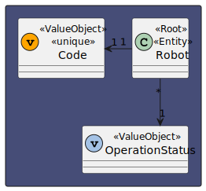
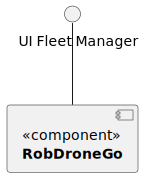

# US 370 - As a Fleet Manager, I want to disable a robot

## 1. Context

* First time that this task is developed.
* This task is relative to system user Fleet Manager.

## 2. Requirements

**US 370 -** As a Fleet Manager, I want to disable a robot

> **Q**: ...para além deste "estado" que outros estados pretende que existam? em funcionamento, ocupado, livre, a executar tarefa? Ou basta apenas inibido - desinibido?
<br>
> **A**: ... de um ponto de vista funcional pretende-se que seja possivel inibir ou desinibr um robot e que essa informação seja devidamente utilizada nos restantes casos de uso. por exemplo, um robot inibido não pode executar tarefas.

**Dependencies:**

- **US350 -** As a fleet manager, I want to add a new type of robot indicating its designation and what types of tasks it can perform from the predefined list of tasks.

- **US360 -** As a fleet manager, I want to add a new robot to the fleet indicating its type, name, etc.

## 3. Analysis

*In this section, the team should report the study/analysis/comparison that was done in order to take the best design decisions for the requirement. This section should also include supporting diagrams/artifacts (such as domain model; use case diagrams, etc.),*

### 3.1. Domain Model Excerpt



## 4. Design

### 4.1. Realization

### Level 1

* Logical:



* Process


* Scenary


### level 2

* Logical:


* Process


* Physical


* Implementation


### Level 3

* Logical:


* Implementation


* Process


### 4.3. Applied Patterns

### 4.4. Tests

**Test 1:** *Verifies that it is not possible to create an instance of the Example class with null values.*

```
@Test(expected = IllegalArgumentException.class)
public void ensureNullIsNotAllowed() {
	Example instance = new Example(null, null);
}
````

## 5. Implementation

*In this section the team should present, if necessary, some evidencies that the implementation is according to the design. It should also describe and explain other important artifacts necessary to fully understand the implementation like, for instance, configuration files.*

*It is also a best practice to include a listing (with a brief summary) of the major commits regarding this requirement.*

## 6. Integration/Demonstration

*In this section the team should describe the efforts realized in order to integrate this functionality with the other parts/components of the system*

*It is also important to explain any scripts or instructions required to execute an demonstrate this functionality*

## 7. Observations

*This section should be used to include any content that does not fit any of the previous sections.*

*The team should present here, for instance, a critical prespective on the developed work including the analysis of alternative solutioons or related works*

*The team should include in this section statements/references regarding third party works that were used in the development this work.*