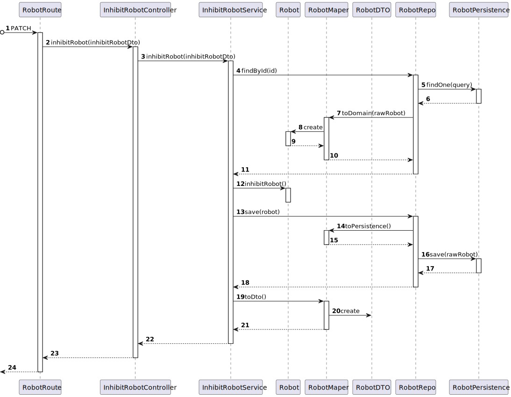

# US 370 - As a Fleet Manager, I want to disable a robot

## 1. Context

* First time that this task is developed.
* This task is relative to system user Fleet Manager.

## 2. Requirements

**US 370 -** As a Fleet Manager, I want to disable a robot

**Client Clarifications**
> **Q**: ...para além deste "estado" que outros estados pretende que existam? em funcionamento, ocupado, livre, a executar tarefa? Ou basta apenas inibido - desinibido?
<br>
> **A**: ... de um ponto de vista funcional pretende-se que seja possivel inibir ou desinibr um robot e que essa informação seja devidamente utilizada nos restantes casos de uso. por exemplo, um robot inibido não pode executar tarefas.

**Dependencies:**

- **US350 -** As a fleet manager, I want to add a new type of robot indicating its designation and what types of tasks it can perform from the predefined list of tasks.
- **US360 -** As a fleet manager, I want to add a new robot to the fleet indicating its type, name, etc.

## 3. Analysis

**Analyzing this User Story we understand that:**
* Fleet Manager is a user role that manages the data of the robots and drones and the types of tasks.
* A robot has an operation status that is true when the robot is enabled and false when it is disabled.

### 3.1. Domain Model Excerpt


## 4. Design

### 4.1. Realization

### Level 1

* Logical:


* Process


* Scenary


### level 2

* Logical:


* Process


* Physical


* Implementation


### Level 3

* Logical:


* Implementation


* Process



### 4.2. Applied Patterns


### 4.3. Tests

**Test 1:** *Tests the controller when a robot is in the database*

```
it('2. Controller unit test robot exist on database', async function () {
        const robotTypeDTO: ICreateRobotTypeDTO = {
            "robotTypeID": "k4",
            "robotBrand": "Apple",
            "robotModel": "IRobot15",
            "availableTasks": ["Floor surveillance", "Object transport"]
        }
        const robotType = RobotType.create(robotTypeDTO, robotTypeDTO.robotTypeID).getValue()
        const robotDTO: ICreateRobotDTO = {
            "code": "code1",
            "nickname": "marsupial",
            "type": "k4",
            "serialNumber": "maxC",
            "description": "fast"
        }
        const robotJson = {
            id: "code1"
        }
        const robotexpectedDto = {
            code: "code1",
            nickname: "marsupial",
            type: "k4",
            serialNumber: "maxC",
            description: "fast",
            operationStatus: false
        }

        let req: Partial<Request> = {}
        req.body = robotJson
        let res: Partial<Response> = {
            status: sinon.stub().returnsThis(),
            json: sinon.spy()
        }
        let next: Partial<NextFunction> = () => { }

        const service = Container.get('inhibitRobotSerivce')

        sinon.stub(service, 'inhibitRobot')
            .returns(new Promise((resolve, reject) => { resolve(Result.ok<IRobotDTO>(robotexpectedDto)) }))


        const controller = new InhibitRobotController(service as IInhibitRobotService)

        await controller.inhibitRobot(<Request>req, <Response>res, <NextFunction>next)

        sinon.assert.calledOnce(res.status)
        sinon.assert.calledWith(res.status, 201)
        sinon.assert.calledOnce(res.json)
        sinon.assert.calledWith(res.json, robotexpectedDto)
    })
````

**Test 2:** *Tests the service when a robot doesn't exist in the database*

```
it('4. Service unit test robot dosen\'t exist on database', async function () {
        const robotJson = {
            id: "code1"
        }
        let req: Partial<Request> = {}
        req.body = robotJson
        let res: Partial<Response> = {
            status: sinon.stub().returnsThis(),
            send: sinon.spy()
        }
        let next: Partial<NextFunction> = () => { }

        const service = Container.get('inhibitRobotSerivce')

        sinon.stub(service, 'inhibitRobot')
            .returns(new Promise((resolve, reject) => { resolve(Result.fail<IRobotDTO>('There is no robot with that id')) }))


        const controller = new InhibitRobotController(service as IInhibitRobotService)

        await controller.inhibitRobot(<Request>req, <Response>res, <NextFunction>next)

        sinon.assert.calledOnce(res.status)
        sinon.assert.calledWith(res.status, 400)
        sinon.assert.calledOnce(res.send)
    })
````         

## 5. Implementation

**inhibitRobotService:**

```
export default class InhibitRobotService implements IInhibitRobotService {
    
    constructor(
        @Inject(config.repos.robot.name) private robotRepo: IRobotRepo
    )
    {}
    
    public async inhibitRobot(inhibitRobotDto: IInhibitRobotDTO): Promise<Result<IRobotDTO>> {
        const robotOrError = await this.robotRepo.findById(inhibitRobotDto.id)

        if (robotOrError === null) {
            return Result.fail<IRobotDTO>('There is no robot with such ID')
        }

        robotOrError.inhibit()

        const saved = await this.robotRepo.save(robotOrError)

        return Result.ok<IRobotDTO>(RobotMap.toDto(saved))
    }

}
````

## 6. Integration/Demonstration

To use this US, you need to send and HTTP request with the following JSON:

Using this URI: localhost:4000/api/robots/inhibitRobot

````
{
    "id": "k4"
}
````

## 7. Observations

No additional observations.