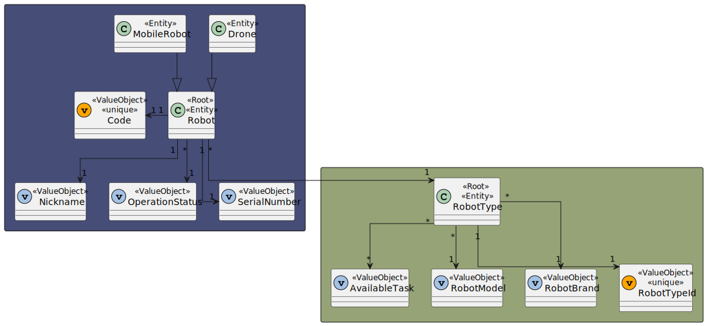

# US 380 - As a fleet manager, I want to consult all robots in the fleet.

## 1. Context

* First time that this task is developed.
* This task is relative to system user Campus Manager .

## 2. Requirements

**US 380 -** As a fleet manager, I want to consult all robots in the fleet.

- **FRE0X - XXX XXX:** yyyyyyyyy.

**Dependencies:**
- **US350 -** As a fleet manager, I want to add a new type of robot indicating its designation and what types of tasks it can perform from the predefined list of tasks.
- **US360 -** As a fleet manager, I want to add a new robot to the fleet indicating its type, name, etc.

**Regarding this requirement we understand that:** <br>
As a Fleet Manager, an actor of the system, I will be able to access the system and list all robots in the fleet.

## 3. Analysis

**Analyzing this User Story we understand that:**
* Fleet Manager is a user role that manages the data of the robots and drones and the types of tasks.
* Robots can be a Robisep or a Droneisep.
* Droneisep is a type of drone that can move in the outdoor space of the campus. It can perform tasks such as delivery of objects, surveillance, image acquisition, or window cleaning.
* Robisep is a type of mobile robot that can move through the corridors and elevators of the buildings, but not stairs. It can perform tasks such as surveillance, cleaning, or delivery of items.

### 3.1. Domain Model Excerpt


### 3.2. System Sequence Diagram


## 4. Design

### 4.1. Realization


### 4.2. Class Diagram


### 4.3. Applied Patterns

### 4.4. Tests

**Test 1:** *Verifies that it is not possible to create an instance of the Example class with null values.*

```
@Test(expected = IllegalArgumentException.class)
public void ensureNullIsNotAllowed() {
	Example instance = new Example(null, null);
}
````

## 5. Implementation

*In this section the team should present, if necessary, some evidencies that the implementation is according to the design. It should also describe and explain other important artifacts necessary to fully understand the implementation like, for instance, configuration files.*

*It is also a best practice to include a listing (with a brief summary) of the major commits regarding this requirement.*

## 6. Integration/Demonstration

*In this section the team should describe the efforts realized in order to integrate this functionality with the other parts/components of the system*

*It is also important to explain any scripts or instructions required to execute an demonstrate this functionality*

## 7. Observations

*This section should be used to include any content that does not fit any of the previous sections.*

*The team should present here, for instance, a critical prespective on the developed work including the analysis of alternative solutioons or related works*

*The team should include in this section statements/references regarding third party works that were used in the development this work.*