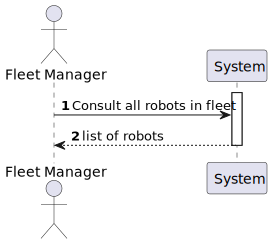
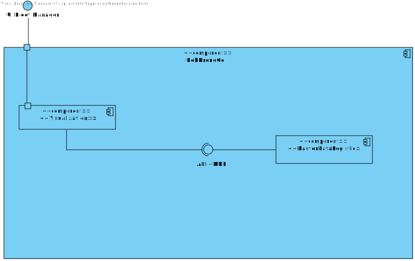
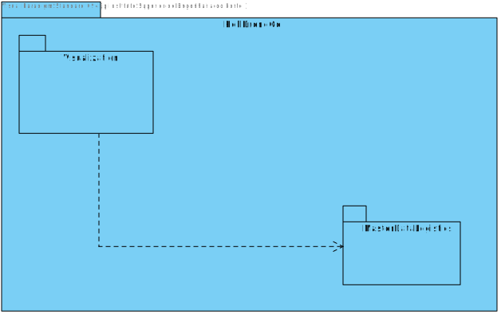
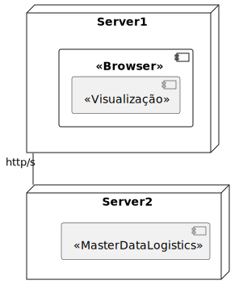
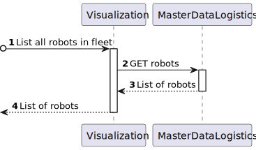
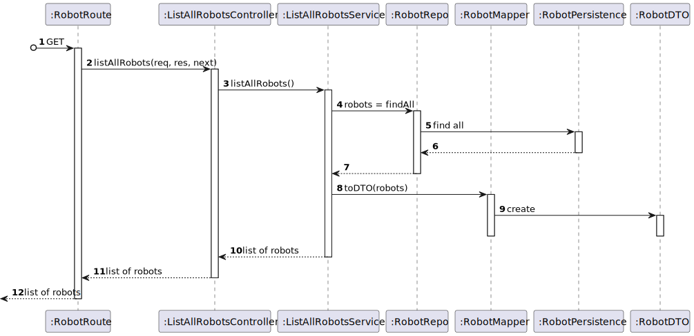

# US 380 - As a fleet manager, I want to consult all robots in the fleet.

## 1. Context

* This task comes in context of Sprint A.
* First time that this task is developed.
* This task is relative to system user Fleet Manager.

## 2. Requirements

**US 380 -** As a fleet manager, I want to consult all robots in the fleet.

**Dependencies:**
- **US350 -** As a fleet manager, I want to add a new type of robot indicating its designation and what types of tasks it can perform from the predefined list of tasks.
- **US360 -** As a fleet manager, I want to add a new robot to the fleet indicating its type, name, etc.

**Regarding this requirement we understand that:** <br>
As a Fleet Manager, an actor of the system, I will be able to access the system and list all robots in the fleet.

## 3. Analysis

**Analyzing this User Story we understand that:**
* Fleet Manager is a user role that manages the data of the robots and drones and the types of tasks.
* Robots can be a Robisep or a Droneisep.
* Droneisep is a type of drone that can move in the outdoor space of the campus. It can perform tasks such as delivery of objects, surveillance, image acquisition, or window cleaning.
* Robisep is a type of mobile robot that can move through the corridors and elevators of the buildings, but not stairs. It can perform tasks such as surveillance, cleaning, or delivery of items.

### 3.1. Domain Model Excerpt


## 4. Design

### 4.1. Realization

### Level1
###### LogicalView:


###### SceneryView:


###### ProcessView:


#### Level2

###### LogicalView:



###### ImplementationView:


###### PhysicalView:


###### ProcessView:


#### Level3
###### LogicalView:


###### ImplementationView:


###### ProcessView:


### 4.2. Applied Patterns
* Controller
* Service
* Repository
* Mapper
* DTO
* GRASP
### 4.3. Tests

**Test 1:** *Verifies that controller class returns the right response to a valid get request.*

``` typescript
    it('1. Controller with stub service returns robots', async function () {
        const robot1Result = {
            code: robot.getValue().id.toString(),
            nickname: robot.getValue().props.nickname.nickname,
            type: robot.getValue().props.type.id.toString(),
            serialNumber: robot.getValue().props.serialNumber.serialNumber,
            description: robot.getValue().props.description.description,
            operationStatus: robot.getValue().props.operationStatus.status
        } as IRobotDTO

        const robot2Result = {
            code: robot2.getValue().id.toString(),
            nickname: robot2.getValue().props.nickname.nickname,
            type: robot2.getValue().props.type.id.toString(),
            serialNumber: robot2.getValue().props.serialNumber.serialNumber,
            description: robot2.getValue().props.description.description,
            operationStatus: robot2.getValue().props.operationStatus.status
        } as IRobotDTO

        const result = [robot1Result, robot2Result]

        let req: Partial<Request> = {}

        let res: Partial<Response> = {
            status: sinon.stub().returnsThis(),
            json: sinon.spy()
        }

        let next: Partial<NextFunction> = () => { }

        const listAllRobotsService = Container.get('listAllRobotsService')

        sinon.stub(listAllRobotsService, 'listAllRobots').returns(new Promise((resolve, reject) => { resolve(Result.ok<IRobotDTO[]>(result)) }))

        const listAllRobotsController = new ListAllRobotsController(listAllRobotsService as IListAllRobotsService)

        await listAllRobotsController.listAllRobots(<Request>req, <Response>res, <NextFunction>next)

        sinon.assert.calledOnce(res.status)
        sinon.assert.calledWith(res.status, 200)
        sinon.assert.calledOnce(res.json)
        sinon.assert.calledWith(res.json, sinon.match(result))
    })
```

**Test 2:** *Verifies that controller class returns the right response when there are no robots in the system.*

``` typescript
	it('2. Controller with stub service returns no robots', async function () {
        let req: Partial<Request> = {}

        let res: Partial<Response> = {
            status: sinon.stub().returnsThis(),
            send: sinon.spy()
        }

        let next: Partial<NextFunction> = () => { }

        const listAllRobotsService = Container.get('listAllRobotsService')

        sinon.stub(listAllRobotsService, 'listAllRobots').returns(new Promise((resolve, reject) => { resolve(Result.fail<IRobotDTO[]>('No Robots found!')) }))

        const listAllRobotsController = new ListAllRobotsController(listAllRobotsService as IListAllRobotsService)

        await listAllRobotsController.listAllRobots(<Request>req, <Response>res, <NextFunction>next)
        sinon.assert.calledOnce(res.status)
        sinon.assert.calledWith(res.status, 400)
        sinon.assert.calledOnce(res.send)
    })
```

**Test 3:** *Verifies that service class returns the right list when there are robots in the system.*

``` typescript
	it('3. Service with stub repo lists robots', async function () {
        const robot1Result = {
            code: robot.getValue().id.toString(),
            nickname: robot.getValue().props.nickname.nickname,
            type: robot.getValue().props.type.id.toString(),
            serialNumber: robot.getValue().props.serialNumber.serialNumber,
            description: robot.getValue().props.description.description,
            operationStatus: robot.getValue().props.operationStatus.status
        } as IRobotDTO

        const robot2Result = {
            code: robot2.getValue().id.toString(),
            nickname: robot2.getValue().props.nickname.nickname,
            type: robot2.getValue().props.type.id.toString(),
            serialNumber: robot2.getValue().props.serialNumber.serialNumber,
            description: robot2.getValue().props.description.description,
            operationStatus: robot2.getValue().props.operationStatus.status
        } as IRobotDTO

        const expected = [robot1Result, robot2Result]

        const returnRepo = [robot.getValue(), robot2.getValue()]

        const robotRepo = Container.get('robotRepo')
        sinon.stub(robotRepo, 'findAll').returns(new Promise((resolve, reject) => {resolve(returnRepo)}))

        const listAllRobotsService = Container.get('listAllRobotsService') as IListAllRobotsService

        const actual = await listAllRobotsService.listAllRobots()

        sinon.assert.match(actual.getValue(), expected)
    })

```

**Test 4:** *Verifies that controller and service classes return the right list when there are robots in the system.*

``` typescript
    it('5. Controller + Service with stub repo returns robots', async function () {
        const robot1Result = {
            code: robot.getValue().id.toString(),
            nickname: robot.getValue().props.nickname.nickname,
            type: robot.getValue().props.type.id.toString(),
            serialNumber: robot.getValue().props.serialNumber.serialNumber,
            description: robot.getValue().props.description.description,
            operationStatus: robot.getValue().props.operationStatus.status
        } as IRobotDTO

        const robot2Result = {
            code: robot2.getValue().id.toString(),
            nickname: robot2.getValue().props.nickname.nickname,
            type: robot2.getValue().props.type.id.toString(),
            serialNumber: robot2.getValue().props.serialNumber.serialNumber,
            description: robot2.getValue().props.description.description,
            operationStatus: robot2.getValue().props.operationStatus.status
        } as IRobotDTO

        const result = [robot1Result, robot2Result]


        let req: Partial<Request> = {}

        let res: Partial<Response> = {
            status: sinon.stub().returnsThis(),
            json: sinon.spy()
        }

        let next: Partial<NextFunction> = () => { }

        const returnRepo = [robot.getValue(), robot2.getValue()]

        const robotRepo = Container.get('robotRepo')
        sinon.stub(robotRepo, 'findAll').returns(new Promise((resolve, reject) => {resolve(returnRepo)}))

        const listAllRobotsService = Container.get('listAllRobotsService') as IListAllRobotsService

        const listAllRobotsController = new ListAllRobotsController(listAllRobotsService as IListAllRobotsService)

        await listAllRobotsController.listAllRobots(<Request>req, <Response>res, <NextFunction>next)


        sinon.assert.calledOnce(res.status)
        sinon.assert.calledWith(res.status, 200)
        sinon.assert.calledOnce(res.json)
        sinon.assert.calledWith(res.json, sinon.match(result))
    })

```

## 5. Implementation
### Class ListAllRobotsService
``` typescript
    @Service()
export default class ListAllRobotsService implements IListAllRobotsService {

    constructor(
        @Inject(config.repos.robot.name) private robotRepo: IRobotRepo
    ) { }

    public async listAllRobots(): Promise<Result<IRobotDTO[]>> {
        try{
            const robotsList = await this.robotRepo.findAll()
            
            if (robotsList.length === 0) return Result.fail<IRobotDTO[]>('No Robots found!')

            let resolve: IRobotDTO[] = []
            
            robotsList.forEach(robot => {
                resolve.push(RobotMap.toDto(robot))
            })

            return Result.ok<IRobotDTO[]>(resolve)

        } catch(e) {
            throw e
        }
    }
}

```

## 6. Integration/Demonstration
To use this US, you need to send and HTTP request with the following URI:

localhost:4000/api/robots/listAll

## 7. Observations

No observations.
